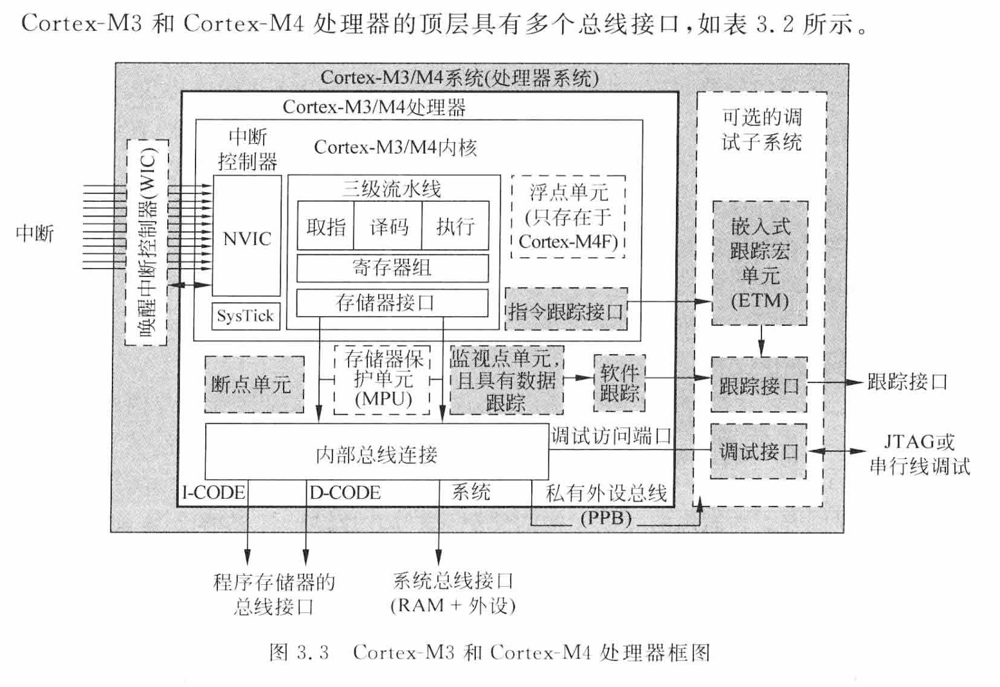
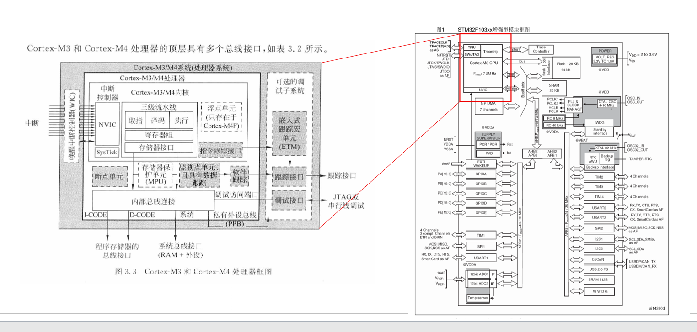

Cortex-M和STM32到底是什么关系？

# Cortex-M系统框图

图片来自<ARM Cortex-M3与Cortex-M4权威指南 第三版>

## Cortex-M系统

如果一个厂商向ARM购买了Cortex-M的IP，那么图中的所有东西都会一起交付给厂商，其中有一些部分是可选的，比如FPU、WIC、MPU这些单元。

如果站在STM32的视角上看，整个Cortex-M的内部是被封装的，这部分功能由ARM设计，对外提供了系统总线、程序存储器总线、跟踪接口、串行线调试接口、中断接口

如果使用个人电脑类比，Cortex-M系统就是CPU，而STM32是集成了CPU、南桥、北桥、内存、硬盘...的一个主板

## Cortex-M处理器

这部分除去**Cortex-M内核**之外，还有NVIC和SysTick；

对于内核而言，NVIC和SysTick就已经属于“外设”级别的电路了，但是NVIC、SysTick 又和 芯片厂商所添加的UART这些外设不同，NVIC、SysTick属于“内核外设”，他们属于Cortex-M强制定义、随核交付的**私有外设总线**

## Cortex-M内核

图中可见，Cortex-M3 M4的内核只包含三级流水线、寄存器组、存储器接口这三个部分

# Cortex-M和MCU的关系

图左边是Cortex-M系统框图

图右边是STM32F108系列的系统框图

可见Cortex-M在STM32里只占一部分

# 站在完整的产品视角上看

LED灯、各种传感器、SD卡...这些东西属于**外设**

STM32F108C8T6 则被称为**MCU**或者SoC（一般还是叫MCU多，SoC指的是更牛逼的、能跑Linux系统的那种芯片）

Cortex-M藏在MCU里，被称为**核心**

**如果用电脑打比方，Cortex-M核心像是CPU；而STM32F108C8T6这种芯片，其功能几乎是一块安装了CPU、内存条、硬盘的主板了**
