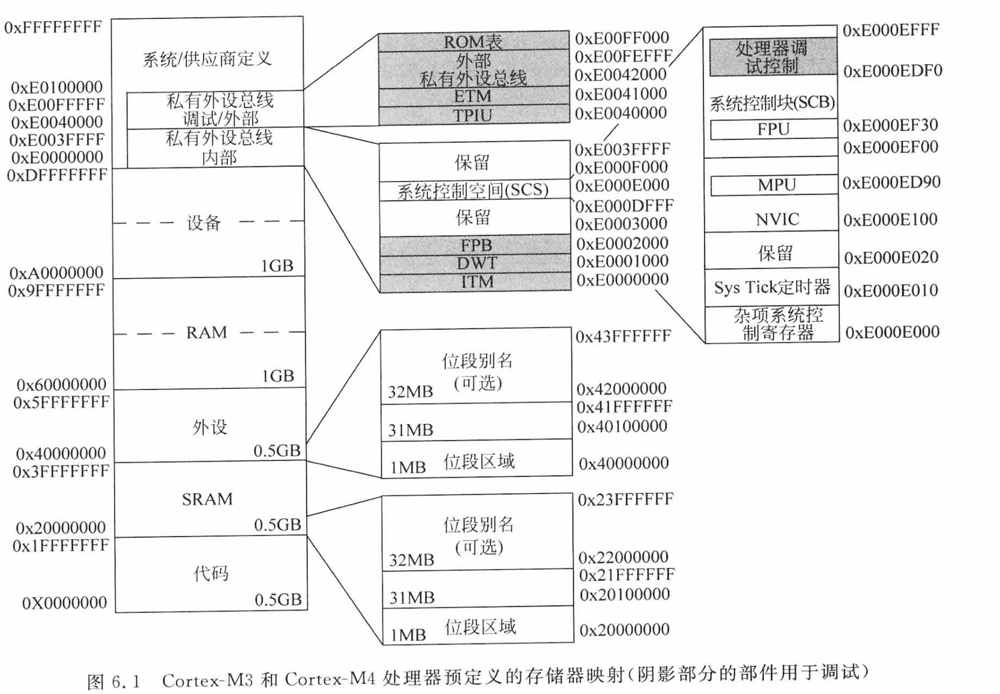
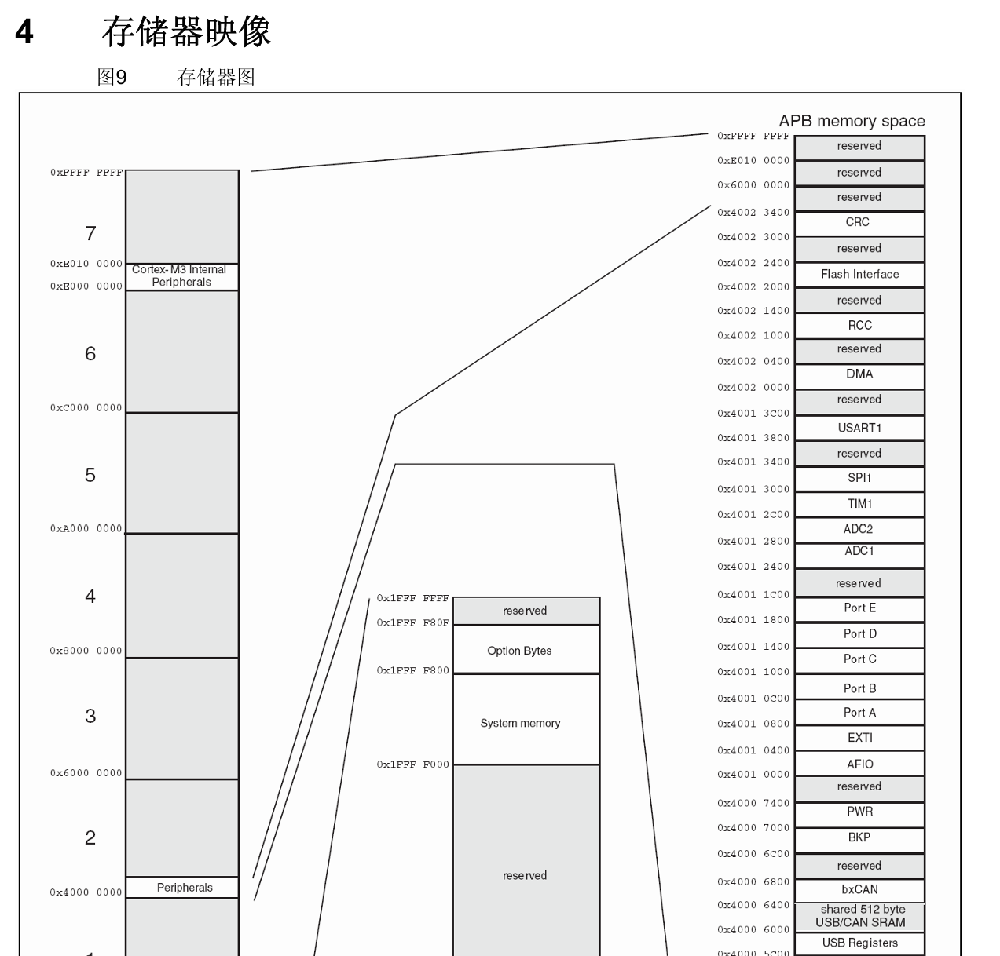
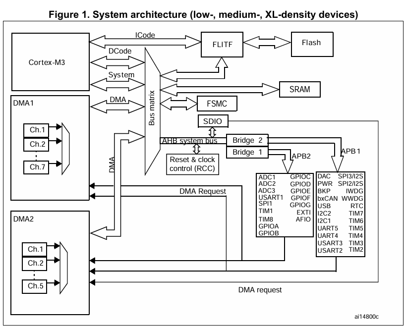
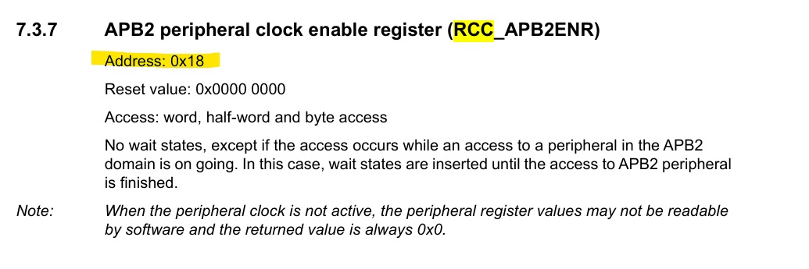
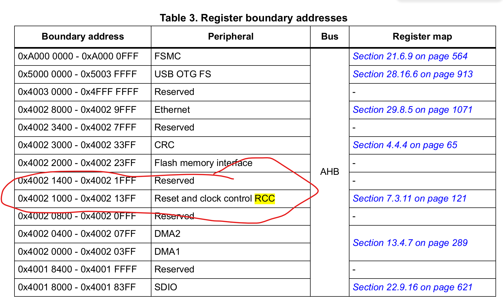
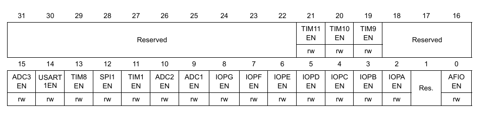
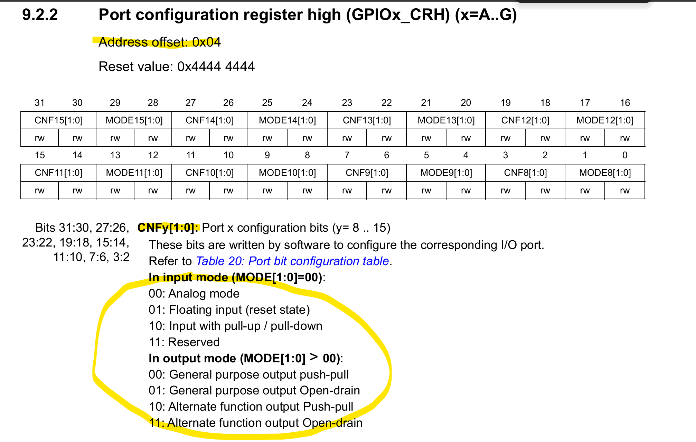
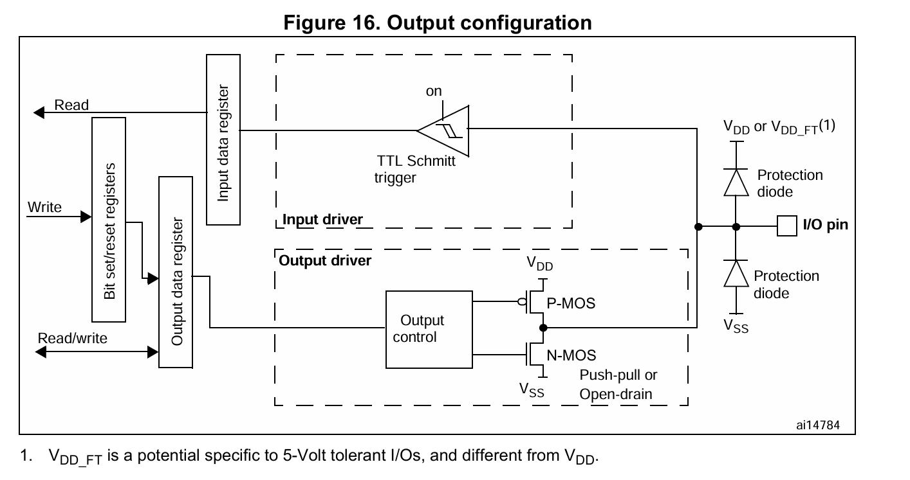
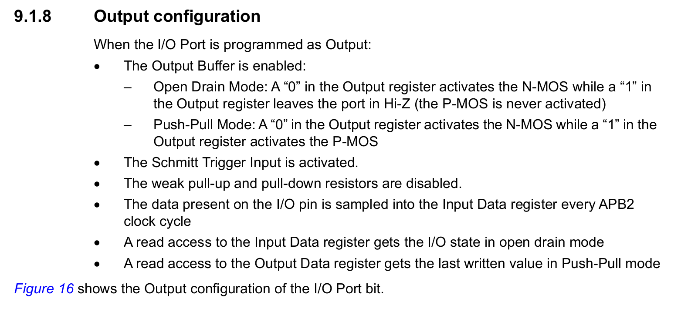

# Cortex-M的存储设备 | 外设怎么控制 | 点个灯

写在最前面：通过MCU点灯，这个操作的本质是，Cortex-M写引脚对应的内存地址，然后灯就亮了~

在具体点灯之前，要先了解一下为什么写内存就能操作外设

## 内存架构

冯诺依曼架构：指令和数据是统一存储的，访问指令与访问数据需要通过同一个总线进行，取址的时候不能取数

哈弗架构：指令和数据是分开存储的，访问指令与访问数据使用的总线也是独立的，取址的时候可以取数

Cortex-M3/M4是改进型哈弗架构，他的数据和指令仍是统一存储的，但是访问指令和数据的总线又是独立的（Cortex-M拥有ICode、DCode、System三条总线）；因此Cortex-M在取址的时候也能取数

## 地址空间和MMU

Cortex-M使用32位寻址，内存空间大小是4GB，且并没有配备MMU，这意味着Cortex-M没有使用虚拟空间的能力，所以它最多跑跑RTOS，想要跑Linux是不行的；（Cortex-M核心的处理器，不能跑LINUX等系统，是因为没有MMU）

## 地址空间的分配

Cortex-M将地址空间划分成了很多块，根据《ARM Cortex-M3与Cortex-M4权威指南 第三版》中的说明：




### 外设区0x4000 0000 ~ 0x5FFF FFFF

以STM32F103C8T6 为例，ST公司把 GPIO、USART、TIM、ADC、RCC 等全映射在这里，并细分为 APB1、APB2、AHB 总线；

STM32的手册上介绍了其存储器映射：(截图没有截完整，意思到了就行了)




## 点灯

### 点灯的控制链是什么样的？

点灯之前先看看STM32的系统结构，下图来在STM32的reference manual：



我看的课程，其LED一端连VCC、一端连PC13（GPIOC中的一个PIN）；通过图片可以查看这个引脚是如何与Cortex-M核心连起来并被控制的：

1. 左上角的Cortex-M3可以通过System总线和DCode总线 连接 Bus matrix

2. Bus matrix 连接了 AHB system bus（Advanced High-performance Bus-高级高性能总线）

3. AHB bus则分别通过两个桥（Bridge1和2）连接了APB1和APB2（APB - advanced Peripheral Bus - 高级外设总线）

4. APB1和APB2则连接了很多外设，比如GPIOA、GPIOB....

5. RCC 通过配置 HCLK/PCLK1/PCLK2 以及各外设时钟使能位，决定 AHB/APB 域和具体外设是否有时钟；没有时钟，AHB 通路上的器件不翻转，外设寄存器读写为空。

**所以，要点亮一个灯，就要让RCC给指定的GPIO外设灌入时钟**


### 具体怎么让RCC给GPIO灌时钟？

查询STM32手册，第七章讲解了RCC寄存器，其中有APB2时钟使能寄存器的使用说明

首先要注意的是APB2时钟使能寄存器的地址



可见APB2寄存器相对RCC的偏移地址是0X18，通过查询手册可知，RCC的基地址是0x40021000，如下图所示：



那么APB2时钟使能寄存器的地址就是0x40021018 ( 0x40021000 + 0x18 )

然后是寄存器的说明：



根据说明，我们只需要把bit4，也就是IOPCEN写1即可


### 对GPIO输出模式进行配置

嗯...只让时钟使能还不够，如果做过MCU相关工作的话，应该知道想让灯亮起来还得给GPIO进行诸如开漏、推挽....一系列配置才行，配置GPIO同样是通过寄存器配置的

类似于上一小节，查询GPIO C的基地址，地址为0x40011000

再查询GPIO配置寄存器的地址与使用说明：



解释一下：CNFy[1:0]中的CNF就是configuration，y代表第几个脚，[1:0]表示这个配置占2个bit；

我们要配置PC13为推挽输出，就是要配置GPIO C的y=13的引脚为推挽输出

即：向GPIO C基地址（0x40011000）偏移0x04的寄存器（0x40011004） 的 20与21写入 11（>0即可，表示PC13是输出）， 22与23bit写入 00（表示输出模式是推挽输出）


### 对输出的值进行配置

如果LED一段连VCC，一端连PC13，那么很显然PC13必须输出低电平才能点亮灯，还是类似于配置RCC和配置GPIO输出模式，STM32的手册仍旧是给出了非常详细的解释：





根据手册描述，推挽模式下，如果将寄存器对应位设为0，则N-MOS导通，输出Vss电平（低电平）；如果设为1，则P-MOS导通，输出Vdd电平（高电平）；

可以通过Bit set/reset register（BSRR）配置output data register（ODR），进而控制输出；写BSRR操作ODR是原子操作

也可以直接配置ODR控制输出，直接操作ODR不是原子操作，线程不安全

至于寄存器的用法，每一位代表什么意思，和前两小节还是一样的，Reference Manual上有很详细的解释


### 汇编点灯代码怎么写？

```assembly
# 省略前面的部分，直接从boot_code开始

boot_code:
	ldr r0, =0x40021018 # RCC_APB2ENR寄存器地址
	ldr r1, [r0] # 把r0里存的地址里的东西取出来，放到r1里
	orr r1, #0x10 # 使用或操作修改想要修改的位
	str r1, [r0] # 把r1里值写入r0里的地址对应的内存里
	
	ldr r0, =0x40011004 # GPIOx_CRH寄存器地址
	ldr r1, [r0]
	orr r1, #0x00300000 # 21:20设置为输出模式
	and r1, #0xFF3FFFFF # 设置为推挽输出
	str r1, [r0]
	
	ldr r0, =0x4001100C # ODR寄存器地址
	ldr r1, [r0]
	and r1, #0xFFFFDFFF # 输出低电平
	str r1, [r0]
```

为什么用ldr不用mov？因为mov不能操作8bits以上的数，像这种32位的数，只能使用ldr操作
