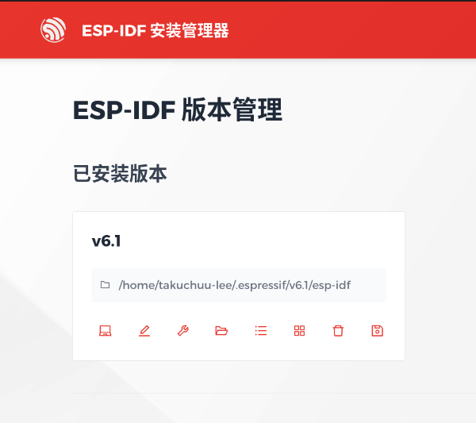

# ESP-IDF环境搭建

## 1. ESP_IDF安装

网址

https://docs.espressif.com/projects/esp-idf/en/v6.0.1/esp32h2/get-started/linux-setup.html


### 1.1安装Pre-requisites
不同的linxu发行版有不同的pre requisites，参照
https://docs.espressif.com/projects/idf-im-ui/en/latest/prerequisites.html#linux
我使用的是Ubuntu，根据文档，我需要安装
```shell
libffi-dev: Development headers for Foreign Function Interface.
libusb-1.0-0: Runtime library for USB device access.
libssl-dev: Development headers for OpenSSL (SSL/TLS cryptography).
libgcrypt20: Runtime library for cryptographic functions (QEMU dependency).
libglib2.0-0: Runtime library for GLib (QEMU dependency).
libpixman-1-0: Runtime library for pixman (QEMU dependency).
libsdl2-2.0-0: Runtime library for SDL2 (QEMU dependency).
libslirp0: Runtime library for SLIRP user-mode networking (QEMU dependency).
```
此外需要注意的是，ESP-IDF需要python3.10以上的python环境，在安装前要准备好；

### 1.2 安装EIM
有两种安装方式：
#### 1.2.1 下载安装包离线安装
https://dl.espressif.com/dl/eim/
#### 1.2.2 通过命令行安装
Debian系的linux系统可以通过apt命令进行安装
```shell
# 1. 将EIM仓库添加到APT源中
echo "deb [trusted=yes] https://dl.espressif.com/dl/eim/apt/ stable main" | sudo tee /etc/apt/sources.list.d/espressif.list

sudo apt update

# 2. 安装GUI和CLI
sudo apt install eim

# 2. 只安装CLI
sudo apt install eim-cli
```

### 1.3 通过EIM安装IDF

EIM是有GUI的软件，可以直接通过界面安装你想要的ESP-IDF版本


## 2. 使用ESP-IDF

通过EIM，可以查看当前已经安装的IDF的信息，如下图所示



正常情况下点击V6.1左下角的笔记本电脑图标，就可以使用IDF终端了；然而我的环境里，点击之后显示有错误...因此不得已，我只能在终端里继续进行配置

### 2.1 在终端里使用IDF

**安装工具链&配置环境变量**

```shell
# 进入esp-idf路径
~/.espressif/v6.1/esp-idf

# 这个路名下有一个install.sh脚本
# 执行 install.sh脚本安装MCU对应的工具，all参数可以安装所有的工具，也可以根据
# MCU的型号，只安装自己所需要的工具
install.sh all

# 执行export.sh
# 这个脚本会把工具所需要的环境变量添加到终端中
. ./export.sh

# 然后就可以使用dif.py build命令，编译项目
# ~/.espressif/v6.1/esp-idf/examples/get-started/hello_world是一个demo
# 进入这个路径然后执行
cd ~/.espressif/v6.1/esp-idf/examples/get-started/hello_world
dif.py build

```

需要注意，如果退出这个终端，下次再打开终端，dif.py build这个指令就会时效，此时要重新执行 export.sh脚本

毫无疑问这个操作很麻烦...因此：

**为配置环境变量的脚本配置一个别名**

```shell
# 给~/.bashrc中添加
alias get_idf='. $HOME/.espressif/v6.1/esp-idf/export.sh'
# 执行source使之生效
source ~/.bashrc
```

此后，如果重新打开终端，只需要执行get_idf就可以使用dif,py了