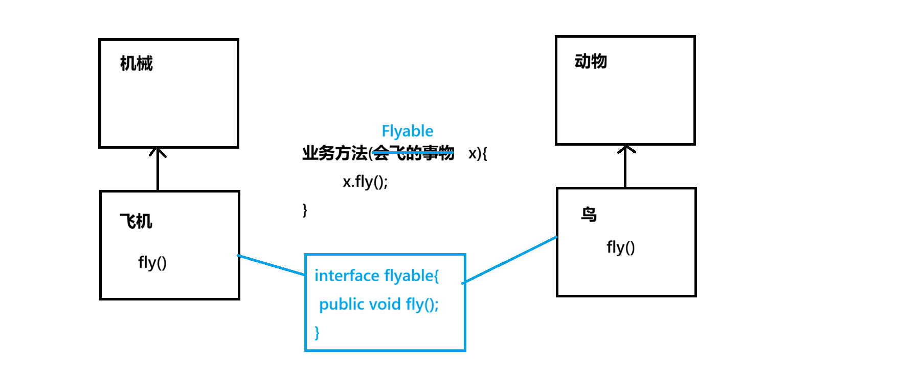
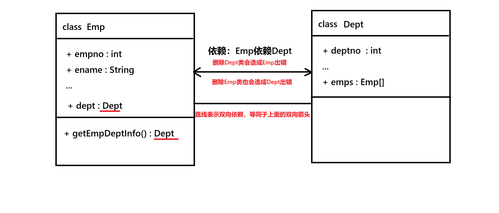
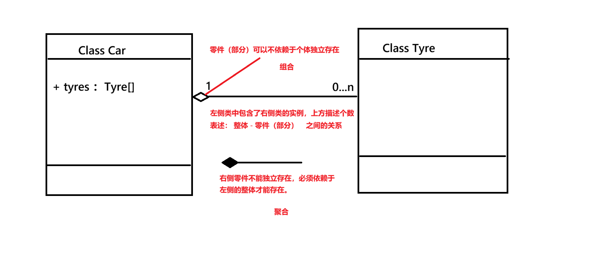

# 抽象类

为什么需要抽象类？因为在做多态设计的时候经常会面临一些“问题”

1. 父类经常是以“概念”的形式出现，本身没有实例，但是实际上程序里可以声明父类的实例，这不符合常理；
2. 父类中可以明确一些行为，但是这些行为没办法描述细节，具体的细节是依靠子类重写实现；此时父类的方法实现要怎么写？
3. 新编写子类时，不知道哪些方法必须被重写
   为了解决这些问题，要使用抽象，关键字为 abstract
   abstract 可以修饰 类 和 方法

## 抽象类

```Java
public abstract class xxx
{
    // 1. 抽象类里可以写：属性、方法、构造、抽象方法
    // 2. 抽象方法只能定义在 抽象类 和 接口 中

    // 也就是 普通类里可以声明的东西，抽象类都可以定义
    // 但抽象方法 是不能写在普通类里的
  
    // 抽象类的特征：
    // 1. 抽象类不能实例化
    // 2. 抽象方法只需要声明，不需要定义方法体； 
    // 3. 子类继承抽象类后，必须重写抽象里中所有的抽象方法，除非，子类也是一个抽象类
}
```

# 接口

接口是一种 弱化版本的抽象类 对java单继承特点进行补充，对于支持多继承的语言，接口这个东西就不是很必要了...
**接口不是类，一个类只能继承一个父类，但是可以实现多个接口**
接口的关键字是 interface 用于对行为的抽象，强调的是“行为”



fly这个行为，既不能写在机械类里，又不能写在动物类里，因为这两个类中，明显有很多子类是不会飞的；

但话又说回来了，这俩类的子类中，又有不少子类，是具备飞行能力的，因此“飞行”这个方法，又存在明显的实用价值；

java的继承是单继承，它不能像C++那样，再写一个Fly类，然后让“飞机”同时继承机械和Fly；接口是用来解决这个问题的；

```java
public class Animal
{
}
public class Machine
{
}

// 以Flyable为例
public interface Flyable
{
    // 可以定义：
    // 常量、抽象方法、lambda表达式
    // 注意：普通方法不能写在接口里
    public abstract int fly();// 其中public abstract 可以省略
  
}

public class Brid extends Animal implements Flyable
{
    public int fly()
    {
        // 具体的实现
    }
}

public class Plane extends Machine implements Flyable
{
    public int fly()
    {
        // 具体的实现
    }
}

public class Test
{
    public void doFly(Flyable f)
    {
        //调用fly
    }

    // 此时，可以声明一个
    Flyable tmpBrid = new Brid();
    Flyable tmpPlane = new Plane();
    doFly(tmpBrid);// 可以这样调用
    doFly(tmpPlane);//也可以这样调用
  
}
```

## 接口组合

把多个接口搓成一个接口

```java
public interface A
{
}

public interface B
{
}

public interface C extnds A, 噹B
{
    //接口C描述的是同时就有能力A、能力B的事务
}
```

# 类的关系的设计与描述

关系：

1. 继承 三角头表示
2. 实现 箭头虚线表示
3. 依赖 实线双箭头表示 \ 或者使用一根直线
4. 组合与聚合 使用空心菱形表示 一般发生在 整体类和局部类 之间的关系（比如：汽车类和轮胎类）

### 继承&实现

.png)

### 依赖



### 组合与聚合

比如车的类和车轱辘的类  两者会构成组合关系

如果部分不依赖个体可以存在，那么就是组合

如果部分不能独立存在，那么就是聚合


