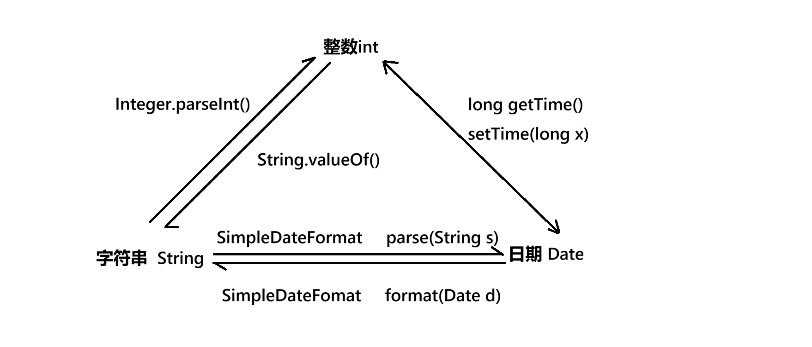

# 包装类

## 包装类是啥

在java中，有些情况下，只能使用引用类型（比如在集合类中），此时需要将各基本类型，投影为引用数据类型；

**个人理解：包装类，就是基本类型的引用类型版本（比如，Integer是int的引用类型版本）**

byte - Byte类

short - Short类

int - Integer类

long - Long类

double - Double类

char - Character类

boolean - Boolean类


```java
int x = 32; // x是基本类型
Integer y = 32;// 自动装箱
Integer y = Integer.valueOf(32); // 手动装箱

int z = y; // 自动拆箱
int z = y.intValue(); // 手动拆箱
```

**包装类的对象之间，是不能用==进行判断的，要用equals**


## 数字与字符串之间的转换

```java
// String -> int
String n = "1024";
int val = Integer.parseInt(n);
// String -> double
String d = "3.14";
double valD = Double.parseDouble(d);

// int -> String
int a = 123;
String aStr = String.valueOf(a);
// double -> String
double d = 3.14;
String dStr = String.valueOf(d);

// Date -> long
Date date = new Date();
long dateMs = date.getTime();
// long -> Date
date.setTime(dateMs);
```





## BigDecimal 和 BigInteger

用于金融业务

**一定要使用字符串构造BigDecimal**

```java
BigDecimal b1 = new BigDecimal(String.valueOf(3.14));
BigDecimal b2 = new BigDecimal(String.valueOf(2));

// 加法
b1.add(b2);
// 减法
b1.subtract(b2);
// 乘法
b1.multiply(b2);
// 除法
b1.divide(b2,1,RoundingMode.HALF_UP); // 保留1位，四舍五入（5向上进位）

```

# 集合类

集合类有两个大类：

1. Collection  --  线性
2. Map  --  非线性

## 线性集合 Collection 的继承体系

Collection以线性结构为基础实现，有两个子接口：

1. List  有序 - 可重复 （有序->有下标）（equals相等，认为重复）
2. Set  无序 - 不重复 （无序->没下标）（天然拥有去重能力）

## 线性集合子接口List

List集合有两种实现类

1. ArrayList 底层使用数组实现
2. LinkedList 底层使用链表实现

ArrayList更加常用

### 创建List

```java
List list<Integer> = new ArrayList<Integer>();
```

### 向List中添加内容 add()

```java
list.add(111); // 向尾部插入一个元素
list.add(222);
list.add(333);
list.add(444);
// [111, 222, 333, 444]
```

### 向固定位置插入内容 add()

```java
list.add(2,99);
// 结果
// [111, 222, 99, 333, 444]
```

### 修改固定位置的数据 set()

```java
list.set(2,999);
// 结果
// [111, 222, 999, 333, 444]
```

### 删除某个位置的数据 remove()

```java
list.remove(2);
// 结果
// [111, 222, 333, 444]
```

### 删除某个特定数据 remove()

```java
boolean res = list.remove(Integer.valueOf(111));
// 如果成功删除，返回true
// 如果list中没有111，则返回false
```

### 清空集合 clear()

```java
list.clear();
// 注意：清空之后，list的长度为0，但是list并不会变成null
```

### 获取某个位置的数据 get()

```java
int val = list.get(2); // list为[111,222,333,444]
// val的值为333
```

### 是否包含数据 contains()

```java
// 这里的包含是以equals相等为标准判断的
boolean res = list.contains(111);//这里有自动装箱了
```

### 判断某个数据在List中的位置

```java
int index = list.indexOf(111);
int index = list.lastIndexOf(111);
```

### 集合的长度

```java
int len = list.size();
```

### 集合判空

```java
boolean res = list.isEmpty();
```

### 集合遍历

```java
// 主要有三种

// 1. 通过集合长度遍历
for(int i = 0; i < list.size(); i++)
{
    int tmp = list.get(i);
    System.out.println(d);
}

// 2. for-each
for(int d : list)
{
    System.out.println(d);
}

// 3. 使用迭代器
Iterator<Integer> ite = list.iterator();
while(ite.hasNext())
{
    int d = ite.next();
    System.out.println(d);
}
```


## 集合工具 Collections类


## 线性集合子接口Set


## 键值对集合接口Map

