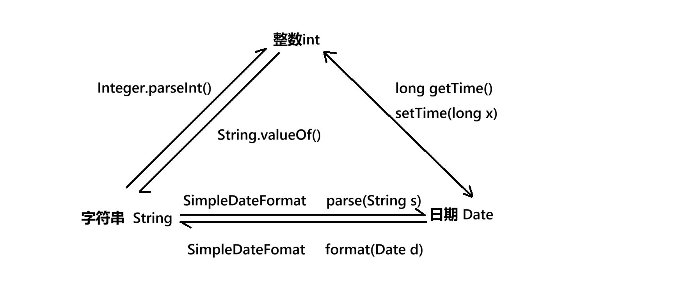

# 包装类

## 包装类是啥

在java中，有些情况下，只能使用引用类型（比如在集合类中），此时需要将各基本类型，投影为引用数据类型；

**个人理解：包装类，就是基本类型的引用类型版本（比如，Integer是int的引用类型版本）**

byte - Byte类

short - Short类

int - Integer类

long - Long类

double - Double类

char - Character类

boolean - Boolean类


```java
int x = 32; // x是基本类型
Integer y = 32;// 自动装箱
Integer y = Integer.valueOf(32); // 手动装箱

int z = y; // 自动拆箱
int z = y.intValue(); // 手动拆箱
```

**包装类的对象之间，是不能用==进行判断的，要用equals**


## 数字与字符串之间的转换

```java
// String -> int
String n = "1024";
int val = Integer.parseInt(n);
// String -> double
String d = "3.14";
double valD = Double.parseDouble(d);

// int -> String
int a = 123;
String aStr = String.valueOf(a);
// double -> String
double d = 3.14;
String dStr = String.valueOf(d);

// Date -> long
Date date = new Date();
long dateMs = date.getTime();
// long -> Date
date.setTime(dateMs);
```





## BigDecimal 和 BigInteger

用于金融业务

**一定要使用字符串构造BigDecimal**

```java
BigDecimal b1 = new BigDecimal(String.valueOf(3.14));
BigDecimal b2 = new BigDecimal(String.valueOf(2));

// 加法
b1.add(b2);
// 减法
b1.subtract(b2);
// 乘法
b1.multiply(b2);
// 除法
b1.divide(b2,1,RoundingMode.HALF_UP); // 保留1位，四舍五入（5向上进位）

```

# 集合类

集合类有两个大类：

1. Collection  --  线性
2. Map  --  非线性

## 线性集合 Collection 的继承体系

Collection以线性结构为基础实现，有两个子接口：

1. List  有序 - 可重复 （有序->有下标）（equals相等，认为重复）
2. Set  无序 - 不重复 （无序->没下标）（天然拥有去重能力）

## 线性集合子接口List

List集合有两种实现类

1. ArrayList 底层使用数组实现
2. LinkedList 底层使用链表实现

ArrayList更加常用

### 创建List

```java
List list<Integer> = new ArrayList<Integer>();
```

### 向List中添加内容 add()

```java
list.add(111); // 向尾部插入一个元素
list.add(222);
list.add(333);
list.add(444);
// [111, 222, 333, 444]
```

### 向固定位置插入内容 add()

```java
list.add(2,99);
// 结果
// [111, 222, 99, 333, 444]
```

### 修改固定位置的数据 set()

```java
list.set(2,999);
// 结果
// [111, 222, 999, 333, 444]
```

### 删除某个位置的数据 remove()

```java
list.remove(2);
// 结果
// [111, 222, 333, 444]
```

### 删除某个特定数据 remove()

```java
boolean res = list.remove(Integer.valueOf(111));
// 如果成功删除，返回true
// 如果list中没有111，则返回false
```

### 清空集合 clear()

```java
list.clear();
// 注意：清空之后，list的长度为0，但是list并不会变成null
```

### 获取某个位置的数据 get()

```java
int val = list.get(2); // list为[111,222,333,444]
// val的值为333
```

### 是否包含数据 contains()

```java
// 这里的包含是以equals相等为标准判断的
boolean res = list.contains(111);//这里有自动装箱了
```

### 判断某个数据在List中的位置

```java
int index = list.indexOf(111);
int index = list.lastIndexOf(111);
```

### 集合的长度

```java
int len = list.size();
```

### 集合判空

```java
boolean res = list.isEmpty();
```

### 集合遍历

```java
// 主要有三种

// 1. 通过集合长度遍历
for(int i = 0; i < list.size(); i++)
{
    int tmp = list.get(i);
    System.out.println(d);
}

// 2. for-each
for(int d : list)
{
    System.out.println(d);
}

// 3. 使用迭代器
Iterator<Integer> ite = list.iterator();
while(ite.hasNext())
{
    int d = ite.next();
    System.out.println(d);
}
```


## Collections工具类

### sort 排序

**注:要求泛型类型实现了Comparable接口**

```java
// 排序
List<Integer> list = new ArrayList<Integer>();
Collections.sort(list);//升序排序
```

### reverse 反转

```java
Collections.reverse(list);// 将list反转
```

### min & max 最小、最大值

```java 
Integer minVal = Collections.min(list); // 获取list中的最小值
Integer maxVal = Collections.max(list); // 获取list中的最大值
```

### shuffle 打乱

```java
Collections.shuffle(list); // 打乱集合
```


### Comparator接口

通过实现Comparator接口，可以实现两个对象之间的比较规则

```java
// 被比较的类
// 其中已经实现了Comparable接口
public class Employee implements Comparable<Employee> {

	public int empno;
	public String ename;
	public int salary;

	public Employee(){}
	public Employee(int empno, String ename, int salary){
		this.empno = empno;
		this.ename = ename;
		this.salary = salary;
	}
    
	@Override
	public String toString() {
		return "{"+empno+","+ename+","+salary+"}";
	}

	@Override
	public int compareTo(Employee o) {
		//利用员工编号empno作为默认的比较规则
		if(this.empno < o.empno){
			//this的工号小于o的工号，认为this“小于”o，返回负数
			return -1;
		}else if(this.empno > o.empno){
			//this的工号大于o的工号，认为this“大于”o，返回正数
			return 1;
		}
		return 0;
	}
}

```

```java
// 用于比较的类
public class EmployeeSalaryComparator implements Comparator<Employee> {

	@Override
	public int compare(Employee o1, Employee o2) {
		if(o1.salary > o2.salary){
			return 1;
		}else if(o1.salary < o2.salary){
			return -1;
		}
		return 0;
	}
}
```

Comparator接口中有一个compare(<> o1, <> o2)方法，这个方法的比较规则是：

当o1小于o2时： 返回负数

当o1等于o2时： 返回0

当o1大于o2时； 返回正数

```java
Collections.sort(list, comparator);  //基于comparator的规则进行排序
```

同时，也可通过匿名类使用Comparator

```java
Collections.sort(list, new Comparator<Employee>() {
        @Override
        public int compare(Employee o1, Employee o2) {
            if(o1.salary > o2.salary){
                return 1;
            }else if(o1.salary < o2.salary){
                return -1;
            }
            return 0;
        }
    });
```


## 线性集合子接口Set

常用的实现了Set接口的集合有三种：

1. HashSet 基于HashCode进行存储
2. TreeSet  以升序进行存储（使用TreeSet的前提是，类型要实现Comparable）
3. LinkedSet 基于数据的存入顺序


## 键值对集合接口Map

Map的结构是“key-value”结构

常用的实现了Map接口的集合也有三种：

1. HashMap，基于Key的hashcode进行存储
2. TreeMap 基于Key的升序顺序进行存储（使用TreeMap的前提，Key的类型要实现ComParable）
3. LinkedMap 基于数据存入顺序

### put 存入数据

```
Map<Integer, Employee> map = new HashMap<>();
map.put(1004, new Employee(1004, "DDD", 8000));
```


### put | replace 修改数据

```java
// put和replace均可以修改数据
// put修改的原理是 覆盖；如果之前没有这个key，put就相当于新增
// replace则只有在key已经存在的时候，才会替换；如果key不存在，则什么都不做
map.put(1002, new Employee(1002, "BBBB", 6500));//key不存在，会新增
map.replace(1010, new Employee(1010, "BBBBB", 6555));//key不存在，什么都不做
```

### remove 删除数据

```java
map.remove(1002);  //移除key=1002的整个键值对
```


### clear 清空集合

```java
map.clear();// 清空map，但是保留map这个实体本身。
// 也就是 clear 之后 map不会变成 null
// 只是里面的数据没有了
```


### get | getOrDefault查询数据

```java
Employee e1 = map.get(1001);  //key=1001对应的value
System.out.println(e1);
Employee e2 = map.get(1002);  //key=1002对应的value
System.out.println(e2);       //如果key不存在，得到null
Employee e3 = map.getOrDefault(1002, new Employee()); //获取某个key对应的值，如果对应的key不存在则使用默认值
System.out.println(e3);
```


### containsKey | containsValue 查询是否存在

```java
boolean b1 = map.containsKey(1002);  //某个key是否存在
boolean b2 = map.containsValue(e1);  //某个value是否存在
```


### isEmpty 集合判空

```java
boolean b3 = map.isEmpty(); // 判空
```


### size 集合长度

```java
int len = map.size();
```


### 集合的遍历

```java
// 方式1： 通过key遍历
Set<Integer> ks = map.keySet();
for(int key : ks){
    Employee value = map.get(key);
    System.out.println(key+":"+value);
}

// 方式2：通过entry遍历
Set<Entry<Integer, Employee>> es = map.entrySet();
for(Entry<Integer, Employee> e : es){
    int key = e.getKey();
    Employee value = e.getValue();
    System.out.println(key+":"+value);
}
```


