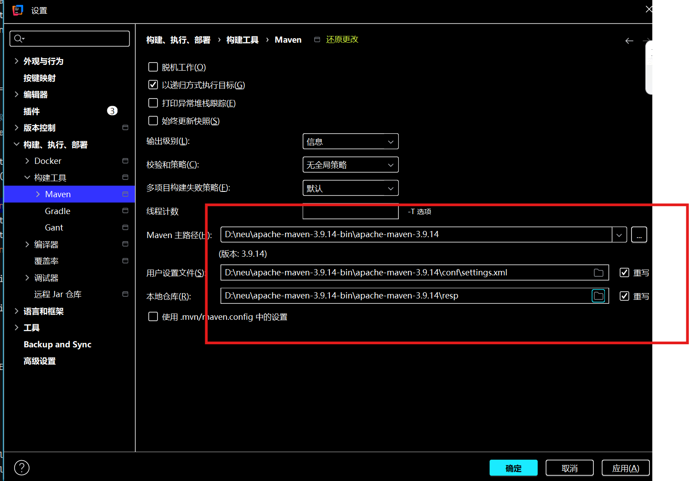
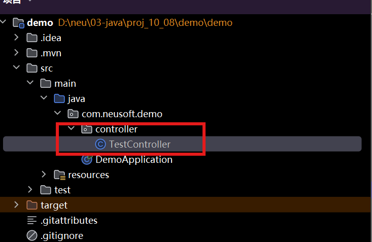

Java技术 --> MVC分层：
1. Model层
    DAO/Mapper层：操作数据库
    Service：业务逻辑/事务控制
2. Controller层
    数据流转/界面切换
3. View层
    前端技术（Vue、React）--> HTML + CSS

# SpringBoot 与 Mybatis
SpringBoot脱胎于Spring框架与SpringMVC
原始的Spring框架有大量的配置文件需要人工写，SpringBoot进一步精简了配置文件

Mybatis主要是用于简化DAO层

## SpringBoot
### IOC 控制反转
#### 正向依赖：
Service中使用了DAO，那么Service中需要有一个DAO的对象
```java
public class Service
{
    public DAO dao = new DAO();
    // 如果没有DAO，那么代码中会报两个错误
    // 1. DAO dao
    // 2. new DAO()
}
```
每次在使用Service之前，要先声明并new一个DAO对象，两者存在耦合关系
为了把两者之间的关系剥离开（解耦合），提出了控制反转

#### 控制反转：
控制反转，最重要的作用是：让Service和DAO解耦
1. 使用依赖注入
2. 使用接口

### AOP 面向切面
使用动态代理模式实现


## 创建SpringBoot项目
1. 官网 https://start.spring.io/

2. 根据需求勾选
    2.1 注意1：Package name很重要，未来的项目中，只有在Package name中写的代码才能使用SpringBoot特性
    2.2 注意2：打包方式，一般情况下开发使用jar包即可，war包一般用于真实部署

3. 根据需要添加插件

4. 点击生成，此时会下载一个压缩包，其本质是一个maven项目

5. 修改IDEA的Maven配置

    

6. 使用IDEA打开第4步中下载的压缩包里的pom.xml

## Controller层

首先建立一个controller包：



编写代码:

```java
package com.neusoft.demo.controller;
import org.springframework.web.bind.annotation.RequestMapping;
import org.springframework.web.bind.annotation.RestController;
import java.util.Date;

@RestController // 注解，表明类TestController是一个controller
public class TestController {

    @RequestMapping("/time.do") // 注解，使用time.do请求，会触发getSystemTime函数
    public Date getSystemTime()
    {
        return new Date();
    }

}
```

### 请求方式 RESTful风格

RESTful风格：使用同一个URL，根据不同的请求方式，决定对数据的处理

1. GET 查询数据
2. POST 修改数据
3. PUT 新增数据
4. DELETE 删除数据

相关注解：

RequestMapping：支持GET、POST、put、delete

GetMapping：支持GET

PostMapping：支持POST

PutMapping：支持PUT

DeleteMapping：支持DELETE

```java
// RequestMapping较为特殊，它可以手动指定接受哪几种请求
// 这样写，time.do只会接受get和post请求 
@RequestMapping(value = "/time.do", method = {RequestMethod.GET, RequestMethod.POST})
```


### 数据提交

前端的数据如何交给后端？（前端如何传参？）

#### GET的提交方式

GET请求比较特殊，GET通过URL提交数据

```http
http://localhost:8080/info.do?account=123&passwd=456
这里可见密码被明文传输了
```

服务端通过account和passwd形参获取参数值

```java
@RestController
public class Test2Controller {
	@GetMapping("/submitData.do")
	public String getData1(String account, String password){
		return "OK:"+account+":"+password;
	}
}
```


由于GET请求会把所有信息附加在URL里提交，因此要避免使用GET提交敏感数据（比如密码），此外，URL有长度限制，因此也不能使用get方法提交文件

#### POST、PUT、DELETE 的提交方式

##### 通过URL

前端：和GET一样，把参数明文放在URL里；

服务端：通过 同名参数 获取参数值


##### 通过Form URL encoded

前端：利用报文体（body）传递数据

服务端：直接在方法上设置同名参数  （少用）


##### 通过Multpart Form

前端：利用报文体(body)传递数据，允许上传文件

服务端：直接在方法上设置同名参数（文件需要另外处理）


##### 通过JSON （常用）

前端：通过JSON提交数据，利用报文体（body）

服务端：需要通过一个对象或者Map集合接受数据对象或map需要通过注解@RequestBody修饰

```java
// 声明一个VO
// VO 映射视图层（View）的数据对象
@Setter
@Getter
@AllArgsConstructor
@NoArgsConstructor
public class LoginVO {

	private String account;
	private String password;

}

// 通过LoginVO对象 或 通过Map集合
// 均可以获取json中的内容
@RestController
public class Test2Controller {
	@PutMapping("/submitData.do")
	public String getData3(@RequestBody LoginVO vo){
		return vo+":"+vo.getAccount()+":"+vo.getPassword();
	}
    
	@DeleteMapping("/submitData.do")
	public String getData4(@RequestBody Map<String, Object> map){
		return map+":"+map.get("account")+":"+map.get("password");
	}
}
```


##### URL参数化（常用）

前端：将参数作为URL的一部分

服务端：通过注解@PathVariable绑定URL参数部分

这样做的好处是，可以实现动态的请求

```java
@RestController
public class Test2Controller {
	@PostMapping("/info/{empid}")
	public String getData5(@PathVariable Integer empid){
		return "处理："+empid+"数据";
	}
}
```

针对这个例子：可以使用/info/11111请求，也可以使用/info/2222请求，empid会接住


## Service层


## Mybatis--持久化层

### 为项目引入Mybatis

1. JDBC依赖
2. Mybatis依赖
3. 数据库驱动依赖
4. 连接池

### 配置Mybatis


