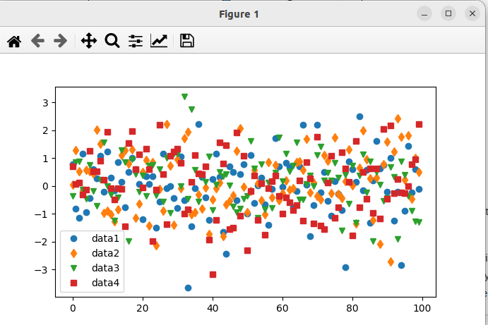

# Matplotlib Quick start guide

## Note

1. 这个文章来自于https://matplotlib.org/stable/tutorials/introductory/quick_start.html；如果有翻译的不到位而导致的无法理解的地方，请对照原文理解；
2. 对于文中出现的对象的名称，不进行翻译...毕竟代码是要用它们写的...
3. 如果代码看不懂，那么强烈建议阅读原文，原文中的每句代码都带有超链接，点击就可以直接查看reference doc
4. 尽管matplotlib和numpy是两个不同的包，但是matplotlib对numpy有着比较强的依赖，后续我应该也会翻译numpy的一些文档，但是如果您在当前文档中遇到不明白的关于numpy相关的知识请暂时自行查阅numpy文档；

## 正文

### 快速开始引导

这个教程包含一些基本的使用模式和最好的例子，以帮助您开始使用matplotlib

```python
import matplotlib as mpl
import matplotlib.pyplot as plt
import numpy as np # numpy不是matpalotlib中的部分，numpy是另一个独立的包...
```


### 一个简单的例子

matplotlib可以将你的数据画到**Figure**上，每个**Figure**都可以包含一个或者多个坐标系（**Aexs**），我们可以在这些x-y坐标体系（或者theta-r极坐标体系，再或者x-y-z三维坐标轴体系）中描述**点**；最简单的创建包含`Axes`的`Figure`的方法是`pyplot.subplots`**这个方法比较重要，具体请参照API文档https://matplotlib.org/stable/api/_as_gen/matplotlib.pyplot.subplots.html#**，我们可以使用`Axes.plot`将数据绘制到这个轴上：

```python
import matplotlib as mpl
import matplotlib.pyplot as plt
import numpy as np

fig, ax = plt.subplots()  # 创建一个包含简单的坐标轴的figure
ax.plot([1, 2, 3, 4], [1, 4, 2, 3])  # 在坐标轴上绘制一些数据

plt.show()
```


请注意，要使得`Figure`被显示，你必须调用`plt.show()`方法，`plt.show()`真正的执行效果取决于你的`backend`；更多关于Figure和backend的细节请查看https://matplotlib.org/stable/users/explain/figures.html#figure-explanation（这篇文章将在这个系列的第二篇文章予以翻译）

### Figure中的各个部分


#### Figure

`Figures`就是这整幅图片，同时`Figure`保持对所有`Axes`（坐标系），其他的“Artists”（关于这个Artists下文会专门介绍，简单的说他们是一些可见的对象的统称）组成的集合，以及子图片（subfigure）的追踪（也就是可以通过一个Figure对象访问所有在该Figure下的Axes，Artists以及subfigures）

使用pyplot创建一个新Figure的方法如下：

```python
import matplotlib as mpl
import matplotlib.pyplot as plt
import numpy as np

fig = plt.figure()  #一个空Figure，不包含Axes
fig, ax = plt.subplots()  # 一个包含一个坐标系的figure
fig, axs = plt.subplots(2, 2)  # 拥有按照2*2分布的四个坐标系的figure
# 左边有一个坐标系，右边有两个坐标系的figure
fig, axs = plt.subplot_mosaic([['left', 'right-top'],['left', 'right_bottom']])

plt.show()
```

上述四个figures如下所示（p.s 下面这四张图是我在ubuntu下运行的，在win上运行或许窗口长相不太一样...不过应该大差不差）


我们通常会在创建figure的时候同时创建坐标系（Axes），但是也可以先创建Figure随后手动添加坐标系；对于大多数**后端**，都支持figure窗口的缩放和平移；

（注：后端，原文为backend，对于matplotlib而言，我们写的python代码被称为前端，前端只负责告诉matplotlib要绘制什么样的图，我们其实并不知道图的每一个像素点是怎么被绘制出来的，真正的绘图工作是由matplotlib在背后完成的；而这真正的绘图部分被称为后端，常见的后端有Qt，macOS/Cocoa等等，这也是为什么我在前面说windows下执行同样的代码可能绘制的窗口会不太一样，这正是因为matplotlib可能会在ubuntu和windows下采用不一样的后端；我们可以手动选择后端，不过一般情况下使用默认即可）

关于Figure的更多知识请参考https://matplotlib.org/stable/users/explain/figures.html#figure-explanation

#### Axes（坐标系）

`Axes`对象是属于`Figure`对象的一个Artist（直译为艺术家...貌似在matplotlib中，会被绘制图上的东西都被称为Artist...这个词不会翻译）,`Axes`是一个允许我们将点绘制在上面的区域，通常包含两个轴对象（`Axis`），在3D情况下是三个轴；（要区分一下Axes与Axis，这两个东西不一样的哦）；

Axis提供了刻度和刻度标签用于表示Axes中的数据的尺度；

每个`Axes`对象有一个独立的标签（使用set_title()设置），一个x轴标签（set_xlabel()），一个y轴标签(set_ylable())；

`Axes`类与他的成员函数是使用面向对象接口的主要接口，并且他们中定义了大多数我们常用的绘图方法；（例如想要plot的时候我们会调用plt.plow()函数，这就是一个典型的面向对象编程的函数调用方法）

（这里额外写一点我自己的理解，到底什么是面向对象，什么是面向过程？面向对象有一个很明显的特点就是结构性很强，他会使用fruit.apple这种语法很明确的表示apple是属于fruit中的一员，而面向过程就很少使用这种结构性很强的语法，因此只要我看到这种xxx.xxxx.xxx()的语法，我一定会把它当做一门面向对象的语言，至于教科书上怎么说那我就不关心了）

#### Axis

这些对象设置了标尺（scale），极限，和总体的刻度与刻度标签；标签的位置取决于`Locator`对象；刻度标签字符串会被`Formatter`格式化（这里的格式化指的是化为小数格式或者整数格式，请勿与磁盘格式化混淆...）；联合使用Locator和Formatter可以很好的控制刻度的位置和标签；

（李某注：Axis中的scales不太好翻译...它被翻译为标尺或者标度，如果你接触过log型的坐标轴，那么可能会更容易理解这个概念；最常见的标尺是线性标尺，即坐标轴是均匀的，对数标尺就不是线性的，对数标尺的坐标轴并不均匀）

#### Artists

**李某注：matplotlib中一个完整的图包括Figure，axes，Artists；其中figure可以理解为窗体；axes是一个坐标系，相当于图中的二极目录，一个figure可以拥有多个axes；每个axes中可以包含曲线（plot），坐标轴（axis），坐标轴刻度标签（tick_label），边界柱（spines），图例（legend），文本（text），标题（title）而这些都被统称为Artists**

基本上，在Figure中，每个可视的对象都是一个Artists（甚至Figure，Axes，Axis也是）；Artist对象包含Text对象，Line2D对象，collections对象，Patch对象等；当Figure被渲染(rendered)时，所有的Artist会被画在画布上；

大多数Artist是被绑定在一个Axes上的，这些Artist不能在不同的Axes上被共享，也不能从一个Axes上被移动到另一个Axes上；

### 绘制函数的输入的各种类型

绘图函数（plotting function）希望 `numpy.array` 或者 `numpy.ma.masked_arrray` 或者 能够传递到`numpy.asarray`的数据 作为输入；与数组相类似的类，例如`pandas`数据对象和`numpy.matrix`或许**不能**如预期那样正常工作；通常的约定是在进行绘制前，将数据转化为`numpy.array`对象使用；例如，转换一个`numpy.matrix`：

```python
b = np.matrix([[1,2],[3,4]])
b_asarray = np.asarray(b)
```

绝大多数方法还将会解析可寻址对象，如`dict`，如`numpy.recarray`，如`pandas.DataFrame`；Matplotlib允许你提供数据关键字参数并且生成和传递与x，y变量对应的字符串进行绘制图像；

```python
import matplotlib as mpl
import matplotlib.pyplot as plt
import numpy as np

np.random.seed(19680801)  # 给随机数生成器设置一个seed（随机数生成器是伪随机，使用相同的种子每次产生的随机数都会一样）
data = {'a': np.arange(50),
        'c': np.random.randint(0, 50, 50),
        'd': np.random.randn(50)}
data['b'] = data['a'] + 10 * np.random.randn(50)
data['d'] = np.abs(data['d']) * 100

fig, ax = plt.subplots(figsize=(5, 2.7), layout='constrained') # 创建figure，同时设置尺寸并且设置图中的内容自动适应figure尺寸（就是layout='constrained'的作用）
ax.scatter('a', 'b', c='c', s='d', data=data) # 绘制数据，其中第一个参数是点的x坐标，第二个参数是点的y坐标，c是点的颜色，s是点的大小，data是一个字典，其中包含了前面四个参数'a' 'b' 'c' 's'
ax.set_xlabel('entry a') # 给x轴重命名
ax.set_ylabel('entry b') # 给y轴重命名

plt.show()
```


### 编码风格

#### 显式的接口与隐式的接口

正如前面所说，有两种使用Matplotlib的方法：

1. 显式的创建Figure和Axes，并且使用他们调用各种方法（也就是OOP风格）
2. 利用pyplot隐式的创建和管理Figure与Axes，并且使用pyplot中的函数绘制图像

举例：

使用OOP风格：

```python
import matplotlib as mpl
import matplotlib.pyplot as plt
import numpy as np

x = np.linspace(0, 2, 100)  # 样本数据

# 注意，即使是OOP风格，我们也还是使用了‘pyplot.figure’创建Figure.
fig, ax = plt.subplots(figsize=(5, 2.7), layout='constrained')
ax.plot(x, x, label='linear')  # 在Axes上画一条线.
ax.plot(x, x**2, label='quadratic')  # 再画一条线
ax.plot(x, x**3, label='cubic')  # 再画一条线
ax.set_xlabel('x label')  # 为x轴更名
ax.set_ylabel('y label')  # 为y轴更名.
ax.set_title("Simple Plot")  # title
ax.legend()  # 添加一个图例（figure legends翻译为图例）

plt.show()
```


使用pyplot风格：

```python
import matplotlib as mpl
import matplotlib.pyplot as plt
import numpy as np

x = np.linspace(0, 2, 100)  # Sample data.

plt.figure(figsize=(5, 2.7), layout='constrained')
plt.plot(x, x, label='linear')  # Plot some data on the (implicit) axes.
plt.plot(x, x**2, label='quadratic')  # etc.
plt.plot(x, x**3, label='cubic')
plt.xlabel('x label')
plt.ylabel('y label')
plt.title("Simple Plot")
plt.legend()

plt.show()
```

这两段代码呈现出的运行结果是一样的；

（此外，还有第三种方法，当将Matplotlib嵌入到GUI应用中，应用完全删除pyplot，甚至放弃图像绘制时；请参照相关章节获得更多信息：https://matplotlib.org/stable/gallery/user_interfaces/index.html#user-interfaces 不过说实话这种情况对一般用户应该很少见...）

Matplotlib的文档和给出的例子都是并用OOP风格与pyplot风格的；总体而言我们建议使用OOP风格，尤其是对复杂的绘图代码 和 函数与脚本属于一个更大的项目，代码可能会被重复利用时；不过pyplot风格在完成快速构建简单任务时也是很方便的；

注意：你或许会找到一些通过`from pylab import *`引用`pylab`的古早的例子，这种引用方法是我们极力不推荐的

#### 构建一个辅助函数

如果你需要对不同的数据集进行多次的绘制；或者你想要对Matplotlib的方法进行简单的包装，可以使用下面这种方法：

```python
def my_plotter(ax, data1, data2, param_dict):
    """
    A helper function to make a graph.
    """
    out = ax.plot(data1, data2, **param_dict)
    return out
```

然后就可以输入两次以进行两次绘制；

```python
data1, data2, data3, data4 = np.random.randn(4, 100)  # make 4 random data sets
fig, (ax1, ax2) = plt.subplots(1, 2, figsize=(5, 2.7))
my_plotter(ax1, data1, data2, {'marker': 'x'})
my_plotter(ax2, data3, data4, {'marker': 'o'})
```

结果如下图：


### Artists的风格（原文为Styling Artists）

大多数绘制函数有Artists选项，当调用绘制函数的时候可以访问，也可以通过Artists的设置器进行访问；在接下来展示的这个例子中，我们手动的设置色彩，线条宽度和线条风格Artists由`plot`创建；并且我们会使用`set_linestyle`去设置第二条线的艺术风格；

```python
import matplotlib as mpl
import matplotlib.pyplot as plt
import numpy as np

data1, data2 = np.random.randn(2, 100)

fig, ax = plt.subplots(figsize=(5, 2.7))
x = np.arange(len(data1))
ax.plot(x, np.cumsum(data1), color='blue', linewidth=3, linestyle='--')
l, = ax.plot(x, np.cumsum(data2), color='orange', linewidth=2)
l.set_linestyle(':')

plt.show()
```


#### 色彩

Matplotlib拥有一个非常灵活的颜色矩阵，且这个颜色矩阵被大多数Artists所接受；请阅读https://matplotlib.org/stable/tutorials/colors/colors.html获取更多有关颜色的规格列表；一些Artists将会使用多种颜色，例如对于一个`scatter`（散点图），点的边缘可能和点的内部颜色不一样：

```python
import matplotlib as mpl
import matplotlib.pyplot as plt
import numpy as np

data1, data2 = np.random.randn(2, 100)

fig, ax = plt.subplots(figsize=(5, 2.7))
ax.scatter(data1, data2, s=50, facecolor='C0', edgecolor='k')

plt.show()
```


这个例子中，点的边缘是黑色，中间是蓝色；使用了两种颜色

#### 线的宽度，线的风格，点的大小

“线宽”以标准印刷点（points，1 points = 1/27英寸，**请注意原文中points是一个单位，我们说的“点”在原文中是mark**）为单位，可以用于具有“描边线”的Artists对象；“描边线”也有“线的风格”可以供选择；详情参照：https://matplotlib.org/stable/gallery/lines_bars_and_markers/linestyles.html

 点的尺寸取决于所使用的方法；`plot`指定了以points为单位的点的大小，`plot`指定的通常是点的直径（或曰宽度）；`scatter`（散点图）指定的点的大小大约与点的可视区域成正比；matplotlib提供了一些默认的点的风格（参照https://matplotlib.org/stable/api/markers_api.html#module-matplotlib.markers），当然你也可以自己手动创建属于自己的美术风格的点（参照https://matplotlib.org/stable/gallery/lines_bars_and_markers/marker_reference.html）：

```python
import matplotlib as mpl
import matplotlib.pyplot as plt
import numpy as np

data1, data2, data3, data4 = np.random.randn(4, 100) 

fig, ax = plt.subplots(figsize=(5, 2.7))
ax.plot(data1, 'o', label='data1')
ax.plot(data2, 'd', label='data2')
ax.plot(data3, 'v', label='data3')
ax.plot(data4, 's', label='data4')
ax.legend()

plt.show()
```



### 图中的标签（labelling plots）

#### 坐标轴的标签和文本

使用`set_xlabel`，`set_ylabel`和`set_title`可以将文本显示在图上（详情请参照https://matplotlib.org/stable/tutorials/text/text_intro.html）；文本也可以直接使用`text`添加到图上；

```python
import matplotlib as mpl
import matplotlib.pyplot as plt
import numpy as np

mu, sigma = 115, 15
x = mu + sigma * np.random.randn(10000)
fig, ax = plt.subplots(figsize=(5, 2.7), layout='constrained')
# the histogram of the data
n, bins, patches = ax.hist(x, 50, density=True, facecolor='C0', alpha=0.75)

ax.set_xlabel('Length [cm]')
ax.set_ylabel('Probability')
ax.set_title('Aardvark lengths\n (not really)')
ax.text(75, .025, r'$\mu=115,\ \sigma=15$')
ax.axis([55, 175, 0, 0.03])
ax.grid(True)

plt.show()
```


所有的`text`函数都会返回一个`matplotlib.text.Text`实例，正如上面的例子一样，你可以通过传递关键字参数到文本函数中的方法去修改文本的属性；

```python
t = ax.set_xlabel("my_data",fontsize = 14, color = "red")
```

这些属性的详细信息请参照https://matplotlib.org/stable/tutorials/text/text_props.html

#### 在文本中使用数学表达式

matplotlib的任何文本表达式都支持TeX公式表达式；例如要在title上写表达式$\sigma_i=15$，你可以在dollor符包住这个公式：

```python
ax.set_title(r'$\sigma_i=15$')
```

其中'r'表示这个字符串是"raw"（即原始字符串），不要将反斜杠视为python的转义字符；matplotlib有内置的TeX解析与布局引擎，并且提供了自己的数学公式字体，详细信息请参照https://matplotlib.org/stable/tutorials/text/mathtext.html；你也可以使用LaTex来直接设计公式对应的文本，直接将LaTeX输出的文本放到你想要显示的地方-详细情况请参照https://matplotlib.org/stable/tutorials/text/usetex.html

#### 注释（Annotations，这部分讲的是如何在图中添加注释）

我们也能在一张图中注释一些点，我们可以用一个箭头指着某个点，后面可以添加说明性的文本

```python
import matplotlib as mpl
import matplotlib.pyplot as plt
import numpy as np

fig, ax = plt.subplots(figsize=(5, 2.7))

t = np.arange(0.0, 5.0, 0.01)
s = np.cos(2 * np.pi * t)
line, = ax.plot(t, s, lw=2)

ax.annotate('local max', xy=(2, 1), xytext=(3, 1.5),
            arrowprops=dict(facecolor='black', shrink=0.05))

ax.set_ylim(-2, 2)

plt.show()
```


#### 图例（legends）

我们经常需要使用`Axes.legend`来区分线或者是点

```python
import matplotlib as mpl
import matplotlib.pyplot as plt
import numpy as np

data1, data2, data3, data4 = np.random.randn(4, 100) 

fig, ax = plt.subplots(figsize=(5, 2.7))
ax.plot(np.arange(len(data1)), data1, label='data1')
ax.plot(np.arange(len(data2)), data2, label='data2')
ax.plot(np.arange(len(data3)), data3, 'd', label='data3')
ax.legend()

plt.show()
```


对比一下没有加legend的图，所谓图例是什么就知道了；


matplotlib中的图例的布局是很灵活的，并且图例也有很多美术风格可供挑选，详情参照：https://matplotlib.org/stable/tutorials/intermediate/legend_guide.html

### 坐标轴的标尺和刻度(Axis scales and ticks)

每个`Axes`都有两个（或三个）`Axis`对象代表x轴和y轴；他们可以控制Axis的scales，tick位置和tick格式；此外`Axes`可以通过附加`Axis`显示更多的轴

#### 标尺（scales）

除了线性标尺，matplotlib也支持非线性标尺，例如log-标尺；由于对数标尺的使用方法本身就很多，所以也有一些封装好的直接可以用的对数标尺的方法，例如`loglog`，`semilogx`，`semilogy`，他们都是标尺（也可以在这里看到一些别的例子：https://matplotlib.org/stable/gallery/scales/scales.html）；下面是一些标尺的例子：

```python
import matplotlib as mpl
import matplotlib.pyplot as plt
import numpy as np

data1, data2, data3, data4 = np.random.randn(4, 100) 

fig, axs = plt.subplots(1, 2, figsize=(5, 2.7), layout='constrained')
xdata = np.arange(len(data1))  # make an ordinal for this
data = 10**data1
axs[0].plot(xdata, data)

axs[1].set_yscale('log')
axs[1].plot(xdata, data)

plt.show()
```


scale sets（翻译为标尺设置）沿着轴映射数据的值；既可以对x轴进行映射（使用`set_xscale()`函数），也可以对y轴进行映射(使用`set_yscale()`函数)，他们组成了matplotlib中将数据映射到坐标系，图，或者屏幕坐标上的映射变换；详情请参照https://matplotlib.org/stable/tutorials/advanced/transforms_tutorial.html

#### 刻度定位器和格式器

每个`Axis`都有刻度定位器（tick locator）和格式器（tick formatter）用于决定刻度沿着轴的哪个方向被设置；`set_xticks`就是其中一个简单的接口：

````python
import matplotlib as mpl
import matplotlib.pyplot as plt
import numpy as np

data1, data2, data3, data4 = np.random.randn(4, 100) 
xdata = np.arange(len(data1))

fig, axs = plt.subplots(2, 1, layout='constrained')
axs[0].plot(xdata, data1)
axs[0].set_title('Automatic ticks')

axs[1].plot(xdata, data1)
axs[1].set_xticks(np.arange(0, 100, 30), ['zero', '30', 'sixty', '90'])
axs[1].set_yticks([-1.5, 0, 1.5])  # note that we don't need to specify labels
axs[1].set_title('Manual ticks')

plt.show()
````


不用的标尺有不用的定位器和格式器；对于log型标尺的实例我们要使用`LogLocator`和`LogFormatter`；详情请参照https://matplotlib.org/stable/gallery/ticks/tick-locators.html和https://matplotlib.org/stable/gallery/ticks/tick-formatters.html，这两篇文章甚至能教你如何自己创建一种标尺的定位器和格式器；

#### 绘制日期和字符串（绘制以日期/字符串为坐标轴变量的图）

matplotlib可以如同处理浮点型数据那样处理日期数据和字符串数据；日期和字符串数据会根据需要获取适当的定位器和格式器；

##### 日期：

##### （李某注：股票的K线图就是一个很好的例子...） 

```python
import matplotlib as mpl
import matplotlib.pyplot as plt
import numpy as np

fig, ax = plt.subplots(figsize=(5, 2.7), layout='constrained')
dates = np.arange(np.datetime64('2021-11-15'), np.datetime64('2021-12-25'),
                  np.timedelta64(1, 'h'))
data = np.cumsum(np.random.randn(len(dates)))
ax.plot(dates, data)
cdf = mpl.dates.ConciseDateFormatter(ax.xaxis.get_major_locator())
ax.xaxis.set_major_formatter(cdf)

plt.show()
```


更多的信息请参照日期相关的例子：（例如：https://matplotlib.org/stable/gallery/text_labels_and_annotations/date.html）

##### 字符串

对于字符串，我们使用分类绘图(详参：https://matplotlib.org/stable/gallery/lines_bars_and_markers/categorical_variables.html）

（李某注： 原文中的这段代码并不是很直观，这段代码与原文中的不同）

```python
import matplotlib as mpl
import matplotlib.pyplot as plt
import numpy as np

fig, ax = plt.subplots(figsize=(5, 2.7), layout='constrained')
categories = ['apple', 'banana', 'orange', 'cherry']

ax.bar(categories, [1,3,4,5])

plt.show()
```


这里有一个关于分类图的警告：有一些**文本文件**解析方法会返回一个字符串列表，即使这些字符串列表表示的是日期或者数字而并不是分类；如果你传递1000个字符串，matplotlib会认为你的参数是1000个类别，并且会再图上添加1000个对应的刻度；

（**李某注：上面这段话的意思是提醒用户，如果数据源是文本文件，那么一定要注意，从文本文件中读到的数字/日期有可能是字符串类型，如果直接使用字符串类型而不进行类型转换可能会出错**）

#### 额外的Axis对象

在一张图中绘制不同幅度（原文是different magnitude）的数据也许会需要一个额外的y-轴；这个额外的轴可以使用`twinx`来添加一个新的坐标系至原图的右侧来实现，这个坐标系的x轴不可见，但是y轴的可见；（李某注：说人话就是在图的右边再附加一个坐标轴）；如果需要例子请参照：https://matplotlib.org/stable/gallery/subplots_axes_and_figures/two_scales.html

类似的，你可以使用`secondary_xaxis`或者`secondary_yaxis`添加不同于主坐标系标尺的轴；https://matplotlib.org/stable/gallery/subplots_axes_and_figures/secondary_axis.html中包含一些例子

```python
import matplotlib as mpl
import matplotlib.pyplot as plt
import numpy as np

t = np.arange(0.0, 5.0, 0.01)
s = np.cos(2 * np.pi * t)

fig, (ax1, ax3) = plt.subplots(1, 2, figsize=(7, 2.7), layout='constrained')
l1, = ax1.plot(t, s)
ax2 = ax1.twinx()
l2, = ax2.plot(t, range(len(t)), 'C1')
ax2.legend([l1, l2], ['Sine (left)', 'Straight (right)'])

ax3.plot(t, s)
ax3.set_xlabel('Angle [rad]')
ax4 = ax3.secondary_xaxis('top', functions=(np.rad2deg, np.deg2rad))
ax4.set_xlabel('Angle [°]')

plt.show()
```


（李某注：可以看到额外的y轴和额外的x轴分别被附加在图的右侧和图的上侧）


### 颜色映射数据

我们时常希望在图中有第三个维度，由颜色图中的颜色表示；Matplotlib有好几种类型可以实现这个需求：

```python
import matplotlib as mpl
import matplotlib.pyplot as plt
import numpy as np

data1, data2, data3, data4 = np.random.randn(4, 100) 

X, Y = np.meshgrid(np.linspace(-3, 3, 128), np.linspace(-3, 3, 128))
Z = (1 - X/2 + X**5 + Y**3) * np.exp(-X**2 - Y**2)

fig, axs = plt.subplots(2, 2, layout='constrained')
pc = axs[0, 0].pcolormesh(X, Y, Z, vmin=-1, vmax=1, cmap='RdBu_r')
fig.colorbar(pc, ax=axs[0, 0])
axs[0, 0].set_title('pcolormesh()')

co = axs[0, 1].contourf(X, Y, Z, levels=np.linspace(-1.25, 1.25, 11))
fig.colorbar(co, ax=axs[0, 1])
axs[0, 1].set_title('contourf()')

pc = axs[1, 0].imshow(Z**2 * 100, cmap='plasma',
                          norm=mpl.colors.LogNorm(vmin=0.01, vmax=100))
fig.colorbar(pc, ax=axs[1, 0], extend='both')
axs[1, 0].set_title('imshow() with LogNorm()')

pc = axs[1, 1].scatter(data1, data2, c=data3, cmap='RdBu_r')
fig.colorbar(pc, ax=axs[1, 1], extend='both')
axs[1, 1].set_title('scatter()')

plt.show()
```


（这些图看起来就很有感觉了）

#### 颜色映射图（colormaps）

所有这些例子都来源于`ScalarMappable`对象；他们都可以将vmin和vmax之间的线性映射 设置为 cmap指定的颜色映射；matplotlib提供了很多颜色图供选择（详参https://matplotlib.org/stable/tutorials/colors/colormaps.html），当然你也可以自己创建颜色图（详参https://matplotlib.org/mpl-third-party/#colormaps-and-styles）；

#### 规范化（Normalization）

有时候我们会想要数据到颜色的非线性映射，例如上面`LogNorm`的例子中展示的那样；此时我们通过`ScalarAppable`提供规范参数 而不是使用vmin和vmax；更多关于规范化的信息参阅：https://matplotlib.org/stable/tutorials/colors/colormapnorms.html

#### 颜色条（Colorbars）

添加一个颜色条是将颜色和数据联系起来的关键；颜色条是一个Figure级别的Artists元素，并且颜色条是附着在`ScalarMappable`上的，并且时常从父轴上偷取空间（这句话的意思大概是colorbars占用的是parent Axes上的空间）；颜色条的放置可能很复杂：有关详细信息，请参https://matplotlib.org/stable/gallery/subplots_axes_and_figures/colorbar_placement.html。您还可以使用extend关键字更改颜色条的外观以在末端添加箭头，并使用shrink和aspect来控制大小。最后，颜色条将具有适用于规范的默认定位器和格式化程序。对于其他轴对象，这些可以更改。


