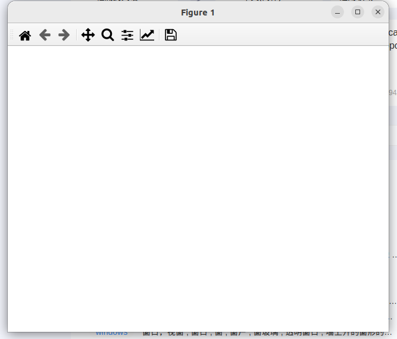

# Matplotlib Quick start guide

## Note

1. 这个文章来自于https://matplotlib.org/stable/tutorials/introductory/quick_start.html；如果有翻译的不到位而导致的无法理解的地方，请自行对照原文理解；
2. 对于文中出现的对象的名称，不进行翻译...毕竟代码是要用它们写的...

## 正文

### 快速开始引导

这个教程包含一些基本的使用模式和最好的例子，以帮助您开始使用matplotlib

```python
import matplotlib as mpl
import matplotlib.pyplot as plt
import numpy as np # numpy不是matpalotlib中的部分，numpy是另一个独立的包...
```


### 一个简单的例子

matplotlib可以将你的数据画到**Figure**上，每个**Figure**都可以包含一个或者多个坐标系（**Aexs**），我们可以在这些x-y坐标体系（或者theta-r极坐标体系，再或者x-y-z三维坐标轴体系）中描述**点**；最简单的创建包含`Axes`的`Figure`的方法是`pyplot.subplots`**这个方法比较重要，具体请参照API文档https://matplotlib.org/stable/api/_as_gen/matplotlib.pyplot.subplots.html#**，我们可以使用`Axes.plot`去绘制一些数据再这个轴上：

```python
import matplotlib as mpl
import matplotlib.pyplot as plt
import numpy as np

fig, ax = plt.subplots()  # 创建一个包含简单的坐标轴的figure
ax.plot([1, 2, 3, 4], [1, 4, 2, 3])  # 在坐标轴上绘制一些数据

plt.show()
```


请注意，要使得`Figure`被显示，你必须调用`plt.show()`方法，`plt.show()`真正的执行效果取决于你的`backend`；更多关于Figure和backend的细节请查看https://matplotlib.org/stable/users/explain/figures.html#figure-explanation（这篇文章将在这个系列的第二篇文章予以翻译）

### Figure中的各个部分


#### Figure

`Figures`就是这整幅图片，同时`Figure`保持对所有`Axes`（坐标系），其他的“Artists”组成的集合（包含figure的标题，figure集合，颜色条等等），以及子图片（subfigure）的追踪（也就是可以通过一个Figure对象访问所有在该Figure下的Axes，Artists以及subfigures）

使用pyplot创建一个新Figure的方法如下：

```python
import matplotlib as mpl
import matplotlib.pyplot as plt
import numpy as np

fig = plt.figure()  #一个空Figure，不包含Axes
fig, ax = plt.subplots()  # 一个包含一个坐标系的figure
fig, axs = plt.subplots(2, 2)  # 拥有按照2*2分布的四个坐标系的figure
# 左边有一个坐标系，右边有两个坐标系的figure
fig, axs = plt.subplot_mosaic([['left', 'right-top'],['left', 'right_bottom']])

plt.show()
```

上述四个figures如下所示（p.s 下面这四张图是我在ubuntu下运行的，在win上运行或许窗口长相不太一样...不过应该大差不差）




我们通常会在创建figure的时候同时创建坐标系（Axes），但是也可以先创建Figure随后手动添加坐标系；对于大多数**后端**，都支持figure窗口的缩放和平移；

（注：后端，原本backend，对于matplotlib而言，我们写的python代码被称为前端，前端只负责告诉matplotlib要绘制什么样的图，我们其实并不知道图的每一个像素点是怎么被绘制出来的，真正的绘图工作是由matplotlib在背后完成的；而这真正的绘图部分被称为后端，常见的后端有Qt，macOS/Cocoa等等，这也是为什么我在前面说windows下执行同样的代码可能绘制的窗口会不太一样，这正是因为matplotlib可能会在ubuntu和windows下采用不一样的后端；我们可以手动选择后端，不过一般情况下使用默认即可）

关于Figure的更多知识请参考https://matplotlib.org/stable/users/explain/figures.html#figure-explanation（这篇文章我将在第三篇进行翻译）

#### Axes

`Axes`对象是属于`Figure`对象的一个Artist（直译为艺术家...貌似在matplotlib中，会被绘制图上的东西都被称为Artist...）,`Axes`是一个允许我们将点绘制在上面的区域，通常包含两个轴对象（`Axis`），在3D情况下是三个轴；（要区分一下Axes与Axis，这两个东西不一样的哦）；

Axis提供了刻度和刻度标签用于表示Axes中的数据的尺度；

每个`Axes`对象有一个独立的标签（使用set_title()设置），一个x轴标签（set_xlabel()），一个y轴标签(set_ylable())；

`Axes`类与他的成员函数是使用面向对象接口的主要接口，并且他们中定义了大多数我们常用的绘图方法；（例如想要plot的时候我们会调用plt.plow()函数，这就是一个典型的面向对象编程的函数调用方法）

（这里额外写一点我自己的理解，到底什么是面向对象，什么是面向过程？面向对象有一个很明显的特点就是结构性很强，他会使用fruit.apple这种语法很明确的表示apple是属于fruit中的一员，而面向过程就很少使用这种结构性很强的语法，因此只要我看到这种xxx.xxxx.xxx()的语法，我一定会把它当做一门面向对象的语言，至于教科书上怎么说那我就不关心了）

#### Axis

这些对象设置了尺度，极限，和总体的刻度与刻度标签；标签的位置取决于`Locator`对象；刻度标签字符串会被`Formatter`格式化（这里的格式化指的是化为小数格式或者整数格式，请勿与磁盘格式化混淆...）；联合使用Locator和Formatter可以很好的控制刻度的位置和标签；

#### Artist

基本上，在Figure中，每个可视的对象都是一个Artist（甚至Figure，Axes，Axis也是）；Artist对象包含Text对象，Line2D对象，collections对象，Patch对象等；当Figure被渲染(rendered)时，所有的Artist会被画在画布上；

大多数Artist是被绑定在一个Axes上的，这些Artist不能在不同的Axes上被共享，也不能从一个Axes上被移动到另一个Axes上；

### 绘制函数的输入的各种类型

绘制函数（plotting function）希望`numpy.array`或者`numpy.ma.masked_arrray`或者能够传递到`numpy.asarray`的数据作为输入；与数组相类似的类，例如`pandas`数据对象和`numpy.matrix`或许不能如预期那样正常工作；通常的约定是在进行绘制前，将数据转化为`numpy.array`对象使用；例如，转换一个`numpy.matrix`：

```python
b = np.matrix([[1,2],[3,4]])
b_asarray = np.asarray(b)
```

绝大多数方法还将会解析可寻址对象，如`dict`，如`numpy.recarray`，如`pandas.DataFrame`；Matplotlib允许你提供数据关键字参数并且生成和传递与x，y变量对应的字符串进行绘制图像；

```python
import matplotlib as mpl
import matplotlib.pyplot as plt
import numpy as np

np.random.seed(19680801)  # 给随机数生成器设置一个seed（随机数生成器是伪随机，使用相同的种子每次产生的随机数都会一样）
data = {'a': np.arange(50),
        'c': np.random.randint(0, 50, 50),
        'd': np.random.randn(50)}
data['b'] = data['a'] + 10 * np.random.randn(50)
data['d'] = np.abs(data['d']) * 100

fig, ax = plt.subplots(figsize=(5, 2.7), layout='constrained') # 创建一个subfigure，同时设置尺寸并且设置图中的内容自动适应figure尺寸（也就是constrained）
ax.scatter('a', 'b', c='c', s='d', data=data) # 绘制数据，其中第一个参数是点的x坐标，第二个参数是点的y坐标，c是点的颜色，s是点的大小，data是一个字典，其中包含了前面四个参数'a' 'b' 'c' 's'
ax.set_xlabel('entry a') # 给x轴重命名
ax.set_ylabel('entry b') # 给y轴重命名

plt.show()
```


### 编码风格

#### 显式的接口与隐式的接口

正如前面所说，有两种使用Matplotlib的方法：

1. 显式的创建Figure和Axes，并且使用他们调用各种方法（也就是OOP风格）
2. 利用pyplot隐式的创建和管理Figure与Axes，并且使用pyplot中的函数绘制图像

举例：

使用OOP风格：

```python
import matplotlib as mpl
import matplotlib.pyplot as plt
import numpy as np

x = np.linspace(0, 2, 100)  # 样本数据

# 注意，即使是OOP风格，我们也还是使用了‘pyplot.figure’创建Figure.
fig, ax = plt.subplots(figsize=(5, 2.7), layout='constrained')
ax.plot(x, x, label='linear')  # 在Axes上画一条线.
ax.plot(x, x**2, label='quadratic')  # 再画一条线
ax.plot(x, x**3, label='cubic')  # 再画一条线
ax.set_xlabel('x label')  # 为x轴更名
ax.set_ylabel('y label')  # 为y轴更名.
ax.set_title("Simple Plot")  # title
ax.legend()  # 添加一个联合

plt.show()
```


使用pyplot风格：

```python
import matplotlib as mpl
import matplotlib.pyplot as plt
import numpy as np

x = np.linspace(0, 2, 100)  # Sample data.

plt.figure(figsize=(5, 2.7), layout='constrained')
plt.plot(x, x, label='linear')  # Plot some data on the (implicit) axes.
plt.plot(x, x**2, label='quadratic')  # etc.
plt.plot(x, x**3, label='cubic')
plt.xlabel('x label')
plt.ylabel('y label')
plt.title("Simple Plot")
plt.legend()

plt.show()
```

这两段代码呈现出的运行结果是一样的；

（此外，还有第三种方法，当将Matplotlib嵌入到GUI应用中，应用完全删除pyplot，甚至放弃图像绘制时；请参照相关章节获得更多信息：https://matplotlib.org/stable/gallery/user_interfaces/index.html#user-interfaces 不过说实话这种情况对一般用户应该很少见...）

Matplotlib的文档和给出的例子都是并用OOP风格与pyplot风格的；总体而言我们建议使用OOP风格，尤其是对复杂的绘制 和 函数与脚本属于一个更大的项目，代码可能会被重复利用时；不过pyplot风格在完成快速构建简单任务时也是很方便的；

注意：你或许会找到一些通过`from pylab import *`引用`pylab`的古早的例子，这种引用方法是我们极力不推荐的

#### 构建一个辅助函数

如果你需要对不同的数据集进行多次的绘制，且绘制使用同一个绘制方法；或者你想要对Matplotlib的方法进行简单的包装，可以使用下面这种方法：

```python
def my_plotter(ax, data1, data2, param_dict):
    """
    A helper function to make a graph.
    """
    out = ax.plot(data1, data2, **param_dict)
    return out
```

然后就可以输入两次以进行两次绘制；

```python
data1, data2, data3, data4 = np.random.randn(4, 100)  # make 4 random data sets
fig, (ax1, ax2) = plt.subplots(1, 2, figsize=(5, 2.7))
my_plotter(ax1, data1, data2, {'marker': 'x'})
my_plotter(ax2, data3, data4, {'marker': 'o'})
```

结果如下图：


### Styling Artists（这部分主要介绍如何修改图像的艺术风格...这两个词我确实不知道如何翻译）

大多数绘制函数有Artists选项，当调用绘制函数的时候可以访问，也可以从Artists上的设置器；在接下来展示的这个例子中，我们手动的设置色彩，线条宽度和线条风格Artists由`plot`创建；并且我们会使用`set_linestyle`去设置第二条线的艺术风格；


