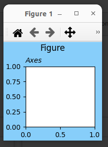
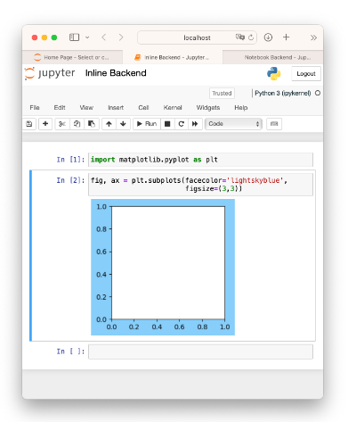
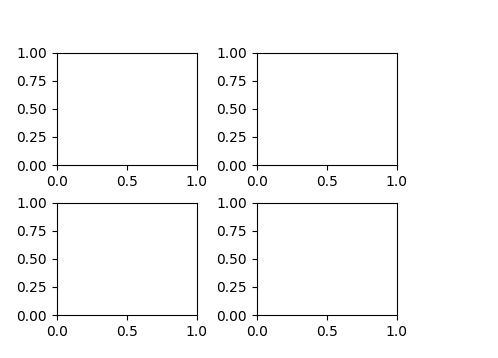
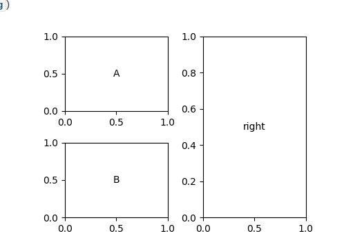
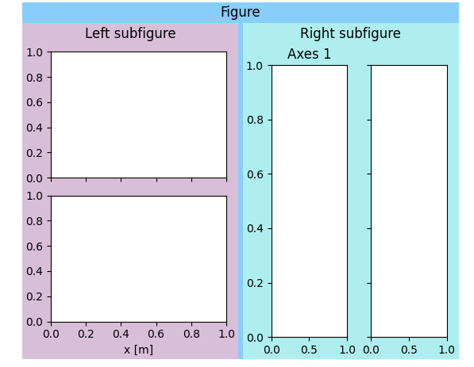
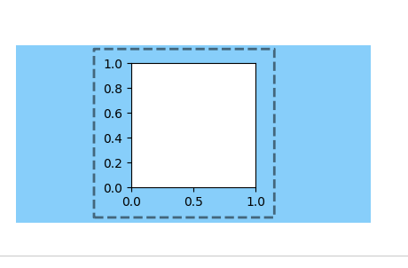

# Creating, viewing, and saving Matplotlib Figures


原文：https://matplotlib.org/stable/users/explain/figures.html#figure-explanation

(这篇文章中的代码我就不一一执行了...所有的执行结果来自于原文截图)


```python
import matplotlib as mpl
import matplotlib.pyplot as plt
import numpy as np

fig = plt.figure(figsize=(2, 2), facecolor='lightskyblue',
                 layout='constrained')
fig.suptitle('Figure')
ax = fig.add_subplot()
ax.set_title('Axes', loc='left', fontstyle='oblique', fontsize='medium')

plt.show()
```



当我们看Matplotlib的形象表达（visualization）时，我们几乎总是看到安放在`Figure`上的各种Artists；在上面这个例子中，Figure是一个蓝色的区域并且`add_subplot`在figure上添加了一个`Axes`；更多复杂的形象表达（visualization）可以将多个`Axes`（坐标系）添加到`Fiugre`；`colorbars`,`legends`,`annotations`和`Axes`本身也可以拥有多种可以添加的Artists；


### 可视化图像

在下面的讨论中，我们将讨论如何创建拥有更多细节的Figures，但是首先了解如何查看Figure对理解如何创建Figure是有帮助的；按照不同的方法使用Matplotlib，以及在不同的后端(backend)下使用matplotlib，情况是不一样的；

#### 记事本和IDEs（集成开发环境）

如果你使用一个记事本(例如Jupyter)或者一个提供记事本功能的IDE(例如PyCharm，VSCode等)，他们有一个后端，这个后端在代码被执行的时候会提供Matplotlib Figure（李某注：这个意思大概是使用这些记事本执行matplotlib的代码时，这些记事本会提供backend）；需要特别指出的是Jupyter的默认后端（`%matplotlib inline`）在默认的情况下会修剪或扩展图片的大小，如此添加到Figure中的Artists的周围会有一个紧密的框；如果你使用的是另一个后端而不是默认的`inline`后端，那么你或许将要使用ipython的“魔法”，例如`%matplotlib notebook`以使用matplotlib notebook，或者使用`%matplotlib widget`以使用ipympl 后端；



（**这里有一些理解难度，我要做一些特殊说明：%matplotlib inline被是一个魔法函数，"魔法函数"的概念并不是Python原有的，这个概念来自于IPython，而IPython是一个python shell（所谓python shell就是python交互命令行，用户可以输入python代码，然后就会得到运行结果），这里必须强调的是有一些记事本软件支持魔法函数，例如Jupyter和vscode，但是有一些记事本根本就不支持Ipython和魔法函数，例如Pycharm，因此这节介绍的内容在有些记事本上无法运行；当我们使用支持Ipython的记事本绘制图片时，最终的结果看起来像是在一篇文章中插入了一个figure**）

#### 独立的脚本和交互式使用

如果用户仅仅想在一个窗口上绘制图片（这里对应于在记事本和IDEs上显示图片），那么有好几个backend可以用来将图片显示在屏幕上，常有的有Python QT，Tk，Wxtoolkit或者MacOs原生的backend；这些后端通常是在matplotlibrc中选择的，还可以在代码的开头通过调用`matplotlib.use('QtAgg')`选择（比如这个例子就使用了QtAgg）；

```python
import matplotlib
matplotlib.use('QtAgg')

# ...后面该咋写咋写
```

当我们使用脚本或者使用python shell进行交互式运行时，直到调用`plt.show()`之前，figure是不会被绘制的；最终figure会被展示在一个新的GUI窗口，并且这个窗口一般情况下都有缩放，平移等交互式的窗口工具；默认情况下，`plt.show()`会阻止脚本或者shell的进一步交互，直到关闭Figure窗口；更多细节请参照https://matplotlib.org/stable/users/explain/interactive.html#controlling-interactive

### 创建Figures

最常见的创建Figure的方式是通过`pyplot`接口；正如API文档所示（https://matplotlib.org/stable/users/explain/api_interfaces.html#api-interfaces）pyplot接口有两个用途：第一是启动backend并且对GUI窗口保持追踪；第二个是Axes和Artists的全局状态，以确保我们可以使用简短的API绘制方法；在下面的例子中，我们使用pyplot是为了第一个目的，同时也创建了Figure对象--`fig`；当然，第二个目的也被实现了，fig被添加到了pyplot的全局状态中，我们可以使用gcf访问；

当创建Figure对象时，用户通常想要一个Axes或者一个Axes网格，因此，除了`figure()`方法外，也有一些便利的方法一同返回Figure对象和一些Axes对象；使用`pyplot.subplots()`方法可以获得一个简单的Axes网格

```python
fig, axs = plt.subplots(2, 2, figsize=(4, 3), layout='constrained')
```



使用`pyplot.subplot_mosaic()`方法可以获得更复杂的Axes网格：

```python
fig, axs = plt.subplot_mosaic([['A', 'right'], ['B', 'right']],
                              figsize=(4, 3), layout='constrained')
for ax_name in axs:
    axs[ax_name].text(0.5, 0.5, ax_name, ha='center', va='center')
```



有时候我们希望在Figure中搞一个嵌套式的布局，即两个或者更多个Axes集合不共享同一个subplot；我们可以使用`add_subfigures`或者`subfigures`在父Figure中来创建虚拟figures，详细信息参照https://matplotlib.org/stable/gallery/subplots_axes_and_figures/subfigures.html

```python
fig = plt.figure(layout='constrained', facecolor='lightskyblue')
fig.suptitle('Figure')
figL, figR = fig.subfigures(1, 2)# 从这行开始，fig中有两个subfigures，分别叫figL和figR
# 接下来的部分在分别针对figL和figR进行操作
figL.set_facecolor('thistle')
axL = figL.subplots(2, 1, sharex=True)
axL[1].set_xlabel('x [m]')
figL.suptitle('Left subfigure')
figR.set_facecolor('paleturquoise')
axR = figR.subplots(1, 2, sharey=True)
axR[0].set_title('Axes 1')
figR.suptitle('Right subfigure')
```



不使用pyplot接口实例化出来一个`Figure`对象也是有可能的；不过这种操作只有你想创建不带pyplot全局状态的自定义的GUI应用或者服务时候才是有必要的（英语的长难句就算翻译出来，读起来也好痛苦...）；这种情况通常在嵌入式系统设计中会用到，详参：https://matplotlib.org/stable/gallery/user_interfaces/index.html#user-interfaces

#### Figure选项

当我们创建figure的时候，有几个选项是可选的；Figure在屏幕上的尺寸可以使用`figsize`和`dpi`设置，`figsize`是Figure的(width,height)，单位是英寸（当然，如果你愿意，也可以用72个印刷点为单位）；dpi的含义是每英寸上渲染多少多少个像素；为了使你的Figure能够按照你要求的尺寸被显示在屏幕上，你应该将`dpi`设置为与你的图形系统的dpi所一致（也就是和显示器，显卡等设备保持一致）；请注意：现在很多图形系统使用“dpi率”来指定使用多少个**屏幕像素**去表达一个**图形像素**（也就是说有可能屏幕设备会用多个物理像素点表示一个图像像素，这在高分辨率设备上比较常见）；matplotlib将dpi率应用到传递给figure的dpi，以确保figure获得较高的解析度，因此用户最好将较低的数字传递给figure；

*facecolor*,*edgecolor*,*linewitdh*,*frameon*选项都会如他们的名字对figure产生对应的影响，如果将*frameon*设置为False，那么figure会变得透明；

最后，用户可以使用*layout*指定一个布局引擎，目前matplotlib支持“constrained”，“compressed”和“tight”布局引擎；这些引擎都可以对Figure中的Axes进行缩放布局，以防止ticklables重叠，并且会尽量使Axes整齐，并且通常情况下这些布局也会保存我们手动的一些调整；

#### 添加Artists

`FgiureBase`类有好几个方法可以往`Figure`或者`SubFigure`中添加artists；最常见的是添加不同配置的Axes（`add_axes`,`add_subplot`,`subplots`,`subplot_mosaic`）和subfigres（`subfigures`）；Colorbar（颜色条）可以被添加到Axes或者Figure级别的一组Axes中；搞一个Figure级别的legend也是可以实现的（`legend`）；除此之外Artists还包括figure维度的标签（`suptitle`,`supxlabel`,`supylabel`）和文本（`text`）；最终，低级别的Artists可以使用`add_artist`直接添加，通常要注意使用适当的转换；通常这些Artists包含`Figure.transFigure`，他在每个方向上的取值都是0-1，表示当前figure大小的分数，或者`Figure.dpi_scale_trans`，这个值是左下角到右上角的长度，单位是英寸；更多细节请参照https://matplotlib.org/stable/tutorials/advanced/transforms_tutorial.html


### 保存Figures

最后，Figures可以使用`savefig`方法保存到本地；`fig.savefig('Myfig.png',dpi=200)`将会把这个图保存到当前路径的Myfig.png文件中，当然格式是PNG格式，解析度为每英寸200个点；请注意文件名中也可包含相对路径；

matplotlib也支持很多格式，比如PNG，GIF，JEPG，TIFF和一些向量格式，例如PDF，EPS，SVG；

默认情况下，保存下来的图片的尺寸是由Figure的尺寸（单位是英寸），对于raster格式，则是由dpi决定；如果没有设置dpi，那么就使用Figure的dpi；请注意，如果图包含了被点阵化的Artists，那么即使是在像PDF这样的矢量格式中，dpi也是有意义的，指定的dpi是点阵化的对象的分辨率；

在保存图片的时候，使用*bbox_inches*参数去改变Figure的尺寸是可以的；可以手动设置，单位是英寸，不过通常的做法是使用`bbox_inches='tight'`；这个选项会进行“紧缩包裹”，根据需要修剪或者扩大的图形的尺寸，时期紧紧围绕图中的Artists，并且使用`pad_inches`所指定的衬垫（pad...这里是在是不知道怎么翻译了...），这个衬垫默认是0.1英寸的；下图中的虚线框显示了如果使用bbox_inches='tight'将保存下来的部分；



