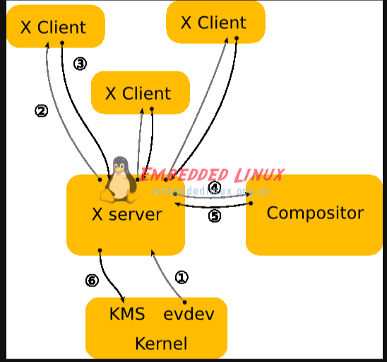

# linux的图形界面


# 常见名词的解释

众所周知linux其实是不带界面的，大佬们可以用命令行征服这个系统，但是我不是大佬，所以我还是需要图形界面的；

说实话我接触linux长达四五年的时间里，X11 GTK QT GNOME KDE XFACE这些词汇时常出现，但是我却不理解他们到底是什么；这次就尽量对这些东西构建一个大局上的认识；

## linux的图形界面

linux的图形界面并不是linux系统的一部分，图形界面只是一款运行在linux下的普通软件，这一点和windows不同，对于windows来说，界面就是系统的一部分；

unix的图形界面一直以来都是以MIT的X window system为标准的，


## X协议，X11，X11R6

X协议是一个协议，这个协议使用了C\S架构，即Xserver和Xclinet；

X11是X协议的第11个版本，而X11R6的是X11的第六个发行版...

需要注意的是不同版本的X协议是无法相互通信的；


## X server和X client

X server的任务是接受来自键盘，鼠标等设备的输入，将输入传递给X client供X client使用；

X client也可以将自己的需求发送给X server ，X server将会负责图形界面的绘制和显示；

最上层的X client提供了一个完整的GUI负责与用户交互；

X协议负责两者之间的通信；


## Xorg，Xfree86

X协议只是协议，协议只是一种规定，而协议如果没有实现只是一纸空文；

Xorg和Xfree是对X协议的实现；现在的linux一般都用Xorg了；

Xorg是一个Xserver；


## Xlib，xcb，QT，GTK +和 GNOME KDE

xlib是对x协议的封装，xlib是一个库；从原理上说单独使用xlib就可以开发出xclient；

xcb也是对X协议的封装，它是xlib的替代品，相对于xlib，xcb的使用难度更低一点；

QT是以xlib为基础的一套工具，你可以理解为QT对xlib又进行了一次封装，相比于直接使用xlib，使用QT可以大幅减轻开发难度，KDE就是基于QT开发的一套桌面环境；

GTK+包含两部分：GTK和GDK；GDK也是对Xlib的封装（GDK的定位与Qt相同），而GTK则提供了一些控件和对象模型；GNOME是GTK+开发的一套桌面环境；

QT并不是GPL协议，这也是kde和gnome大战的起因；


## QT与GTK之间的战争

在unix界，图形界面的标准一直都是MIT的X window system；但是在商业应用上，早年间有两个派别：一个是当年的巨头sun公司（openlook），一个是现在仍是巨头的IBM公司（motif）；这两者最后胜出的是IBM的motif；后来sun和IBM又相互妥协，推出了CDE作为一个标准图形界面；当年motif的授权价格非常贵，微软的windows发展也如日中天，linux也在寻找一个不要钱的图形界面标准；

96年，有一个德国人发起了KDE项目；这个项目针对的是CDE的；KDE本身使用GPL协议，但是KDE的底层是QT，QT在当时已经在unix下自由发布了，但是QT并不是GPL协议；因此有一部分人认为KDE并不能算作自由软件；于是这部分人兵分两路，其中一部分决定重写一个库代替QT（harmonny计划），另一部分决定干脆重写一个GNOME（GNU network object environment ）代替KDE；

当年的redhat公司是linux界的老大，它对KDE/QT的版权问题感到担心，因此红帽非常支持GNOME的发展；为了GNOME的发展红帽出钱出力；

于是KDE和GNOME之间的战争又打响了；KDE由于QT的版权问题被一部分人诟病，并且KDE/QT使用C++，明显开发难度高于使用C语言的GNOME/GTK；但是KDE毕竟是先行者，先发优势很大，KDE的稳定性很高；而GNOME虽然当年的稳定性很差，但是吸引了很多自由软件开发者，GNOME大有赶上KDE的趋势；

在2000年左右，这场战争进入白热化阶段；一批Apple出身的工程师成立了自己的公司为GNOME设计界面；KDE2.0也发布了，这个版本的KDE继承了Koffice，Kdevelop等大量的软件，甚至集成了一个当时足以与微软的IE浏览器相抗衡的网络浏览器Kounqueror；另一边Sun，RedHat等一票公司成立了GNOME基金会，Sun宣布将自己的Star office集成到GNOME里；目前为止GNOME已经从当年稳定性奇差的项目进化到可以与KDE一战的项目了；最终，同年10月，QT的公司Trolltech将QT的自由版本发布为GPL宣言，KDE/QT的版权问题最终得到了解决，同时还发布了嵌入式QT，时至今日（2023年）嵌入式QT仍旧是嵌入式开发中的重要工具；

这场战争在2023的今天仍在继续..不过说实话激烈程度已经没有那么高了；GNOME由于根正苗红的自由软件，谁用都免费，也不存在被收费的可能，因此大公司们为了规避可能存在的风险会倾向于选择GNOME；而KDE的质量和开发效率都比GNOME高，并且在嵌入式领域有绝对的优势，不过QT毕竟只有free edition是GPL协议，如果你在windows或者unix上使用Qt仍旧需要购买；

# X11 programming manual

https://tronche.com/gui/x/xlib/

这里只做简单的翻译的学习

**请注意：这篇翻译中，所有的dispaly，screen，window不翻译，windows表示window的复数，不是指微软的windows**

### 第一章：介绍xlib

X windows system是由MIT设计的network-transparent window system；X display server可以运行在一个单色/彩色显示硬件上；server可以将用户的输入分配给位于同一台机器或者网络上其他地方点的各种client，并且接受这些client的输出请求；client和server可以在同一台机器上，也可以在不同的机器上，这点可能会引起我们的困惑，但是这不是重点；

#### 1.1 x window system介绍

本书中的一些词条是X所独有的，其他的通用的词条在其他window system中可能与X中有不同的含义，关于这点请参考词汇表；

X window system支持一个或多个包含重叠的windows或者subwindows的screen；screen是一个物理意义上的监视器，他可以是彩色的，也可以是单色的，灰阶的；每个display或者workstation可以拥有多个screen；一个X server可以为多个screen提供服务；**由一个键盘，一个鼠标，一个或多个screen组成的集合我们称之为"display"；**

在X server中，所有的windows都被安排在严格层级结构中；每个层级结构的顶端是是一个root window，root window可以覆盖一个display中全部的screens；每个root windows都部分地或者完整地被 child window所覆盖；除开root window之外的全部window都有parents；通常情况下每个应用软件都至少有一个window；child window也可以有自己的child window；按照这种方式，一个应用软件可以在任何一个screen上创建任意深度的树形结构；X则为windows提供图形，文字，像素操作；

child window的尺寸是可以比parent大的；也就是说child的一部分或者整个child是可以超过其parents的边界的，但是其输出却由其parent进行裁剪；如果一个window的几个child有相互重叠的部分，其中一个被认为是高（top/raised）于其他的child，那么这个高的child会遮盖其他的child；如果输出到了被其他窗口遮盖的地方，那么这个窗口会被window system所抑制，除非这个窗口本身有backing store；如果窗口被第二个窗口所遮盖，那么第二个窗口仅遮挡第一个窗口和第二个窗口共同的祖先；

一个window可以没有边框，也可以有多个像素宽的边框，这个边框也可以是你喜欢的颜色或者样式；window通常（但不是一定）是有背景的，当window未被覆盖时，这个背景就会被绘制；child会遮盖他们的parents，parent中的图形操作也时常被child所裁切；

每个window和pixmap都有独立的坐标系统；这个坐标系统的原点位于屏幕的左上角，有xy两个轴；坐标是以像素为单位的整数，并且是与像素中心重合的；对于window而言，原点位于左上角内侧的边界内；

X并不保证能够保存windows中的内容；如果一个windows的一部分或者整个windows被隐藏，并且被带回到screen时，windows的内容是可能会丢失的；然后，server会向client发送一个Expose事件以提醒这个窗口一部分或者整个要被重绘；程序必须按照要求准备好window的内容；

X也提供了一个off-screen存储图像对象的方法，叫做pixmap，深度为1的pximap有时候也会被叫做bitmaps；pixmap在多数图形函数中都可以被与window交替使用，并且用于各种图形操作以定义图案或者标题；windows和pixmap被合称为drawables（可绘制对象）；

Xlib中的大多数函数只是向输出buffer中添加请求；这些请求随后会在X server上异步执行；返回 存储在server中的值的 函数 在没有收到明确的答复或者发生错误之前，是不会返回的（阻塞的）；你可以提供一个错误处理handle，当错误发生的时候以供调用；

如果一个client不希望异步执行请求，那么它可以在请求后面调用一下XSync()，这个函数会阻塞，直到所有先前被缓存的异步事件被发送和处理；这有一个比较重要的应用，xlib的输出buffer总是通过调用从服务器返回值挥着等待输入的任何函数来刷新；

xlib中的许多函数会返回一个整数的资源ID，这个ID允许你调用存储在server中的对象；这些对象可以是windw，font，pixmap，colormap，cursor，GContext，这些家伙被定义在<X11/x.h>中；这些资源都是被请求创建的，并且当链接被关闭的时候会被请求所释放（销毁）；这些资源中大多数资源是可以在不同的应用之间被共享的，实际上，windows是被window manager显示的管理的；fonts和cursor天生就被多个screens所分享；font被按照需求所加载或者卸载，同时被数个client分享；font经常被缓存在server中；xlib没有提供应用之间的图像上下文分享功能；

client程序是被事件驱动的；事件可能是请求的副产物（例如：重新生成windows的Expose事件）；也可以是完全异步的（例如通过键盘）；client被要求悉知事件，因为其他的应用也可以给你的程序发送事件，所以程序必须准备处理所有类型的事件；

输入事件（例如：鼠标移动或者一个键被按下）从服务器异步到达，并在队列中等待，直到他们被显式的调用（例如XNextEvent()或者XWindowEvent()）；此外，一些库函数（例如XRaiseWindow()）生成Expose和ConfigureRequest事件，这些事件也会异步到达，但是client或许会希望 在调用一个 可以让服务器生成事件的函数之后 通过调用XSync() 显式的等待他们；

#### 1.2 Error

有一些函数返回**Status**，它是一个整数，用来指示错误；如果函数返回一个零状态，则表示返回参数尚未被更新；由于C语言不支持返回多个值，因此很多要通过将结果写入client-passed存储来返回结果；默认情况下，错误不是通过标准库处理就是通过你提供的方法处理；返回字符串指针的函数，如果字符串不存在，就会返回NULL指针；

X server在检测到协议错误的时候会报告这些错误；如果一个请求会产生多个错误，那么server会报告这些错误中的任何一个；

由于Xlib通常不会立即将请求送入server（通常会缓存它们），错误的报告或许会比错误的发生会延迟很多；处于debug的考虑，xlib提供了强制同步机制；当同步机制被打开的时候，错误就能被及时的汇报；

*（11.8.1 enabling or disable synchronization：在进行调试时，让xlib同步运行会方便很多，这样在错误出现的时候会及时报告错误；使用`XSynchronize()`函数启用或禁用同步；但是需要注意的是当你启用同步的时候，图像的绘制速度将会减慢至少30倍甚至更多；在posix标准系统下，有一个全局变量_Xdebug，如果在debugger下运行程序前将这个变量设为非零，将会强制同步库行为；完成这些工作后，所有生成协议请求的函数会调用所谓的after function，`XSetAfterFunction()`设置会被调用的函数）*

当xlib检测到错误的时候，他会调用你的程序提供的错误处理句柄；如果你没有提供错误处理，这个错误会被打印，并且你的程序会被终止；

#### 1.3 标准头文件

以下是Xlib的标准库

- `X11/Xlib.h`

  这是Xlib最主要的头文件，所有主要的xlib符号被声明在这个文件里；这个文件中还包含了一个预处理器符号`XlibSpecificationRelease` 

  

- `X11/X.h`

  这个文件中声明了应用软件所需要的X 协议的类型和常量；它是被X11/Xlib.h所包含的，因此不应该直接引用这个头文件

  

- `X11/Xcms.h`

  这个文件中包含了“颜色管理函数（https://tronche.com/gui/x/xlib/color/）”中描述的许多颜色管理功能的符号；前缀为'Xcms'的所有函数，类型，符号，加上颜色转换上下文宏，都被定义在这个文件里；在引用这个文件之前必须引用Xlib.h 

  

- `X11/Xutil.h`

  这个文件中定义了很多用于inter-client(网络client)交互和应用软件实用的函数，详情参照 "[Inter-Client Communication Functions](https://tronche.com/gui/x/xlib/ICC/)" 和 "[Application Utility Functions](https://tronche.com/gui/x/xlib/utilities/)". 在包含这个头文件前必须先包含`X11/Xlib.h`

  

- `X11/Xresource.h`

  这个文件定义了用于资源管理器设施的全部函数，类型和符号；详情参见"[Resource Manager Functions](https://tronche.com/gui/x/xlib/resource-manager/)". 引用前必须引用`X11/Xlib.h`

  

- `X11/Xatom.h`

  这个文件声明了全部的预定义atom，这些atom前缀为'XA_' 

  

- `X11/cursorfont.h`

  这个文件声明了标准光标字体的光标符号，这些符号被列出在[X Font Cursors](https://tronche.com/gui/x/xlib/appendix/b/). 所有这些符号的前缀都为"XC_".

  

- `X11/keysymdef.h`

  这个文件声明了全部的标准KeySym值，这些值是以"XK_"为前缀的符号，这些KeySyms被按组排列，并且有一个预处理器符号控制每个组的内容；在文件中，预处理器符号必须先于这些内容被声明，以让预处理器符号获取这些值 . 这些预处理器符号是XK_MISCELLANY, XK_LATIN1, XK_LATIN2, XK_LATIN3, XK_LATIN4, XK_KATAKANA, XK_ARABIC, XK_CYRILLIC, XK_GREEK, XK_TECHNICAL, XK_SPECIAL, XK_PUBLISHING, XK_APL, XK_HEBREW, XK_THAI, and XK_KOREAN.

  

- `X11/keysym.h`

  这个文件定义了预处理器符号XK_MISCELLANY, XK_LATIN1, XK_LATIN2, XK_LATIN3, XK_LATIN4, 和 XK_GREEK，也包含了`X11/keysymdef.h`.

  

- `X11/Xlibint.h`

  这个文件中定义了扩展所用到的全部函数，类型和符号，关于扩展，详情参照 [Extensions](https://tronche.com/gui/x/xlib/appendix/c/). 这个文件自动的被包含在`X11/Xlib.h`

  

- `X11/Xproto.h`

  这个文件定义了基础X协议的类型和符号，用于实现扩展；这个文件被自动的包含在`X11/Xlibint.h`里，因此应用程序和扩展程序里不应当直接使用这个文件；

  

- `X11/Xprotostr.h`

  This file declares types and symbols for the basic X protocol, for use in implementing extensions. It is included automatically from **`X11/Xproto.h`**, so application and extension code should never need to reference this file directly.同上

  

- **`X11/X10.h`**

  这个文件里定义了X10所兼容的功能所用到的全部函数，类型，符号；[Compatibility Functions](https://tronche.com/gui/x/xlib/appendix/d/).

#### 1.4 Generic Values and Types

下面这些符号有Xlib所定义，并且在这个手册中贯穿始终；

1. xlib定义了**Bool**和布尔类型的值 **True** **False**
2. **None**是资源ID和atom通用的NULL
3. 类型**XID**用作通用资源ID
4. 类型XPointer被定义为char *，用作指向数据的不透明指针

#### 1.5 名称和参数的约定

Xlib follows a number of conventions for the naming and syntax of the functions. Given that you remember what information the function requires, these conventions are intended to make the syntax of the functions more predictable.

The major naming conventions are:

- 

- To differentiate the X symbols from the other symbols, the library uses mixed case for external symbols. It leaves lowercase for variables and all uppercase for user macros, as per existing convention.

  

- All Xlib functions begin with a capital X.

  

- The beginnings of all function names and symbols are capitalized.

  

- All user-visible data structures begin with a capital X. More generally, anything that a user might dereference begins with a capital X.

  

- Macros and other symbols do not begin with a capital X. To distinguish them from all user symbols, each word in the macro is capitalized.

  

- All elements of or variables in a data structure are in lowercase. Compound words, where needed, are constructed with underscores (_).

  

- The display argument, where used, is always first in the argument list.

  

- All resource objects, where used, occur at the beginning of the argument list immediately after the display argument.

  

- When a graphics context is present together with another type of resource (most commonly, a drawable), the graphics context occurs in the argument list after the other resource. Drawables outrank all other resources.

  

- Source arguments always precede the destination arguments in the argument list.

  

- The x argument always precedes the y argument in the argument list.

  

- The width argument always precedes the height argument in the argument list.

  

- Where the x, y, width, and height arguments are used together, the x and y arguments always precede the width and height arguments.

  

- Where a mask is accompanied with a structure, the mask always precedes the pointer to the structure in the argument list.

#### 1.6 编程注意事项

主要的编程注意事项如下：

1. 在X中坐标和尺寸实际上是一个16位的量；这么做是为了在满足给定性能的情况下尽可能减少带宽（X是cs架构，带宽会影响性能）；接口中坐标经常被声明为int型；超过16位的值将被截断；长和宽被声明为无符号量；
2. 来自不同制造商的键盘可能是最大的变数；如果你想要你的程序有较高的可移植性，那么你应该在针对键盘的处理上多加小心
3. 用户应该对他们的显示屏拥有控制权，所以当你编写程序的时候尽量去控制window而不是去控制整个screen；你在顶级窗口中最好只控制你自己的应用；更多信息请参照"[Inter-Client Communication Functions](https://tronche.com/gui/x/xlib/ICC/)和 [*Inter-Client Communication Conventions Manual*](https://tronche.com/gui/x/icccm/).


#### 1.8 格式约定

这章是介绍接口文档的格式的，不翻译了；


### 第二章：Display函数

在你的程序可以使用一个display之前，你必须同Xserver建立链接；一旦你建立了链接，你就可以使用本章中讨论的xlib的宏和函数去返回关于display的信息；

#### 2.1 打开（链接）display

打开一个控制着display的Xserver，使用**XOpenDisplay()**

##### Syntax

```
Display *XOpenDisplay(display_name)
      char *display_name;
```

##### Arguments

| **display_name** | 指定一个display名称，这个名称将用于确定哪个display和通信域会被使用；在POSIX标准的系统下，这个值是NULL，因为这个值默认的和DISPLAY系统变量一样 |
| ---------------- | ------------------------------------------------------------ |

##### Description

display名称的编码和解释依赖于实现； Host Portable Character Encoding中的字符串是可以的；对于其他字符的支持则取决于实现；对于POSIX标准的系统，dispaly名称或者DISPLAY环境变量可以是以下这个格式：

```
	hostname:number.screen_number
```


| **hostname**      | 指定display物理链接的主机的名称，后面可以跟一个:或者两个::   |
| ----------------- | ------------------------------------------------------------ |
| **number**        | 指明主机所拥有的display server的编号，你可以在这一项后面随意的添加一个句点(.)；一个cpu可以拥有多个display，如果有多个，那么第一个display的编号是0； |
| **screen_number** | 指明会被用到的screen编号，一个Xserver可以控制多个screen；screen_number是一个内部变量，C语言可以使用 **[DefaultScreen()](https://tronche.com/gui/x/xlib/display/display-macros.html#DefaultScreen)** 访问，其他的语言可以使用 **[XDefaultScreen()](https://tronche.com/gui/x/xlib/display/display-macros.html#DefaultScreen)** 访问，参照 "[Display Macros](https://tronche.com/gui/x/xlib/display/information.html#display)"). |


例如：下面这个例子表明要使用一叫dual-headed的机器的第0个display的第一个screen

> dual-headed:0.1

**XOpenDisplay()** 函数返回一个 [Display](https://tronche.com/gui/x/xlib/display/opening.html#Display) 结构体，这个结构体用作和Xserver的链接，并且包含了这个Xserver的全部信息； **XOpenDisplay()** 使用TCP或DEC网路协议链接你的应用和Xserver，也可能用一些本地网络进程协议链接Xserver和应用； 如果hostname和display编号之间使用一个分号隔离，那么就会使用TCP协议；如果没有分隔，那么xlib会使用它认为最快速的协议；如果使用两个分号分隔，那么将会使用DECnet；一个Xserver能够同时支持任何一种传输机制或者全部的机制；特殊的Xlib实现可以支持更多种传输机制；

如果顺利的话， **XOpenDisplay()** 将会返回一个指向**Display**结构体的指针；这个结构体被定义在**X11/Xlib.h**. 如果**XOpenDisplay()** 执行的不顺利，那么它就会返回一个NULL，如果XOpenDisplay()** 被成功调用，那么这个dispaly下面的全部screen都可以被这个client使用；指定的screen的编号可以使用**[DefaultScreen()](https://tronche.com/gui/x/xlib/display/display-macros.html#DefaultScreen)**返回 （或者使用 **[XDefaultScreen()](https://tronche.com/gui/x/xlib/display/display-macros.html#DefaultScreen)** 函数). 你可以使用information宏指令或者函数去访问Display或者 [Screen](https://tronche.com/gui/x/xlib/display/display-macros.html) 结构体的内容.更多关于使用宏指令和函数获取Dispaly结构体信息的知识请参照 [Display Macros](https://tronche.com/gui/x/xlib/display/information.html#display).

Xserver或许实现了多种不同的接入机制(see "[Controlling Host Access](https://tronche.com/gui/x/xlib/window-and-session-manager/controlling-host-access/)").


#### 2.2 获取关于display，image format，screen的信息

xlib提供了诸多实用的宏和对应的函数来从Display结构体中返回信息，宏是给C语言用的，对应的函数则是给其他函数用的；

同时， 下面会提到 **[XDisplayWidth()](https://tronche.com/gui/x/xlib/display/image-format-macros.html#DisplayWidth)**, **[XDisplayHeight()](https://tronche.com/gui/x/xlib/display/image-format-macros.html#DisplayHeight)**, **[XDisplayCells()](https://tronche.com/gui/x/xlib/display/display-macros.html#DisplayCells)**, **[XDisplayPlanes()](https://tronche.com/gui/x/xlib/display/display-macros.html#DisplayPlanes)**, **[XDisplayWidthMM()](https://tronche.com/gui/x/xlib/display/image-format-macros.html#DisplayWidthMM)**, 和 **[XDisplayHeightMM()](https://tronche.com/gui/x/xlib/display/image-format-macros.html#DisplayHeightMM)** 函数，这些函数真的应该被命名为ScreenXXX而不是DisplayXXX，这是我们的过错，对造成的困扰我们表示歉意；

##### 2.2.1 Display Macros

应用软件不应该直接修改Display或者Screen结构体中的内容，这些成员应该是只读的，尽管他们可能会因为一些操作被改变；

下述的被列出的C语言宏，以及对应的其他语言的函数是等价的，他们都可以返回数据

###### AllPlanes

```c
AllPlanes

unsigned long XAllPlanes() 
```

Both return a value with all bits set to 1 suitable for use in a plane argument to a procedure.

###### BlackPixel, WhitePixel

Both **BlackPixel()** and **WhitePixel()** can be used in implementing a monochrome application. These pixel values are for permanently allocated entries in the default colormap. The actual RGB (red, green, and blue) values are settable on some screens and, in any case, may not actually be black or white. The names are intended to convey the expected relative intensity of the colors.

```c
BlackPixel(display, screen_number)

unsigned long XBlackPixel(display, screen_number)
      Display *display;
      int screen_number;
```

| **display**       | Specifies the connection to the X server.                   |
| ----------------- | ----------------------------------------------------------- |
| **screen_number** | Specifies the appropriate screen number on the host server. |

Both return the black pixel value for the specified screen.

```c
WhitePixel(display, screen_number)

unsigned long XWhitePixel(display, screen_number)
      Display *display;
      int screen_number;
```

| **display**       | Specifies the connection to the X server.                   |
| ----------------- | ----------------------------------------------------------- |
| **screen_number** | Specifies the appropriate screen number on the host server. |

Both return the white pixel value for the specified screen.

###### ConnectionNumber

```c
ConnectionNumber(display) 
int XConnectionNumber(display)
    Display *display; 
```

| **display** | Specifies the connection to the X server. |
| ----------- | ----------------------------------------- |
|             |                                           |

Both return a connection number for the specified display. On a POSIX-conformant system, this is the file descriptor of the connection.DefaultColormap```DefaultColormap(**display**, **screen_number**) Colormap XDefaultColormap(**display**, **screen_number**)      Display ***display**;      int **screen_number**; `

| **display**       | Specifies the connection to the X server.                   |
| ----------------- | ----------------------------------------------------------- |
| **screen_number** | Specifies the appropriate screen number on the host server. |

Both return the default colormap ID for allocation on the specified screen. Most routine allocations of color should be made out of this colormap.

###### DefaultDepth

```c
DefaultDepth(display, screen_number) 
int XDefaultDepth(display, screen_number)      
    Display *display;      
	int screen_number; 
```

| **display**       | Specifies the connection to the X server.                   |
| ----------------- | ----------------------------------------------------------- |
| **screen_number** | Specifies the appropriate screen number on the host server. |

Both return the depth (number of planes) of the default root window for the specified screen. Other depths may also be supported on this screen (see .PN XMatchVisualInfo ).

###### XListDepths

To determine the number of depths that are available on a given screen, use **XListDepths()**.

```c
int *XListDepths(display, screen_number, count_return)      
    Display *display;      
	int screen_number;      
	int *count_return; 
```


| **display**       | Specifies the connection to the X server.                   |
| ----------------- | ----------------------------------------------------------- |
| **screen_number** | Specifies the appropriate screen number on the host server. |
| **count_return**  | Returns the number of depths                                |

The **XListDepths()** function returns the array of depths that are available on the specified screen. If the specified **screen_number** is valid and sufficient memory for the array can be allocated, **XListDepths()** sets **count_return** to the number of available depths. Otherwise, it does not set count_return and returns NULL. To release the memory allocated for the array of depths, use **[XFree()](https://tronche.com/gui/x/xlib/display/XFree.html)**.

###### DefaultGC

```c
DefaultGC(display, screen_number) 
GC XDefaultGC(display, screen_number)      
    Display *display;      
	int screen_number; 
```

| **display**       | Specifies the connection to the X server.                   |
| ----------------- | ----------------------------------------------------------- |
| **screen_number** | Specifies the appropriate screen number on the host server. |

Both return the default graphics context for the root window of the specified screen. This GC is created for the convenience of simple applications and contains the default GC components with the foreground and background pixel values initialized to the black and white pixels for the screen, respectively. You can modify its contents freely because it is not used in any Xlib function. This GC should never be freed.

###### DefaultRootWindow

```c
DefaultRootWindow(display) 
Window XDefaultRootWindow(display)      
    Display *display; 
```

| **display** | Specifies the connection to the X server. |
| ----------- | ----------------------------------------- |
|             |                                           |

Both return the root window for the default screen.

###### DefaultScreenOfDisplay

```c
DefaultScreenOfDisplay(display) 
Screen *XDefaultScreenOfDisplay(display)      
    Display *display; 
```

| **display** | Specifies the connection to the X server. |
| ----------- | ----------------------------------------- |
|             |                                           |

Both return a pointer to the default screen.

###### ScreensOfDisplay

```c
ScreenOfDisplay(display, screen_number) 
Screen *XScreenOfDisplay(display, screen_number)      
    Display *display;      
	int screen_number; 
```

| **display**       | Specifies the connection to the X server.                   |
| ----------------- | ----------------------------------------------------------- |
| **screen_number** | Specifies the appropriate screen number on the host server. |

Both return a pointer to the indicated screen.

###### DefaultScreen

```c
DefaultScreen(display) 
int XDefaultScreen(display)      
    Display *display; 
```

| **display** | Specifies the connection to the X server. |
| ----------- | ----------------------------------------- |
|             |                                           |

Both return the default screen number referenced by the **[XOpenDisplay()](https://tronche.com/gui/x/xlib/display/opening.html)** function. This macro or function should be used to retrieve the screen number in applications that will use only a single screen.

###### DefaultVisual

```c
DefaultVisual(display, screen_number) 
Visual *XDefaultVisual(display, screen_number)      
    Display *display;      
	int screen_number; 
```

| **display**       | Specifies the connection to the X server.                   |
| ----------------- | ----------------------------------------------------------- |
| **screen_number** | Specifies the appropriate screen number on the host server. |

Both return the default visual type for the specified screen. For further information about visual types, see section 3.1.

###### DisplayCells

```c
DisplayCells(display, screen_number) 
int XDisplayCells(display, screen_number)      
    Display *display;      
	int screen_number; 
```

| **display**       | Specifies the connection to the X server.                   |
| ----------------- | ----------------------------------------------------------- |
| **screen_number** | Specifies the appropriate screen number on the host server. |

Both return the number of entries in the default colormap.

###### DisplayPlanes

```c
DisplayPlanes(display, screen_number) 
int XDisplayPlanes(display, screen_number)      
    Display *display;      
	int screen_number; 
```

| **display**       | Specifies the connection to the X server.                   |
| ----------------- | ----------------------------------------------------------- |
| **screen_number** | Specifies the appropriate screen number on the host server. |

Both return the depth of the root window of the specified screen. For an explanation of depth, see the [glossary](https://tronche.com/gui/x/xlib/glossary/).

###### DisplayString

```c
DisplayString(display) 
char *XDisplayString(display)      
    Display *display; 
```

| **display** | Specifies the connection to the X server. |
| ----------- | ----------------------------------------- |
|             |                                           |

Both return the string that was passed to **[XOpenDisplay()](https://tronche.com/gui/x/xlib/display/opening.html)** when the current display was opened. On POSIX-conformant systems, if the passed string was NULL, these return the value of the DISPLAY environment variable when the current display was opened. These are useful to applications that invoke the **fork** system call and want to open a new connection to the same display from the child process as well as for printing error messages.

###### XExtendedMaxRequestSize

```c
long XExtendedMaxRequestSize(display) 
	Display *display; 
```

| **display** | Specifies the connection to the X server. |
| ----------- | ----------------------------------------- |
|             |                                           |

The **XExtendedMaxRequestSize()** function returns zero if the specified display does not support an extended-length protocol encoding; otherwise, it returns the maximum request size (in 4-byte units) supported by the server using the extended-length encoding. The Xlib functions **[XDrawLines()](https://tronche.com/gui/x/xlib/graphics/drawing/XDrawLines.html)**, **[XDrawArcs()](https://tronche.com/gui/x/xlib/graphics/drawing/XDrawArcs.html)**, **[XFillPolygon()](https://tronche.com/gui/x/xlib/graphics/filling-areas/XFillPolygon.html)**, **[XChangeProperty()](https://tronche.com/gui/x/xlib/window-information/XChangeProperty.html)**, **[XSetClipRectangles()](https://tronche.com/gui/x/xlib/GC/convenience-functions/XSetClipRectangles.html)**, and **[XSetRegion()](https://tronche.com/gui/x/xlib/utilities/regions/XSetRegion.html)** will use the extended-length encoding as necessary, if supported by the server. Use of the extended-length encoding in other Xlib functions (for example, **[XDrawPoints()](https://tronche.com/gui/x/xlib/graphics/drawing/XDrawPoints.html)**, **[XDrawRectangles()](https://tronche.com/gui/x/xlib/graphics/drawing/XDrawRectangles.html)**, **[XDrawSegments()](https://tronche.com/gui/x/xlib/graphics/drawing/XDrawSegments.html)**, **[XFillArcs()](https://tronche.com/gui/x/xlib/graphics/filling-areas/XFillArcs.html)**, **[XFillRectangles()](https://tronche.com/gui/x/xlib/graphics/filling-areas/XFillRectangles.html)**, **[XPutImage()](https://tronche.com/gui/x/xlib/graphics/XPutImage.html)**) is permitted but not required; an Xlib implementation may choose to split the data across multiple smaller requests instead.

###### XMaxRequestSize

```c
long XMaxRequestSize(display) 
    Display *display; 
```

| **display** | Specifies the connection to the X server. |
| ----------- | ----------------------------------------- |
|             |                                           |

The **XMaxRequestSize()** function returns the maximum request size (in 4-byte units) supported by the server without using an extended-length protocol encoding. Single protocol requests to the server can be no larger than this size unless an extended-length protocol encoding is supported by the server. The protocol guarantees the size to be no smaller than 4096 units (16384 bytes). Xlib automatically breaks data up into multiple protocol requests as necessary for the following functions: **[XDrawPoints()](https://tronche.com/gui/x/xlib/graphics/drawing/XDrawPoints.html)**, **[XDrawRectangles()](https://tronche.com/gui/x/xlib/graphics/drawing/XDrawRectangles.html)**, **[XDrawSegments()](https://tronche.com/gui/x/xlib/graphics/drawing/XDrawSegments.html)**, **[XFillArcs()](https://tronche.com/gui/x/xlib/graphics/filling-areas/XFillArcs.html)**, **[XFillRectangles()](https://tronche.com/gui/x/xlib/graphics/filling-areas/XFillRectangles.html)**, and **[XPutImage()](https://tronche.com/gui/x/xlib/graphics/XPutImage.html)**.

###### LastKnownRequestProcessed

```c
LastKnownRequestProcessed(display) 
unsigned long XLastKnownRequestProcessed(display)     
    Display *display; 
```

| **display** | Specifies the connection to the X server. |
| ----------- | ----------------------------------------- |
|             |                                           |

Both extract the full serial number of the last request known by Xlib to have been processed by the X server. Xlib automatically sets this number when replies, events, and errors are received.

###### NextRequest

```c
NextRequest(display) 
unsigned long XNextRequest(display)     
    Display *display; 
```

| **display** | Specifies the connection to the X server. |
| ----------- | ----------------------------------------- |
|             |                                           |

Both extract the full serial number that is to be used for the next request. Serial numbers are maintained separately for each display connection.

###### ProtocolVersion

```c
ProtocolVersion(display) 
int XProtocolVersion(display)      
    Display *display; 
```

| **display** | Specifies the connection to the X server. |
| ----------- | ----------------------------------------- |
|             |                                           |

Both return the major version number (11) of the X protocol associated with the connected display.

###### ProtocolRevision

```c
ProtocolRevision(display) 
int XProtocolRevision(display)      
    Display *display; 
```

| **display** | Specifies the connection to the X server. |
| ----------- | ----------------------------------------- |
|             |                                           |

Both return the minor protocol revision number of the X server.

###### QLength

```c
QLength(display) 
int XQLength(display)      
    Display *display; 
```

| **display** | Specifies the connection to the X server. |
| ----------- | ----------------------------------------- |
|             |                                           |

Both return the length of the event queue for the connected display. Note that there may be more events that have not been read into the queue yet (see **[XEventsQueued()](https://tronche.com/gui/x/xlib/event-handling/XEventsQueued.html)**).

###### RootWindow

```c
RootWindow(display, screen_number) 
Window XRootWindow(display, screen_number)      
    Display *display;      
	int screen_number; 
```

| **display**       | Specifies the connection to the X server.                   |
| ----------------- | ----------------------------------------------------------- |
| **screen_number** | Specifies the appropriate screen number on the host server. |

Both return the root window. These are useful with functions that need a drawable of a particular screen and for creating top-level windows.

###### ScreenCount

```c
ScreenCount(display) 
int XScreenCount(display)      
    Display *display; 
```

| **display** | Specifies the connection to the X server. |
| ----------- | ----------------------------------------- |
|             |                                           |

Both return the number of available screens.

###### ServerVendor

```c
ServerVendor(display) 
char *XServerVendor(display)      
    Display *display; 
```

| **display** | Specifies the connection to the X server. |
| ----------- | ----------------------------------------- |
|             |                                           |

Both return a pointer to a null-terminated string that provides some identification of the owner of the X server implementation. If the data returned by the server is in the Latin Portable Character Encoding, then the string is in the Host Portable Character Encoding. Otherwise, the contents of the string are implementation dependent.

###### VendorRelease

```c
VendorRelease(display) 
int XVendorRelease(display)      
    Display *display; 
```

| **display** | Specifies the connection to the X server. |
| ----------- | ----------------------------------------- |
|             |                                           |

Both return a number related to a vendor's release of the X server.


##### 2.2.2 Image Format Functions and Macros

应用程序需要以server所要求的方式向Xserver提供数据；为了帮助应用程序简化，转化数据所需要的大多数工作由Xlib所提供 (see "[Transferring Images between Client and Server](https://tronche.com/gui/x/xlib/graphics/images.html)" and "[Manipulating Images](https://tronche.com/gui/x/xlib/utilities/manipulating-images.html)").

结构体XPixmapFormatValues 为链接建立时返回的bitmap格式信息 提供了一个接口，这个结构体如下：

```c
typedef struct {
	int depth;
	int bits_per_pixel;
	int scanline_pad;
} XPixmapFormatValues;
```

###### XListPixmapFormats

To obtain the pixmap format information for a given display, use **XListPixmapFormats()** .

```c
XPixmapFormatValues *XListPixmapFormats(display, count_return)      Display *display;      int *count_return; 
```

| **display**      | Specifies the connection to the X server.                    |
| ---------------- | ------------------------------------------------------------ |
| **count_return** | Returns the number of pixmap formats that are supported by the display. |

The **XListPixmapFormats()** function returns an array of [XPixmapFormatValues](https://tronche.com/gui/x/xlib/display/image-format-macros.html#XPixmapFormatValues) structures that describe the types of Z format images supported by the specified display. If insufficient memory is available, **XListPixmapFormats** returns NULL. To free the allocated storage for the [XPixmapFormatValues](https://tronche.com/gui/x/xlib/display/image-format-macros.html#XPixmapFormatValues) structures, use **[XFree()](https://tronche.com/gui/x/xlib/display/XFree.html)**.

The following lists the C language macros, their corresponding function equivalents that are for other language bindings, and what data they both return for the specified server and screen. These are often used by toolkits as well as by simple applications.

###### ImageByteOrder

```c
ImageByteOrder(display) 
int XImageByteOrder(display)      
    Display *display; 
```

| **display** | Specifies the connection to the X server. |
| ----------- | ----------------------------------------- |
|             |                                           |

Both specify the required byte order for images for each scanline unit in XY format (bitmap) or for each pixel value in Z format. The macro or function can return either **LSBFirst** or **MSBFirst** .

###### BitmapUnit

```c
BitmapUnit(display) 
int XBitmapUnit(display)      
    Display *display; 
```

| **display** | Specifies the connection to the X server. |
| ----------- | ----------------------------------------- |
|             |                                           |

Both return the size of a bitmap's scanline unit in bits. The scanline is calculated in multiples of this value.

###### BitmapBitOrder

```c
BitmapBitOrder(display) 
int XBitmapBitOrder(display)      
    Display *display; 
```

| **display** | Specifies the connection to the X server. |
| ----------- | ----------------------------------------- |
|             |                                           |

Within each bitmap unit, the left-most bit in the bitmap as displayed on the screen is either the least-significant or most-significant bit in the unit. This macro or function can return **LSBFirst** or **MSBFirst**.

###### BitmapPad

```c
BitmapPad(display) 
int XBitmapPad(display)      
    Display *display; 
```

| **display** | Specifies the connection to the X server. |
| ----------- | ----------------------------------------- |
|             |                                           |

Each scanline must be padded to a multiple of bits returned by this macro or function.

###### DisplayHeight

```c
DisplayHeight(display, screen_number) 
int XDisplayHeight(display, screen_number)      
    Display *display;      
	int screen_number; 
```

| **display**       | Specifies the connection to the X server.                   |
| ----------------- | ----------------------------------------------------------- |
| **screen_number** | Specifies the appropriate screen number on the host server. |

Both return an integer that describes the height of the screen in pixels.

###### DisplayHeightMM

```c
DisplayHeightMM(display, screen_number) 
int XDisplayHeightMM(display, screen_number)      
    Display *display;      
	int screen_number; 
```

| **display**       | Specifies the connection to the X server.                   |
| ----------------- | ----------------------------------------------------------- |
| **screen_number** | Specifies the appropriate screen number on the host server. |

Both return the height of the specified screen in millimeters.

###### DisplayWidth

```c
DisplayWidth(display, screen_number) 
int XDisplayWidth(display, screen_number)      
    Display *display;      
	int screen_number; 
```


| **display**       | Specifies the connection to the X server.                   |
| ----------------- | ----------------------------------------------------------- |
| **screen_number** | Specifies the appropriate screen number on the host server. |

Both return the width of the screen in pixels.

###### DisplayWidthMM

```c
DisplayWidthMM(display, screen_number) 
int XDisplayWidthMM(display, screen_number)      
    Display *display;      
	int screen_number; 
```

| **display**       | Specifies the connection to the X server.                   |
| ----------------- | ----------------------------------------------------------- |
| **screen_number** | Specifies the appropriate screen number on the host server. |

Both return the width of the specified screen in millimeters.


##### 2.2.3  Screen Information Macros

###### BlackPixelOfScreen

```c
BlackPixelOfScreen(screen) 
unsigned long XBlackPixelOfScreen(screen)      
    Screen *screen; 
```

| **screen** | Specifies the appropriate [Screen](https://tronche.com/gui/x/xlib/display/opening.html#Screen) structure. |
| ---------- | ------------------------------------------------------------ |
|            |                                                              |

Both return the black pixel value of the specified screen.

###### WhitePixelOfScreen

```c
WhitePixelOfScreen(screen)
unsigned long XWhitePixelOfScreen(screen)
      Screen *screen;
```

| **screen** | Specifies the appropriate [Screen](https://tronche.com/gui/x/xlib/display/opening.html#Screen) structure. |
| ---------- | ------------------------------------------------------------ |
|            |                                                              |

Both return the white pixel value of the specified screen.

###### CellsOfScreen

```c
CellsOfScreen(screen) 
int XCellsOfScreen(screen)      
    Screen *screen; 
```

| **screen** | Specifies the appropriate [Screen](https://tronche.com/gui/x/xlib/display/opening.html#Screen) structure. |
| ---------- | ------------------------------------------------------------ |
|            |                                                              |

Both return the number of colormap cells in the default colormap of the specified screen.

###### DefaultColormapOfScreen

```c
DefaultColormapOfScreen(screen) 
Colormap XDefaultColormapOfScreen(screen)      
	Screen *screen; 
```

| **screen** | Specifies the appropriate [Screen](https://tronche.com/gui/x/xlib/display/opening.html#Screen) structure. |
| ---------- | ------------------------------------------------------------ |
|            |                                                              |

Both return the default colormap of the specified screen.

###### DefaultDepthOfScreen

```c
DefaultDepthOfScreen(screen)

int XDefaultDepthOfScreen(screen)
      Screen *screen;
```

| **screen** | Specifies the appropriate [Screen](https://tronche.com/gui/x/xlib/display/opening.html#Screen) structure. |
| ---------- | ------------------------------------------------------------ |
|            |                                                              |

Both return the depth of the root window.

###### DefaultGCOfScreen

```c
DefaultGCOfScreen(screen)

GC XDefaultGCOfScreen(screen)
      Screen *screen;
```

| **screen** | Specifies the appropriate [Screen](https://tronche.com/gui/x/xlib/display/opening.html#Screen) structure. |
| ---------- | ------------------------------------------------------------ |
|            |                                                              |

Both return a default graphics context (GC) of the specified screen, which has the same depth as the root window of the screen. The GC must never be freed.

###### DefaultVisualOfScreen

```c
DefaultVisualOfScreen(screen)

Visual *XDefaultVisualOfScreen(screen)
      Screen *screen;
```

| **screen** | Specifies the appropriate [Screen](https://tronche.com/gui/x/xlib/display/opening.html#Screen) structure. |
| ---------- | ------------------------------------------------------------ |
|            |                                                              |

Both return the default visual of the specified screen. For information on visual types, see "[Visual Types](https://tronche.com/gui/x/xlib/window/visual-types.html)".

###### DoesBackingStore

```c
DoesBackingStore(screen)

int XDoesBackingStore(screen)
      Screen *screen;
```

| **screen** | Specifies the appropriate [Screen](https://tronche.com/gui/x/xlib/display/opening.html#Screen) structure. |
| ---------- | ------------------------------------------------------------ |
|            |                                                              |

Both return a value indicating whether the screen supports backing stores. The value returned can be one of **WhenMapped**, **NotUseful**, or **Always** (see "[Backing Store Attribute](https://tronche.com/gui/x/xlib/window/attributes/backing-store.html)").

###### DoesSaveUnders

```c
DoesSaveUnders(screen)

Bool XDoesSaveUnders(screen)
      Screen *screen;
```

| **screen** | Specifies the appropriate [Screen](https://tronche.com/gui/x/xlib/display/opening.html#Screen) structure. |
| ---------- | ------------------------------------------------------------ |
|            |                                                              |

Both return a Boolean value indicating whether the screen supports save unders. If **True**, the screen supports save unders. If **False**, the screen does not support save unders (see "[Save Under Flag](https://tronche.com/gui/x/xlib/window/attributes/save-under.html)").

###### DisplayOfScreen

```c
DisplayOfScreen(screen)

Display *XDisplayOfScreen(screen)
      Screen *screen;
```

| **screen** | Specifies the appropriate [Screen](https://tronche.com/gui/x/xlib/display/opening.html#Screen) structure. |
| ---------- | ------------------------------------------------------------ |
|            |                                                              |

Both return the display of the specified screen.

###### ScreenNumberOfScreen

.FD 0 int XScreenNumberOfScreen(**screen**) [Screen](https://tronche.com/gui/x/xlib/display/opening.html#Screen) ***screen**; .FN .IP **screen** 1i Specifies the appropriate [Screen](https://tronche.com/gui/x/xlib/display/opening.html#Screen) structure.

The **XScreenNumberOfScreen()** function returns the screen index number of the specified screen.

###### EventMaskOfScreen

```c
EventMaskOfScreen(screen)

long XEventMaskOfScreen(screen)
      Screen *screen;
```

| **screen** | Specifies the appropriate [Screen](https://tronche.com/gui/x/xlib/display/opening.html#Screen) structure. |
| ---------- | ------------------------------------------------------------ |
|            |                                                              |

Both return the event mask of the root window for the specified screen at connection setup time.

###### WidthOfScreen

```c
WidthOfScreen(screen) 
int XWidthOfScreen(screen)      
	Screen *screen; 
```

| **screen** | Specifies the appropriate [Screen](https://tronche.com/gui/x/xlib/display/opening.html#Screen) structure. |
| ---------- | ------------------------------------------------------------ |
|            |                                                              |

Both return the width of the specified screen in pixels.

###### HeightOfScreen

```c
HeightOfScreen(screen)

int XHeightOfScreen(screen)
      Screen *screen;
```

| **screen** | Specifies the appropriate [Screen](https://tronche.com/gui/x/xlib/display/opening.html#Screen) structure. |
| ---------- | ------------------------------------------------------------ |
|            |                                                              |

Both return the height of the specified screen in pixels.

###### WidthMMOfScreen

```c
WidthMMOfScreen(screen)

int XWidthMMOfScreen(screen)
      Screen *screen;
```

| **screen** | Specifies the appropriate [Screen](https://tronche.com/gui/x/xlib/display/opening.html#Screen) structure. |
| ---------- | ------------------------------------------------------------ |
|            |                                                              |

Both return the width of the specified screen in millimeters.

###### HeightMMOfScreen

```c
HeightMMOfScreen(screen) 
int XHeightMMOfScreen(screen)      
	Screen *screen; 
```

| **screen** | Specifies the appropriate [Screen](https://tronche.com/gui/x/xlib/display/opening.html#Screen) structure. |
| ---------- | ------------------------------------------------------------ |
|            |                                                              |

Both return the height of the specified screen in millimeters.

###### MaxCmapsOfScreen

```c
MaxCmapsOfScreen(screen) 
int XMaxCmapsOfScreen(screen)      
	Screen *screen; 
```

| **screen** | Specifies the appropriate [Screen](https://tronche.com/gui/x/xlib/display/opening.html#Screen) structure. |
| ---------- | ------------------------------------------------------------ |
|            |                                                              |

Both return the maximum number of installed colormaps supported by the specified screen (see "[Managing Installed Colormaps](https://tronche.com/gui/x/xlib/window-and-session-manager/managing-installed-colormap.html)").

###### MinCmapsOfScreen

```c
MinCmapsOfScreen(screen) 
int XMinCmapsOfScreen(screen)      
	Screen *screen; 
```

| **screen** | Specifies the appropriate [Screen](https://tronche.com/gui/x/xlib/display/opening.html#Screen) structure. |
| ---------- | ------------------------------------------------------------ |
|            |                                                              |

Both return the minimum number of installed colormaps supported by the specified screen (see "[Managing Installed Colormaps](https://tronche.com/gui/x/xlib/window-and-session-manager/managing-installed-colormap.html)").

###### PlanesOfScreen

```c
PlanesOfScreen(screen) 
int XPlanesOfScreen(screen)      
	Screen ***screen**; 
```

| **screen** | Specifies the appropriate [Screen](https://tronche.com/gui/x/xlib/display/opening.html#Screen) structure. |
| ---------- | ------------------------------------------------------------ |
|            |                                                              |

Both return the depth of the root window.

###### RootWindowOfScreen

```c
RootWindowOfScreen(screen) 
Window XRootWindowOfScreen(screen)      
	Screen *screen; 
```

| **screen** | Specifies the appropriate [Screen](https://tronche.com/gui/x/xlib/display/opening.html#Screen) structure. |
| ---------- | ------------------------------------------------------------ |
|            |                                                              |

Both return the root window of the specified screen.


#### 2.4 释放Client所创建的数据

使用XFree()来释放Xlib所创建的内存数据；

##### Syntax

```c
XFree(data)     void *data;  
```

##### Arguments

| **data** | 指明需要被释放的数据 |
| -------- | -------------------- |
|          |                      |

##### Description

XFree()函数是一个通用的Xlib例行程序，这个函数是用来释放指定的数据的；你必须使用这个函数来释放任何由Xlib创建的对象，除非有特别指明必须使用另一个函数去释放指定的对象；这个函数不接受NULL指针作为参数；

#### 关闭Display

要关闭一个display或者同Xserver断开链接，使用 **[XCloseDisplay()](https://tronche.com/gui/x/xlib/display/XCloseDisplay.html)**.

Xlib也提供了一个函数，允许client的数据在client的链接被关闭后仍旧保存，使用**[XSetCloseDownMode()](https://tronche.com/gui/x/xlib/display/XSetCloseDownMode.html)**改变client的模式；


### 第三章：Window Function

在X Window System下，window指的是一个矩形区域，这个区域可以让你进行图像输出；client应用可以在由Xserver驱动的一个或者多个screen上堆叠和嵌套一个或者多个window；想要创建window的client必须先使用 **[XOpenDisplay()](https://tronche.com/gui/x/xlib/display/opening.html)** 创建和Xserver的链接；这个章节将会从讨论可见的类型和window属性开始；这个章节将会讨论如下你可以用到的Xlib函数：

- [Create windows](https://tronche.com/gui/x/xlib/window/create.html)
- [Destroy windows](https://tronche.com/gui/x/xlib/window/destroy.html)
- [Map windows](https://tronche.com/gui/x/xlib/window/map.html)
- [Unmap windows](https://tronche.com/gui/x/xlib/window/unmap.html)
- [Configure windows](https://tronche.com/gui/x/xlib/window/configure.html)
- [Change the stacking order](https://tronche.com/gui/x/xlib/window/stacking-order.html)
- [Change window attributes](https://tronche.com/gui/x/xlib/window/change-attributes.html)

这个章节也会区分可能会产生event的window动作

请注意：你的应用软件要遵守和window managers建立起来的通信规范，这样才能与使用中的各种manager正常的工作；(see section "[Client to Window Manager Communication](https://tronche.com/gui/x/xlib/ICC/client-to-window-manager/)"). 通常工具集会帮你遵守这个规范，从而减轻你的负担；工具包也会时常使用自己的版本取代这章中提到的功能，因此你应该多多查阅你自己使用的工具包的文档； 


#### 3.3 创建window

xlib提供了创建windos的基础方法，工具包经常会提供更多的高级功能，专用于创建和放置top-level window（root 的直属child），这些内容将在适合的工具包文档中介绍；如果你压根不用工具包，那么你就必须要使用 **[Xlib inter-client communication functions](https://tronche.com/gui/x/xlib/ICC/)**给window manager提供一些标准信息或者提示；

如果你使用Xlib去创建你自己的top-level windows，你必须遵守下面的规则以便所有的应用可以在不同风格的window manager下有序的互动；

- 你不应该和window manager去争夺top-window的尺寸和位置 

  

- 你必须有处理你获得的任何大小的窗口，哪怕这个窗口只是输出一条文字信息

  

- 你应该只在响应用户要求的时候去尝试调整top-level window的尺寸或者位置；如果尝试调整top-level的请求失败，你也应该准备在这个结果下保持程序正常；你可以随意的在必要的时候改变top-level window的child window  (工具包时常会提供自动重新排版的功能.)

  

- 如果不使用自动设置标准window属性的工具，你就要在top-level window映射他们之前设置他们的属性；

更多的信息请看 "[Inter-Client Communication Functions](https://tronche.com/gui/x/xlib/ICC/)" and the *[Inter-Client Communication Conventions Manual](https://tronche.com/gui/x/icccm/)*.

**[XCreateWindow()](https://tronche.com/gui/x/xlib/window/XCreateWindow.html)** 是一个更加通用的函数，这个函数允许你在创建window的时候设置各种参数； **[XCreateSimpleWindow()](https://tronche.com/gui/x/xlib/window/XCreateWindow.html)** 创建的window可以继承parent的参数

对于图形请求，暴露处理和 **[VisibilityNotify](https://tronche.com/gui/x/xlib/events/window-state-change/visibility.html)**事件，Xserver的反映就好像f **[InputOnly](https://tronche.com/gui/x/xlib/window/create.html#InputClass)**window不存在一样； **[InputOnly](https://tronche.com/gui/x/xlib/window/create.html#InputClass)** window 不能被用作绘制 (that is, as a source or destination for graphics requests). **[InputOnly](https://tronche.com/gui/x/xlib/window/create.html#InputClass)** 和 **InputOutput** windows 在其他的请求方面反应是一样的 (properties, grabs, input control, and so on). 扩展包可以定义其他的window类.

如果要创建一个未映射的window并且设置它的属性使用  **[XCreateWindow()](https://tronche.com/gui/x/xlib/window/XCreateWindow.html)**.

如果想要创建一个 被给定的parent window的 未映射的 **InputOutput** subwindow 使用 **[XCreateSimpleWindow()](https://tronche.com/gui/x/xlib/window/XCreateWindow.html)**.


#### 3.4 销毁windows

Xlib提供了函数，你可以使用这些函数去销毁一个window或者销毁一个window的subwindow

销毁一个window以及其全部的subwindow，请使用 **[XDestroyWindow()](https://tronche.com/gui/x/xlib/window/XDestroyWindow.html)**.

销毁一个window的全部subwindows，请使用 **[XDestroySubWindows()](https://tronche.com/gui/x/xlib/window/XDestroySubWindows.html)**.

#### 3.5 映射Windows（mapping windows）

如果一个window调用了 **[XMapWindow()](https://tronche.com/gui/x/xlib/window/XMapWindow.html)**，那么这个window就会被认为是被映射了；如果看不见这个window，那可能是以下几种情况：

- 被其他的window遮盖了

  

- 他的祖先中的一个未被映射

  

- 被它的一个祖先裁剪了

当一个窗口的一部分或者整个窗口变得可见时，会为窗口生成 **[Expose](https://tronche.com/gui/x/xlib/events/exposure/expose.html)**  事件；client只有在索求这个事件的时候才会接收到Expose事件；当他们未被映射的时候，windows会保留他们在堆叠顺序中的位置；

一个window manager或许想要控制subwindows的放置；如果parent window（一般是root）选中 **[SubstructureRedirectMask](https://tronche.com/gui/x/xlib/events/processing-overview.html#SubstructureRedirectMask)** ，那么由其他的child window所发起的 map request 将不会被执行，同时window manager会发送一个**MapRequest** 事件；然而，如果child上的 override-redirect标志被设置为True，那么map request就会被执行；

一个tilling window manager（平铺窗口管理器）可能会决定重定位和调整其他的client的windows，随后才会决定窗口映射到最终位置；一个想要提供装饰的window manager也许会 首先将child 重定父级 到一个框架里；更多的信息请参考 "[Override Redirect Flag](https://tronche.com/gui/x/xlib/window/attributes/override-redirect.html)" 和 "[Window State Change Events](https://tronche.com/gui/x/xlib/events/window-state-change/)"；一次一个client可以选择**[SubstructureRedirectMask](https://tronche.com/gui/x/xlib/events/processing-overview.html#SubstructureRedirectMask)**.（**这里感觉没有翻译好...原文附上**）

*（A tiling window manager might decide to reposition and resize other clients' windows and then decide to map the window to its final location. A window manager that wants to provide decoration might reparent the child into a frame first. For further information, see "[Override Redirect Flag](https://tronche.com/gui/x/xlib/window/attributes/override-redirect.html)" and "[Window State Change Events](https://tronche.com/gui/x/xlib/events/window-state-change/)". Only a single client at a time can select for **[SubstructureRedirectMask](https://tronche.com/gui/x/xlib/events/processing-overview.html#SubstructureRedirectMask)**.）*

类似的，单一的client可在parent window上选择 **[ResizeRedirectMask](https://tronche.com/gui/x/xlib/events/processing-overview.html#ResizeRedirectMask)** ；随后，任何来自其他client的试图重新调整大小的动作将被禁止，并且这个client会收到一个 **[ResizeRequest](https://tronche.com/gui/x/xlib/events/structure-control/resize.html)** 事件；

映射一个给定的window，使用 **[XMapWindow()](https://tronche.com/gui/x/xlib/window/XMapWindow.html)**.

映射并且将这个窗口提升，使用 **[XMapRaised()](https://tronche.com/gui/x/xlib/window/XMapRaised.html)**.

映射指定窗口的全部子窗口，使用 **[XMapSubwindows()](https://tronche.com/gui/x/xlib/window/XMapSubwindows.html)**.

#### 3.6 取消映射windows（unmapping windows）

Xlib 提供了让你unmap一个window或者所有subwindow的函数

想要unmap一个window，使用 **[XUnmapWindow()](https://tronche.com/gui/x/xlib/window/XUnmapWindow.html)**.

想要unmap一个指定window的全部subwindow，使用 **[XUnmapSubwindows()](https://tronche.com/gui/x/xlib/window/XUnmapSubwindows.html)**.


#### 3.7 配置windows（configuring windows）

Xlib provides functions that you can use to move a window, resize a window, move and resize a window, or change a window's border width. To change one of these parameters, set the appropriate member of the **XWindowChanges** structure and OR in the corresponding value mask in subsequent calls to **[XConfigureWindow()](https://tronche.com/gui/x/xlib/window/XConfigureWindow.html)**. The symbols for the value mask bits and the **XWindowChanges** structure are:

```c
/* Configure window value mask bits */

#define CWX		(1<<0)
#define CWY		(1<<1)
#define CWWidth		(1<<2)
#define CWHeight	(1<<3)
#define CWBorderWidth	(1<<4)
#define CWSibling	(1<<5)
#define CWStackMode	(1<<6)
```


```c
/* Values */

typedef struct {
	int x, y;
	int width, height;
	int border_width;
	Window sibling;
	int stack_mode;
} XWindowChanges;
```

The x and y members are used to set the window's x and y coordinates, which are relative to the parent's origin and indicate the position of the upper-left outer corner of the window. The width and height members are used to set the inside size of the window, not including the border, and must be nonzero, or a **BadValue** error results. Attempts to configure a root window have no effect.

The border_width member is used to set the width of the border in pixels. Note that setting just the border width leaves the outer-left corner of the window in a fixed position but moves the absolute position of the window's origin. If you attempt to set the border-width attribute of an **[InputOnly](https://tronche.com/gui/x/xlib/window/create.html#InputClass)** window nonzero, a **BadMatch** error results.

The sibling member is used to set the sibling window for stacking operations. The stack_mode member is used to set how the window is to be restacked and can be set to **Above**, **Below**, **TopIf**, .PN BottomIf , or **Opposite**.

If the [override-redirect](https://tronche.com/gui/x/xlib/window/attributes/override-redirect.html) flag of the window is **False** and if some other client has selected **[SubstructureRedirectMask](https://tronche.com/gui/x/xlib/events/processing-overview.html#SubstructureRedirectMask)** on the parent, the X server generates a **[ConfigureRequest](https://tronche.com/gui/x/xlib/events/structure-control/configure.html)** event, and no further processing is performed. Otherwise, if some other client has selected **[ResizeRedirectMask](https://tronche.com/gui/x/xlib/events/processing-overview.html#ResizeRedirectMask)** on the window and the inside width or height of the window is being changed, a **[ResizeRequest](https://tronche.com/gui/x/xlib/events/structure-control/resize.html)** event is generated, and the current inside width and height are used instead. Note that the override-redirect flag of the window has no effect on **[ResizeRedirectMask](https://tronche.com/gui/x/xlib/events/processing-overview.html#ResizeRedirectMask)** and that **[SubstructureRedirectMask](https://tronche.com/gui/x/xlib/events/processing-overview.html#SubstructureRedirectMask)** on the parent has precedence over **[ResizeRedirectMask](https://tronche.com/gui/x/xlib/events/processing-overview.html#ResizeRedirectMask)** on the window.

When the geometry of the window is changed as specified, the window is restacked among siblings, and a **[ConfigureNotify](https://tronche.com/gui/x/xlib/events/window-state-change/configure.html)** event is generated if the state of the window actually changes. **[GravityNotify](https://tronche.com/gui/x/xlib/events/window-state-change/gravity.html)** events are generated after **[ConfigureNotify](https://tronche.com/gui/x/xlib/events/window-state-change/configure.html)** events. If the inside width or height of the window has actually changed, children of the window are affected as specified.

If a window's size actually changes, the window's subwindows move according to their window gravity. Depending on the window's bit gravity, the contents of the window also may be moved (see "[Gravity Attributes](https://tronche.com/gui/x/xlib/window/attributes/gravity.html)").

If regions of the window were obscured but now are not, exposure processing is performed on these formerly obscured windows, including the window itself and its inferiors. As a result of increasing the width or height, exposure processing is also performed on any new regions of the window and any regions where window contents are lost.

The restack check (specifically, the computation for **BottomIf**, **TopIf**, and **Opposite**) is performed with respect to the window's final size and position (as controlled by the other arguments of the request), not its initial position. If a sibling is specified without a stack_mode, a **BadMatch** error results.

If a sibling and a stack_mode are specified, the window is restacked as follows:


| **Above**    | The window is placed just above the sibling.                 |
| ------------ | ------------------------------------------------------------ |
| **Below**    | The window is placed just below the sibling.                 |
| **TopIf**    | If the sibling occludes the window, the window is placed at the top of the stack. |
| **BottomIf** | If the window occludes the sibling, the window is placed at the bottom of the stack. |
| **Opposite** | If the sibling occludes the window, the window is placed at the top of the stack. If the window occludes the sibling, the window is placed at the bottom of the stack. |


If a stack_mode is specified but no sibling is specified, the window is restacked as follows:


| **Above**    | The window is placed at the top of the stack.                |
| ------------ | ------------------------------------------------------------ |
| **Below**    | The window is placed at the bottom of the stack.             |
| **TopIf**    | If any sibling occludes the window, the window is placed at the top of the stack. |
| **BottomIf** | If the window occludes any sibling, the window is placed at the bottom of the stack. |
| **Opposite** | If any sibling occludes the window, the window is placed at the top of the stack. If the window occludes any sibling, the window is placed at the bottom of the stack. |


Attempts to configure a root window have no effect.

To configure a window's size, location, stacking, or border, use **[XConfigureWindow()](https://tronche.com/gui/x/xlib/window/XConfigureWindow.html)**.

To move a window without changing its size, use **[XMoveWindow()](https://tronche.com/gui/x/xlib/window/XMoveWindow.html)**.

To change a window's size without changing the upper-left coordinate, use **[XResizeWindow()](https://tronche.com/gui/x/xlib/window/XResizeWindow.html)**.

To change the size and location of a window, use **[XMoveResizeWindow()](https://tronche.com/gui/x/xlib/window/XMoveResizeWindow.html)**.

To change the border width of a given window, use **[XSetWindowBorderWidth()](https://tronche.com/gui/x/xlib/window/XSetWindowBorderWidth.html)**.


#### 3.8 改变window堆叠顺序（changing window stacking order）

Xlib提供能够用于提升window的层级，降低window层级，循环windows，重新堆叠windows的函数； 

用于提升window层级，让其兄弟windows无法遮盖它，请使用 **[XRaiseWindow()](https://tronche.com/gui/x/xlib/window/XRaiseWindow.html)**.

用于降低woindow层级，让它无法在遮盖它的兄弟windows，使用 **[XLowerWindow()](https://tronche.com/gui/x/xlib/window/XLowerWindow.html)**.

以正向或者反向让subwindows循环，使用  **[XCirculateSubwindows()](https://tronche.com/gui/x/xlib/window/XCirculateSubwindows.html)**.

让一个部分或者全部被其他child遮盖的层级最低的child上升，使用  **[XCirculateSubwindowsUp()](https://tronche.com/gui/x/xlib/window/XCirculateSubwindowsUp.html)**.

将最高层级的child的层级降低，使用 **[XCirculateSubwindowsDown()](https://tronche.com/gui/x/xlib/window/XCirculateSubwindowsDown.html)**.

将一个windows集合重新按照顶到底的顺序排序，使用 **[XRestackWindows()](https://tronche.com/gui/x/xlib/window/XRestackWindows.html)**.


#### 3.9 更改window的属性（Changing Window Attributes）

xlib提供了用于更改window属性的函数； **[XChangeWindowAttributes()](https://tronche.com/gui/x/xlib/window/XChangeWindowAttributes.html)** 是一个更加通用的函数，这个函数允许你修改一个或者多个由 [XSetWindowAttributes](https://tronche.com/gui/x/xlib/window/attributes/#XSetWindowAttributes) 结构体所提供的属性；这节描述的其他函数也允许你单独的修改某一特定的属性，例如背景；

想要更改给定的window的一个或者多个属性，请使用 **[XChangeWindowAttributes()](https://tronche.com/gui/x/xlib/window/XChangeWindowAttributes.html)**.

想要将window的背景更改为给定的像素，使用**[XSetWindowBackground()](https://tronche.com/gui/x/xlib/window/XSetWindowBackground.html)**.

想要将window的背景更改为给定的pixmap，使用 **[XSetWindowBackgroundPixmap()](https://tronche.com/gui/x/xlib/window/XSetWindowBackgroundPixmap.html)**.

想要以给定的像素更改，重绘window的边界，使用 **[XSetWindowBorder()](https://tronche.com/gui/x/xlib/window/XSetWindowBorder.html)**.

想要改变给定的window的border tile，使用  **[XSetWindowBorderPixmap()](https://tronche.com/gui/x/xlib/window/XSetWindowBorderPixmap.html)**.

想要给给定的window设置colormap，使用 **[XSetWindowColormap()](https://tronche.com/gui/x/xlib/window/XSetWindowColormap.html)**.

想要指定window中被使用的光标，使用 **[XDefineCursor()](https://tronche.com/gui/x/xlib/window/XDefineCursor.html)**.

想要取消给定window的光标定义，使用 **[XUndefineCursor()](https://tronche.com/gui/x/xlib/window/XUndefineCursor.html)**.


### 第四章：Window Information Function

在你将display连接了Xserver并且创建了一个window之后，你就可以使用Xlib window information函数以实现一下功能 ：

- Obtain information about a window

  

- Translate screen coordinates

  

- Manipulate property lists

  

- Obtain and change window properties

  

- [Manipulate selections](https://tronche.com/gui/x/xlib/window-information/selection.html)

#### 4.1 获取window信息（ Obtaining Window Information）

xlib提供了用于获取window tree，window的当前的信息，window当前的几何信息或者当前指针的坐标 的信息的函数；由于这些信息会非常频繁的被window manager所用到，这些函数都会返回一个状态用来表明这个window是否存在；

想要给定window的parent，children列表和children数量，用 **[XQueryTree()](https://tronche.com/gui/x/xlib/window-information/XQueryTree.html)**.

想要获得给定的window的当前的属性，使用 **[XGetWindowAttributes()](https://tronche.com/gui/x/xlib/window-information/XGetWindowAttributes.html)**.

想要获取当前可绘制对象的几何图形，使用**[XGetGeometry()](https://tronche.com/gui/x/xlib/window-information/XGetGeometry.html)**.

*(To obtain the current geometry of a given drawable, use **[XGetGeometry()](https://tronche.com/gui/x/xlib/window-information/XGetGeometry.html)**. 这里我不是很理解什么叫geometry )*


#### 4.2 变换屏幕坐标系（ Translating Screen Coordinates）

应用软件有时候需要 从一个window的坐标空间转移到另一个window，或者需要确定鼠标等设备当前在那个window上；**[XTranslateCoordinates()](https://tronche.com/gui/x/xlib/window-information/XTranslateCoordinates.html)** 和 **[XQueryPointer()](https://tronche.com/gui/x/xlib/window-information/XQueryPointer.html)** 可以通过要求Xserver去执行这些操作来完美的覆盖这些需求；

想要获取指针的screen坐标或者要确定指针相对给定window的坐标，使用 **[XQueryPointer()](https://tronche.com/gui/x/xlib/window-information/XQueryPointer.html)**.


#### 4.3 Properties and Atoms

（lifugui的吐槽：说实话英语里的property和attribute这两个词，我都会翻译成属性，这两个词确实难以区分，甚至有些文档里也会混用这两个词，严格来说的话property更倾向于特有的属性，也就是特性，而attribute则倾向于普通的属性）

属性（properties）是一些被命名的，被指定了类型的数据的集合；window system有一些预定义的属性（例如：window的名称，尺寸等等）；用户也可以随心所欲的定义其他的信息，并将之与windows捆绑在一起；每一个属性都有一个名称，这个名称是一个ISO Latin-1 字符串（也就是说，这个名称字符串编码是有规范的）；对于每一个被命名的属性，都有一个独特的标识（**atom**）和它关联在一起；属性也有类型，比如string或者int；这些类型同样也使用atom去表示，所以我们可以随意定义新的类型；只有一种类型的数据多半与一个属性名称相关联；client可以存储和查询取用与window相关联的属性；为了性能考量，我们应该使用atom而不是使用string；**[XInternAtom()](https://tronche.com/gui/x/xlib/window-information/XInternAtom.html)** 可以用来获取属性名称的atom 

属性也可能以几种可能的存储方式中的一个进行存储；Xserver可以使用8bit，16bit，32bit量去存储这些信息；这个机制让Xserver可以用client所期望的字节序去传递数据；

注意：如果你定义了复杂的类型的属性，你必须自己完成编码和解码；若这个函数要跨平台，那么就要特别小心的编写；至于如何编写扩展库，请参照"[Extensions](https://tronche.com/gui/x/xlib/appendix/c/)".

属性的类型由atom定义，这个atom是可以在type表里任意扩展的；

某些属性名是为了server常用的函数而预定义的；这些atoms定义在 **`X11/Xatom.h`**中；为了避免名称和用户符号冲突，这些atom的定义都有XA_前缀；关于这些属性的定义，下文会写；有关能让你获取和设置这些存储在预定义属性中的信息的方法，参"[Inter-Client Communication Functions](https://tronche.com/gui/x/xlib/ICC/)"

核心协议并没有将任何语义强加在属性名称上，但是其他的X联盟标准指定了名称的语义，例如 *[Inter-Client Communication Conventions Manual](https://tronche.com/gui/x/icccm/)* 和the *X Logical Font Description Conventions*.（也就是说我们在为属性取名的时候尽量要符合语义的规范）

你可以使用属性在不同的应用之间交流其他的信息；这节所描述的函数能让你在你的应用中定义新的属性，获取唯一的atom ID；

尽管任何特定的atom在每个namespace可以有一些client解释，但是在协议下，atom会出现在五个特定的命名空间下面；

- Selections

  

- Property names

  

- Property types

  

- Font properties

  

- Type of a **[ClientMessage](https://tronche.com/gui/x/xlib/events/client-communication/client-message.html)** event (none are built into the X server)

The built-in selection property names are:

| PRIMARY   |
| --------- |
| SECONDARY |

The built-in property names are:

| CUT_BUFFER0     | RESOURCE_MANAGER    |
| --------------- | ------------------- |
| CUT_BUFFER1     | WM_CLASS            |
| CUT_BUFFER2     | WM_CLIENT_MACHINE   |
| CUT_BUFFER3     | WM_COLORMAP_WINDOWS |
| CUT_BUFFER4     | WM_COMMAND          |
| CUT_BUFFER5     | WM_HINTS            |
| CUT_BUFFER6     | WM_ICON_NAME        |
| CUT_BUFFER7     | WM_ICON_SIZE        |
| RGB_BEST_MAP    | WM_NAME             |
| RGB_BLUE_MAP    | WM_NORMAL_HINTS     |
| RGB_DEFAULT_MAP | WM_PROTOCOLS        |
| RGB_GRAY_MAP    | WM_STATE            |
| RGB_GREEN_MAP   | WM_TRANSIENT_FOR    |
| RGB_RED_MAP     | WM_ZOOM_HINTS       |

The built-in property types are:

| ARC      | POINT         |
| -------- | ------------- |
| ATOM     | RGB_COLOR_MAP |
| BITMAP   | RECTANGLE     |
| CARDINAL | STRING        |
| COLORMAP | VISUALID      |
| CURSOR   | WINDOW        |
| DRAWABLE | WM_HINTS      |
| FONT     | WM_SIZE_HINTS |
| INTEGER  |               |
| PIXMAP   |               |

The built-in font property names are:

| MIN_SPACE           | STRIKEOUT_DESCENT |
| ------------------- | ----------------- |
| NORM_SPACE          | STRIKEOUT_ASCENT  |
| MAX_SPACE           | ITALIC_ANGLE      |
| END_SPACE           | X_HEIGHT          |
| SUPERSCRIPT_X       | QUAD_WIDTH        |
| SUPERSCRIPT_Y       | WEIGHT            |
| SUBSCRIPT_X         | POINT_SIZE        |
| SUBSCRIPT_Y         | RESOLUTION        |
| UNDERLINE_POSITION  | COPYRIGHT         |
| UNDERLINE_THICKNESS | NOTICE            |
| FONT_NAME           | FAMILY_NAME       |
| FULL_NAME           | CAP_HEIGHT        |

更多关于font属性的信息，请看 "[Font Metrics](https://tronche.com/gui/x/xlib/graphics/font-metrics/)"；

使用**[XInternAtom()](https://tronche.com/gui/x/xlib/window-information/XInternAtom.html)**返回给定名称的atom；使用**[XInternAtoms()](https://tronche.com/gui/x/xlib/window-information/XInternAtoms.html)**返回给定多个名称的atom数组；

返回给定atom id的atom的名字，使用 **[XGetAtomName()](https://tronche.com/gui/x/xlib/window-information/XGetAtomName.html)**.

返回给定的多个atom id的名称数组，使用 **[XGetAtomNames()](https://tronche.com/gui/x/xlib/window-information/XGetAtomNames.html)**.


#### 4.4 获取/更改window的属性Obtaining and Changing Window Properties

你可以给每个window都附上一个属性表；每个属性都有名称，类型，值（参照 "[Properties and Atoms](https://tronche.com/gui/x/xlib/window-information/properties-and-atoms.html)"）；这个表是由8bit，16bit，32bit变量组成的数组，解释这些数据的权利留给了client；用char表示8bit值，short表示16位值，long表示32bit值；

xlib提供了一些函数，你可以使用这些函数获取，更改，刷新，或者交换window属性；此外xlib也提供了一些有用的函数用于inter-client通信；

To obtain the type, format, and value of a property of a given window, use **[XGetWindowProperty()](https://tronche.com/gui/x/xlib/window-information/XGetWindowProperty.html)**.

To obtain a given window's property list, use **[XListProperties()](https://tronche.com/gui/x/xlib/window-information/XListProperties.html)**.

To change a property of a given window, use **[XChangeProperty()](https://tronche.com/gui/x/xlib/window-information/XChangeProperty.html)**.

To rotate a window's property list, use **[XRotateWindowProperties()](https://tronche.com/gui/x/xlib/window-information/XRotateWindowProperties.html)**.

To delete a property on a given window, use **[XDeleteProperty()](https://tronche.com/gui/x/xlib/window-information/XDeleteProperty.html)**.


#### 4.5 Selection

selections是一种用于应用之间交换数据的方法；通过这种机制，应用可以交换任何类型的数据，可以商定数据的类型；selection可以被认为是一种动态类型的间接属性，比起将属性存在Xserver中，这种属性被存储在client中；selection是全局的（selection被认为是属于用户，但是由client保存的）而非特定window子层级的私有或者client的特定集合；

xlib提供了一些函数，你可以使用这些函数设置，获取，或者请求selection的转换；这些函数使得应用能够实现当前selection的notion，这个notion要求当应用软件不再拥有selection的时候，应当发送一个通知给应用；支持selection的应用时常强调当前selection，因此当其他的应用得到selection的时候必须通知他们，以便他们取消对selection的强调；

当一个client需要selection中的内容时，client就指定了selection目标类型；这个目标类型也许会被用于控制传输内容的表现形式；例如：如果selection是“用户点击的最后一件事”，并且当前是图像，然后，这个目标类型也许就会指定图片的内容是以xy格式发送还是以z格式发送；

目标类型也可以被用于控制被传送的内容的类，例如，要段落selection的"looks"（字体，行间距，缩进...），而不是段落的文本内容；目标类型也可以被用作其他目的；协议并没有限制用法；

To set the selection owner, use **[XSetSelectionOwner()](https://tronche.com/gui/x/xlib/window-information/XSetSelectionOwner.html)**.

To return the selection owner, use **[XGetSelectionOwner()](https://tronche.com/gui/x/xlib/window-information/XGetSelectionOwner.html)**.

To request conversion of a selection, use **[XConvertSelection()](https://tronche.com/gui/x/xlib/window-information/XConvertSelection.html)**.


### 第十章： event

client应用通过使用 **[XOpenDisplay()](https://tronche.com/gui/x/xlib/display/opening.html)** function和Xserver建立的链接通信；client应用通过这个链接向Xserver发送请求；这个请求是由client去调用Xlib函数发送的；许多xlib函数会造成Xsever产生event，同时，键盘和鼠标的移动也会产生异步事件；xserver会通过链接将事件返回给client；本章主要讨论接下来的内容：

- Event types

  

- Event structures

  

- Event mask

  

- [Event processing](https://tronche.com/gui/x/xlib/events/processing-overview.html)

处理event的方法将在下个章节讨论；

#### 10.1 事件类型

事件是由一些驱动活动或者一些由xlib发送到的请求所引起的Xserver产生的非同步的数据；驱动相关的事件会从源window向祖先window传播，直到某个client应用指明选择该类型的事件，或者直到明确的放弃这个事件；Xserver通常只在client明确表示需要被通知这类型的事件的时候才会收到通知，这些设置通常通过设置window的 [event-mask](https://tronche.com/gui/x/xlib/window/attributes/event-and-do-not-propagate.html) 来设置；mask可以在创建window的设置，也可以通过设置 [event-mask](https://tronche.com/gui/x/xlib/window/attributes/event-and-do-not-propagate.html) 而改变；你也可以通过设置 [do-not-propagate](https://tronche.com/gui/x/xlib/window/attributes/event-and-do-not-propagate.html) mask 来遮罩事件类型；不过, **[MappingNotify](https://tronche.com/gui/x/xlib/events/window-state-change/mapping.html)** events 总会发送给全体client；

事件类型 描述 Xserver生成的特定事件；对于每一种事件类型，都有一个对应的常量定义在X11/X.h中；下面的表中列出了事件分类和他们所关联的类型；关于事件的处理将会在"[Event Processing Overview](https://tronche.com/gui/x/xlib/events/processing-overview.html)"中被讨论

|                                                              |                                                              |
| ------------------------------------------------------------ | ------------------------------------------------------------ |
| **Event Category**                                           | **Event Type**                                               |
|                                                              |                                                              |
| [Keyboard events](https://tronche.com/gui/x/xlib/events/keyboard-pointer/) | **[KeyPress](https://tronche.com/gui/x/xlib/events/keyboard-pointer/keyboard-pointer.html)**, **[KeyRelease](https://tronche.com/gui/x/xlib/events/keyboard-pointer/keyboard-pointer.html)** |
| [Pointer events](https://tronche.com/gui/x/xlib/events/keyboard-pointer/keyboard-pointer.html) | **[ButtonPress](https://tronche.com/gui/x/xlib/events/keyboard-pointer/keyboard-pointer.html)**, **[ButtonRelease](https://tronche.com/gui/x/xlib/events/keyboard-pointer/keyboard-pointer.html)**, **[MotionNotify](https://tronche.com/gui/x/xlib/events/keyboard-pointer/keyboard-pointer.html)** |
| [Window crossing events](https://tronche.com/gui/x/xlib/events/window-entry-exit/) | **[EnterNotify](https://tronche.com/gui/x/xlib/events/window-entry-exit/)**, **[LeaveNotify](https://tronche.com/gui/x/xlib/events/window-entry-exit/)** |
| [Input focus events](https://tronche.com/gui/x/xlib/events/input-focus/) | **[FocusIn](https://tronche.com/gui/x/xlib/events/input-focus/)**, **[FocusOut](https://tronche.com/gui/x/xlib/events/input-focus/)** |
| [Keymap state notification event](https://tronche.com/gui/x/xlib/events/key-map.html) | **[KeymapNotify](https://tronche.com/gui/x/xlib/events/key-map.html)** |
| [Exposure events](https://tronche.com/gui/x/xlib/events/exposure/) | **[Expose](https://tronche.com/gui/x/xlib/events/exposure/expose.html)**, **[GraphicsExpose](https://tronche.com/gui/x/xlib/events/exposure/graphics-expose-and-no-expose.html)**, **[NoExpose](https://tronche.com/gui/x/xlib/events/exposure/graphics-expose-and-no-expose.html)** |
| [Structure control events](https://tronche.com/gui/x/xlib/events/structure-control/) | **[CirculateRequest](https://tronche.com/gui/x/xlib/events/structure-control/circulate.html)**, **[ConfigureRequest](https://tronche.com/gui/x/xlib/events/structure-control/configure.html)**, **[MapRequest](https://tronche.com/gui/x/xlib/events/structure-control/map.html)**, **[ResizeRequest](https://tronche.com/gui/x/xlib/events/structure-control/resize.html)** |
| [Window state notification events](https://tronche.com/gui/x/xlib/events/window-state-change/) | **[CirculateNotify](https://tronche.com/gui/x/xlib/events/window-state-change/circulate.html)**, **[ConfigureNotify](https://tronche.com/gui/x/xlib/events/window-state-change/configure.html)**, **[CreateNotify](https://tronche.com/gui/x/xlib/events/window-state-change/create.html)**, **[DestroyNotify](https://tronche.com/gui/x/xlib/events/window-state-change/destroy.html)**, **[GravityNotify](https://tronche.com/gui/x/xlib/events/window-state-change/gravity.html)**, **[MapNotify](https://tronche.com/gui/x/xlib/events/window-state-change/map.html)**, **[MappingNotify](https://tronche.com/gui/x/xlib/events/window-state-change/mapping.html)**, **[ReparentNotify](https://tronche.com/gui/x/xlib/events/window-state-change/reparent.html)**, **[UnmapNotify](https://tronche.com/gui/x/xlib/events/window-state-change/unmap.html)**, **[VisibilityNotify](https://tronche.com/gui/x/xlib/events/window-state-change/visibility.html)** |
| [Colormap state notification event](https://tronche.com/gui/x/xlib/events/colormap-state.html) | **[ColormapNotify](https://tronche.com/gui/x/xlib/events/colormap-state.html)** |
| [Client communication events](https://tronche.com/gui/x/xlib/events/client-communication/) | **[ClientMessage](https://tronche.com/gui/x/xlib/events/client-communication/client-message.html)**, **[PropertyNotify](https://tronche.com/gui/x/xlib/events/client-communication/property.html)**, **[SelectionClear](https://tronche.com/gui/x/xlib/events/client-communication/selection-clear.html)**, **[SelectionNotify](https://tronche.com/gui/x/xlib/events/client-communication/selection.html)**, **[SelectionRequest](https://tronche.com/gui/x/xlib/events/client-communication/selection-request.html)** |

#### 10.2 event 结构体

每一种事件类型都在X11/Xlib.h中有对应的结构体；所有的事件结构体都有拥有下面这些成员；

```c
typedef struct {
	int type;
	unsigned long serial;	/* # of last request processed by server */
	Bool send_event;	/* true if this came from a SendEvent request */
	Display *display;	/* Display the event was read from */
	Window window;
} XAnyEvent;
```

结构体中的type这个成员是一个唯一的标识常量；例如当Xserver向client报告**[GraphicsExpose](https://tronche.com/gui/x/xlib/events/exposure/graphics-expose-and-no-expose.html)** 事件的时候，它会发送一个 [XGraphicsExposeEvent](https://tronche.com/gui/x/xlib/events/exposure/graphics-expose-and-no-expose.html#XGraphicsExposeEvent) 结构体，这个结构体中的type会被设置成**[GraphicsExpose](https://tronche.com/gui/x/xlib/events/exposure/graphics-expose-and-no-expose.html)** ；

结构体中的display成员设置为指向读取事件的显示器的指针；

如果这个事件来自于 **[SendEvent](https://tronche.com/gui/x/xlib/appendix/a.html#SendEvent)** 协议请求，send_event成员设置为Ture；

serial成员是根据协议中报道的序列号设置的，但是会被从低16位扩展到32位的值；

window成员被设置为最方便调度工具的window；

Xserver可以再任何时候将事件发送到输入流中；当xlib等待回复的时候，Xlib会存储任何接收到的信息到事件队列中，以方便后续使用；Xlib也提供了让你检查这队列中的事件的方法； (see section "[Event Queue Management](https://tronche.com/gui/x/xlib/event-handling/event-queue-management.html)").

除了为每个事件类型声明的单个结构体之外，XEvent结构是一个 每种事件的结构体的共用体（C语言中的union）；根据类型的不同，你应当使用XEvent来访问每个事件的成员；

```c
typedef union _XEvent {
	int type;	/* must not be changed */
	XAnyEvent xany;
	XKeyEvent xkey;
	XButtonEvent xbutton;
	XMotionEvent xmotion;
	XCrossingEvent xcrossing;
	XFocusChangeEvent xfocus;
	XExposeEvent xexpose;
	XGraphicsExposeEvent xgraphicsexpose;
	XNoExposeEvent xnoexpose;
	XVisibilityEvent xvisibility;
	XCreateWindowEvent xcreatewindow;
	XDestroyWindowEvent xdestroywindow;
	XUnmapEvent xunmap;
	XMapEvent xmap;
	XMapRequestEvent xmaprequest;
	XReparentEvent xreparent;
	XConfigureEvent xconfigure;
	XGravityEvent xgravity;
	XResizeRequestEvent xresizerequest;
	XConfigureRequestEvent xconfigurerequest;
	XCirculateEvent xcirculate;
	XCirculateRequestEvent xcirculaterequest;
	XPropertyEvent xproperty;
	XSelectionClearEvent xselectionclear;
	XSelectionRequestEvent xselectionrequest;
	XSelectionEvent xselection;
	XColormapEvent xcolormap;
	XClientMessageEvent xclient;
	XMappingEvent xmapping;
	XErrorEvent xerror;
	XKeymapEvent xkeymap;
	long pad[24];
} XEvent;
```


#### 10.3 Event Masks

client得选择和window相关的大多数事件；为了达到这个目的需要将event mask传递给一个Xlib event-handling函数，这个函数要接受event-mask参数；event mask的bits被定义在X11/X.h中；event mask中的每个bit都对应着一个event name，这些event name就是你想要Xserver返回给你的client 的event或者events（复数..）

除非client指明要求event，否则多数event并不会报道给client；

除非client通过在[GC](https://tronche.com/gui/x/xlib/GC/manipulating.html)中设置 graphics-exposures 为**False** ,否则**[GraphicsExpose](https://tronche.com/gui/x/xlib/events/exposure/graphics-expose-and-no-expose.html)** 和 **[NoExpose](https://tronche.com/gui/x/xlib/events/exposure/graphics-expose-and-no-expose.html)** 会作为**[XCopyPlane()](https://tronche.com/gui/x/xlib/graphics/XCopyPlane.html)** 与 **[XCopyArea()](https://tronche.com/gui/x/xlib/graphics/XCopyArea.html)** 默认的回复； 

**[SelectionClear](https://tronche.com/gui/x/xlib/events/client-communication/selection-clear.html)**, **[SelectionRequest](https://tronche.com/gui/x/xlib/events/client-communication/selection-request.html)**, **[SelectionNotify](https://tronche.com/gui/x/xlib/events/client-communication/selection.html)**, 或者 **[ClientMessage](https://tronche.com/gui/x/xlib/events/client-communication/client-message.html)** 则不能被屏蔽；

selection相关的事件只会发送给与selection合作的client；

当键盘或者鼠标的映射被改变的时候，, **[MappingNotify](https://tronche.com/gui/x/xlib/events/window-state-change/mapping.html)** 总会发送给全部的clients；

下面的表格里是 你可以通过传递的event_mask参数 和 你希望指定的event mask 的环境：

|                                                              |                                                              |
| ------------------------------------------------------------ | ------------------------------------------------------------ |
| **Event Mask**                                               | **Circumstances**                                            |
|                                                              |                                                              |
| **NoEventMask**                                              | No events wanted                                             |
| **[KeyPressMask](https://tronche.com/gui/x/xlib/events/processing-overview.html#KeyPressMask)** | Keyboard down events wanted                                  |
| **[KeyReleaseMask](https://tronche.com/gui/x/xlib/events/processing-overview.html#KeyReleaseMask)** | Keyboard up events wanted                                    |
| **[ButtonPressMask](https://tronche.com/gui/x/xlib/events/processing-overview.html#ButtonPressMask)** | Pointer button down events wanted                            |
| **[ButtonReleaseMask](https://tronche.com/gui/x/xlib/events/processing-overview.html#ButtonReleaseMask)** | Pointer button up events wanted                              |
| **[EnterWindowMask](https://tronche.com/gui/x/xlib/events/processing-overview.html#EnterWindowMask)** | Pointer window entry events wanted                           |
| **[LeaveWindowMask](https://tronche.com/gui/x/xlib/events/processing-overview.html#LeaveWindowMask)** | Pointer window leave events wanted                           |
| **[PointerMotionMask](https://tronche.com/gui/x/xlib/events/processing-overview.html#PointerMotionMask)** | Pointer motion events wanted                                 |
| **[PointerMotionHintMask](https://tronche.com/gui/x/xlib/events/processing-overview.html#PointerMotionHintMask)** | Pointer motion hints wanted                                  |
| **[Button1MotionMask](https://tronche.com/gui/x/xlib/events/processing-overview.html#Button1MotionMask)** | Pointer motion while button 1 down                           |
| **[Button2MotionMask](https://tronche.com/gui/x/xlib/events/processing-overview.html#Button2MotionMask)** | Pointer motion while button 2 down                           |
| **[Button3MotionMask](https://tronche.com/gui/x/xlib/events/processing-overview.html#Button3MotionMask)** | Pointer motion while button 3 down                           |
| **[Button4MotionMask](https://tronche.com/gui/x/xlib/events/processing-overview.html#Button4MotionMask)** | Pointer motion while button 4 down                           |
| **[Button5MotionMask](https://tronche.com/gui/x/xlib/events/processing-overview.html#Button5MotionMask)** | Pointer motion while button 5 down                           |
| **[ButtonMotionMask](https://tronche.com/gui/x/xlib/events/processing-overview.html#ButtonMotionMask)** | Pointer motion while any button down                         |
| **[KeymapStateMask](https://tronche.com/gui/x/xlib/events/processing-overview.html#KeymapStateMask)** | Keyboard state wanted at window entry and focus in           |
| **[ExposureMask](https://tronche.com/gui/x/xlib/events/processing-overview.html#ExposureMask)** | Any exposure wanted                                          |
| **[VisibilityChangeMask](https://tronche.com/gui/x/xlib/events/processing-overview.html#VisibilityChangeMask)** | Any change in visibility wanted                              |
| **[StructureNotifyMask](https://tronche.com/gui/x/xlib/events/processing-overview.html#StructureNotifyMask)** | Any change in window structure wanted                        |
| **[ResizeRedirectMask](https://tronche.com/gui/x/xlib/events/processing-overview.html#ResizeRedirectMask)** | Redirect resize of this window                               |
| **[SubstructureNotifyMask](https://tronche.com/gui/x/xlib/events/processing-overview.html#SubstructureNotifyMask)** | Substructure notification wanted                             |
| **[SubstructureRedirectMask](https://tronche.com/gui/x/xlib/events/processing-overview.html#SubstructureRedirectMask)** | Redirect structure requests on children                      |
| **[FocusChangeMask](https://tronche.com/gui/x/xlib/events/processing-overview.html#FocusChangeMask)** | Any change in input focus wanted                             |
| **[PropertyChangeMask](https://tronche.com/gui/x/xlib/events/processing-overview.html#PropertyChangeMask)** | Any change in property wanted                                |
| **[ColormapChangeMask](https://tronche.com/gui/x/xlib/events/processing-overview.html#ColormapChangeMask)** | Any change in colormap wanted                                |
| **[OwnerGrabButtonMask](https://tronche.com/gui/x/xlib/events/processing-overview.html#OwnerGrabButtonMask)** | Automatic grabs should activate with owner_events set to **True** |
|                                                              |                                                              |

#### 10.4 Event processing overview

在event处理期间，报告给client应用的event却决于你为window提供的event mask属性；对于某些event mask来说，在event mask常量和event type之间是一一对应的关系；例如，如果你想要传入event mask **ButtonPressMask** Xserver只会返回**[ButtonPress](https://tronche.com/gui/x/xlib/events/keyboard-pointer/keyboard-pointer.html)** events；多数event会包含一个time成员，这个time是event发生的时候的time；

在另一些情况下，一个event mask常数可能对应好几个event type常数；例如，如果你想要传递event mask **SubstructureNotifyMask** 那么Xserver可能发送**[CirculateNotify](https://tronche.com/gui/x/xlib/events/window-state-change/circulate.html)**, **[ConfigureNotify](https://tronche.com/gui/x/xlib/events/window-state-change/configure.html)**, **[CreateNotify](https://tronche.com/gui/x/xlib/events/window-state-change/create.html)**, **[DestroyNotify](https://tronche.com/gui/x/xlib/events/window-state-change/destroy.html)**, **[GravityNotify](https://tronche.com/gui/x/xlib/events/window-state-change/gravity.html)**, **[MapNotify](https://tronche.com/gui/x/xlib/events/window-state-change/map.html)**, **[ReparentNotify](https://tronche.com/gui/x/xlib/events/window-state-change/reparent.html)**,  **[UnmapNotify](https://tronche.com/gui/x/xlib/events/window-state-change/unmap.html)** events.

还有一些情况，两个event mask或许会对应一个event type；例如，如果你想传递**PointerMotionMask** or **ButtonMotionMask** Xserver将会返回**[MotionNotify](https://tronche.com/gui/x/xlib/events/keyboard-pointer/keyboard-pointer.html)** event.

接下来的这个表中列出了event mask和他们所关联的event type 以及 event type所关联的结构体名称；其中有一些是在两个event type之间共享的泛用型结构体；请注意NA出现在那些不适合使用information的条例中；

| **Event Mask**                                               | **Event Type**                                               | **Structure**                                                | **Generic Structure**                                        |
| ------------------------------------------------------------ | ------------------------------------------------------------ | ------------------------------------------------------------ | ------------------------------------------------------------ |
|                                                              |                                                              |                                                              |                                                              |
| ButtonMotionMask                                             | **[MotionNotify](https://tronche.com/gui/x/xlib/events/keyboard-pointer/keyboard-pointer.html)** | XPointerMovedEvent                                           | [XMotionEvent](https://tronche.com/gui/x/xlib/events/keyboard-pointer/keyboard-pointer.html#XMotionEvent) |
| Button1MotionMask                                            |                                                              |                                                              |                                                              |
| Button2MotionMask                                            |                                                              |                                                              |                                                              |
| Button3MotionMask                                            |                                                              |                                                              |                                                              |
| Button4MotionMask                                            |                                                              |                                                              |                                                              |
| Button5MotionMask                                            |                                                              |                                                              |                                                              |
|                                                              |                                                              |                                                              |                                                              |
| ButtonPressMask                                              | **[ButtonPress](https://tronche.com/gui/x/xlib/events/keyboard-pointer/keyboard-pointer.html)** | XButtonPressedEvent                                          | [XButtonEvent](https://tronche.com/gui/x/xlib/events/keyboard-pointer/keyboard-pointer.html#XButtonEvent) |
|                                                              |                                                              |                                                              |                                                              |
| ButtonReleaseMask                                            | **[ButtonRelease](https://tronche.com/gui/x/xlib/events/keyboard-pointer/keyboard-pointer.html)** | XButtonReleasedEvent                                         | [XButtonEvent](https://tronche.com/gui/x/xlib/events/keyboard-pointer/keyboard-pointer.html#XButtonEvent) |
|                                                              |                                                              |                                                              |                                                              |
| ColormapChangeMask                                           | **[ColormapNotify](https://tronche.com/gui/x/xlib/events/colormap-state.html)** | [XColormapEvent](https://tronche.com/gui/x/xlib/events/colormap-state.html#XColormapEvent) |                                                              |
|                                                              |                                                              |                                                              |                                                              |
| EnterWindowMask                                              | **[EnterNotify](https://tronche.com/gui/x/xlib/events/window-entry-exit/)** | XEnterWindowEvent                                            | [XCrossingEvent](https://tronche.com/gui/x/xlib/events/window-entry-exit/#XCrossingEvent) |
|                                                              |                                                              |                                                              |                                                              |
| LeaveWindowMask                                              | **[LeaveNotify](https://tronche.com/gui/x/xlib/events/window-entry-exit/)** | XLeaveWindowEvent                                            | [XCrossingEvent](https://tronche.com/gui/x/xlib/events/window-entry-exit/#XCrossingEvent) |
|                                                              |                                                              |                                                              |                                                              |
| ExposureMask                                                 | **[Expose](https://tronche.com/gui/x/xlib/events/exposure/expose.html)** | [XExposeEvent](https://tronche.com/gui/x/xlib/events/exposure/expose.html#XExposeEvent) |                                                              |
| [GCGraphicsExposures](https://tronche.com/gui/x/xlib/GC/manipulating.html#graphics-exposure) in GC | **[GraphicsExpose](https://tronche.com/gui/x/xlib/events/exposure/graphics-expose-and-no-expose.html)** | [XGraphicsExposeEvent](https://tronche.com/gui/x/xlib/events/exposure/graphics-expose-and-no-expose.html#XGraphicsExposeEvent) |                                                              |
|                                                              | **[NoExpose](https://tronche.com/gui/x/xlib/events/exposure/graphics-expose-and-no-expose.html)** | [XNoExposeEvent](https://tronche.com/gui/x/xlib/events/exposure/graphics-expose-and-no-expose.html#XNoExposeEvent) |                                                              |
|                                                              |                                                              |                                                              |                                                              |
| FocusChangeMask                                              | **[FocusIn](https://tronche.com/gui/x/xlib/events/input-focus/)** | XFocusInEvent                                                | [XFocusChangeEvent](https://tronche.com/gui/x/xlib/events/input-focus/#XFocusChangeEvent) |
|                                                              | **[FocusOut](https://tronche.com/gui/x/xlib/events/input-focus/)** | XFocusOutEvent                                               | [XFocusChangeEvent](https://tronche.com/gui/x/xlib/events/input-focus/#XFocusChangeEvent) |
|                                                              |                                                              |                                                              |                                                              |
| KeymapStateMask                                              | **[KeymapNotify](https://tronche.com/gui/x/xlib/events/key-map.html)** | [XKeymapEvent](https://tronche.com/gui/x/xlib/events/key-map.html#XKeymapEvent) |                                                              |
|                                                              |                                                              |                                                              |                                                              |
| KeyPressMask                                                 | **[KeyPress](https://tronche.com/gui/x/xlib/events/keyboard-pointer/keyboard-pointer.html)** | XKeyPressedEvent                                             | [XKeyEvent](https://tronche.com/gui/x/xlib/events/keyboard-pointer/keyboard-pointer.html#XKeyEvent) |
| KeyReleaseMask                                               | **[KeyRelease](https://tronche.com/gui/x/xlib/events/keyboard-pointer/keyboard-pointer.html)** | XKeyReleasedEvent                                            | [XKeyEvent](https://tronche.com/gui/x/xlib/events/keyboard-pointer/keyboard-pointer.html#XKeyEvent) |
|                                                              |                                                              |                                                              |                                                              |
| OwnerGrabButtonMask                                          | N.A.                                                         | N.A.                                                         |                                                              |
|                                                              |                                                              |                                                              |                                                              |
| PointerMotionMask                                            | **[MotionNotify](https://tronche.com/gui/x/xlib/events/keyboard-pointer/keyboard-pointer.html)** | XPointerMovedEvent                                           | [XMotionEvent](https://tronche.com/gui/x/xlib/events/keyboard-pointer/keyboard-pointer.html#XMotionEvent) |
| PointerMotionHintMask                                        | N.A.                                                         | N.A.                                                         |                                                              |
|                                                              |                                                              |                                                              |                                                              |
| PropertyChangeMask                                           | **[PropertyNotify](https://tronche.com/gui/x/xlib/events/client-communication/property.html)** | [XPropertyEvent](https://tronche.com/gui/x/xlib/events/client-communication/property.html#XPropertyEvent) |                                                              |
|                                                              |                                                              |                                                              |                                                              |
| ResizeRedirectMask                                           | **[ResizeRequest](https://tronche.com/gui/x/xlib/events/structure-control/resize.html)** | [XResizeRequestEvent](https://tronche.com/gui/x/xlib/events/structure-control/resize.html#XResizeRequestEvent) |                                                              |
|                                                              |                                                              |                                                              |                                                              |
| StructureNotifyMask                                          | **[CirculateNotify](https://tronche.com/gui/x/xlib/events/window-state-change/circulate.html)** | [XCirculateEvent](https://tronche.com/gui/x/xlib/events/window-state-change/circulate.html#XCirculateEvent) |                                                              |
|                                                              | **[ConfigureNotify](https://tronche.com/gui/x/xlib/events/window-state-change/configure.html)** | [XConfigureEvent](https://tronche.com/gui/x/xlib/events/window-state-change/configure.html#XConfigureEvent) |                                                              |
|                                                              | **[DestroyNotify](https://tronche.com/gui/x/xlib/events/window-state-change/destroy.html)** | [XDestroyWindowEvent](https://tronche.com/gui/x/xlib/events/window-state-change/destroy.html#XDestroyWindowEvent) |                                                              |
|                                                              | **[GravityNotify](https://tronche.com/gui/x/xlib/events/window-state-change/gravity.html)** | [XGravityEvent](https://tronche.com/gui/x/xlib/events/window-state-change/gravity.html#XGravityEvent) |                                                              |
|                                                              | **[MapNotify](https://tronche.com/gui/x/xlib/events/window-state-change/map.html)** | [XMapEvent](https://tronche.com/gui/x/xlib/events/window-state-change/map.html#XMapEvent) |                                                              |
|                                                              | **[ReparentNotify](https://tronche.com/gui/x/xlib/events/window-state-change/reparent.html)** | [XReparentEvent](https://tronche.com/gui/x/xlib/events/window-state-change/reparent.html#XReparentEvent) |                                                              |
|                                                              | **[UnmapNotify](https://tronche.com/gui/x/xlib/events/window-state-change/unmap.html)** | [XUnmapEvent](https://tronche.com/gui/x/xlib/events/window-state-change/unmap.html#XUnmapEvent) |                                                              |
|                                                              |                                                              |                                                              |                                                              |
| SubstructureNotifyMask                                       | **[CirculateNotify](https://tronche.com/gui/x/xlib/events/window-state-change/circulate.html)** | [XCirculateEvent](https://tronche.com/gui/x/xlib/events/window-state-change/circulate.html#XCirculateEvent) |                                                              |
|                                                              | **[ConfigureNotify](https://tronche.com/gui/x/xlib/events/window-state-change/configure.html)** | [XConfigureEvent](https://tronche.com/gui/x/xlib/events/window-state-change/configure.html#XConfigureEvent) |                                                              |
|                                                              | **[CreateNotify](https://tronche.com/gui/x/xlib/events/window-state-change/create.html)** | [XCreateWindowEvent](https://tronche.com/gui/x/xlib/events/window-state-change/create.html#XCreateWindowEvent) |                                                              |
|                                                              | **[DestroyNotify](https://tronche.com/gui/x/xlib/events/window-state-change/destroy.html)** | [XDestroyWindowEvent](https://tronche.com/gui/x/xlib/events/window-state-change/destroy.html#XDestroyWindowEvent) |                                                              |
|                                                              | **[GravityNotify](https://tronche.com/gui/x/xlib/events/window-state-change/gravity.html)** | [XGravityEvent](https://tronche.com/gui/x/xlib/events/window-state-change/gravity.html#XGravityEvent) |                                                              |
|                                                              | **[MapNotify](https://tronche.com/gui/x/xlib/events/window-state-change/map.html)** | [XMapEvent](https://tronche.com/gui/x/xlib/events/window-state-change/map.html#XMapEvent) |                                                              |
|                                                              | **[ReparentNotify](https://tronche.com/gui/x/xlib/events/window-state-change/reparent.html)** | [XReparentEvent](https://tronche.com/gui/x/xlib/events/window-state-change/reparent.html#XReparentEvent) |                                                              |
|                                                              | **[UnmapNotify](https://tronche.com/gui/x/xlib/events/window-state-change/unmap.html)** | [XUnmapEvent](https://tronche.com/gui/x/xlib/events/window-state-change/unmap.html#XUnmapEvent) |                                                              |
|                                                              |                                                              |                                                              |                                                              |
| SubstructureRedirectMask                                     | **[CirculateRequest](https://tronche.com/gui/x/xlib/events/structure-control/circulate.html)** | [XCirculateRequestEvent](https://tronche.com/gui/x/xlib/events/structure-control/circulate.html#XCirculateRequestEvent) |                                                              |
|                                                              | **[ConfigureRequest](https://tronche.com/gui/x/xlib/events/structure-control/configure.html)** | [XConfigureRequestEvent](https://tronche.com/gui/x/xlib/events/structure-control/configure.html#XConfigureRequestEvent) |                                                              |
|                                                              | **[MapRequest](https://tronche.com/gui/x/xlib/events/structure-control/map.html)** | [XMapRequestEvent](https://tronche.com/gui/x/xlib/events/structure-control/map.html#XMapRequestEvent) |                                                              |
|                                                              |                                                              |                                                              |                                                              |
| N.A.                                                         | **[ClientMessage](https://tronche.com/gui/x/xlib/events/client-communication/client-message.html)** | [XClientMessageEvent](https://tronche.com/gui/x/xlib/events/client-communication/client-message.html#XClientMessageEvent) |                                                              |
|                                                              |                                                              |                                                              |                                                              |
| N.A.                                                         | **[MappingNotify](https://tronche.com/gui/x/xlib/events/window-state-change/mapping.html)** | [XMappingEvent](https://tronche.com/gui/x/xlib/events/window-state-change/mapping.html#XMappingEvent) |                                                              |
|                                                              |                                                              |                                                              |                                                              |
| N.A.                                                         | **[SelectionClear](https://tronche.com/gui/x/xlib/events/client-communication/selection-clear.html)** | [XSelectionClearEvent](https://tronche.com/gui/x/xlib/events/client-communication/selection-clear.html#XSelectionClearEvent) |                                                              |
|                                                              |                                                              |                                                              |                                                              |
| N.A.                                                         | **[SelectionNotify](https://tronche.com/gui/x/xlib/events/client-communication/selection.html)** | [XSelectionEvent](https://tronche.com/gui/x/xlib/events/client-communication/selection.html#XSelectionEvent) |                                                              |
|                                                              |                                                              |                                                              |                                                              |
| N.A.                                                         | **[SelectionRequest](https://tronche.com/gui/x/xlib/events/client-communication/selection-request.html)** | [XSelectionRequestEvent](https://tronche.com/gui/x/xlib/events/client-communication/selection-request.html#XSelectionRequestEvent) |                                                              |
|                                                              |                                                              |                                                              |                                                              |
| VisibilityChangeMask                                         | **[VisibilityNotify](https://tronche.com/gui/x/xlib/events/window-state-change/visibility.html)** | [XVisibilityEvent](https://tronche.com/gui/x/xlib/events/window-state-change/visibility.html#XVisibilityEvent) |                                                              |

接下来的章节描述了当你选择不同的mask时的处理过程；这些章节被按照以下类别进行组织：

[Keyboard and pointer events](https://tronche.com/gui/x/xlib/events/keyboard-pointer/)

[Window crossing events](https://tronche.com/gui/x/xlib/events/window-entry-exit/)

[Input focus events](https://tronche.com/gui/x/xlib/events/input-focus/)

[Keymap state notification events](https://tronche.com/gui/x/xlib/events/key-map.html)

[Exposure events](https://tronche.com/gui/x/xlib/events/exposure/)

[Window state notification events](https://tronche.com/gui/x/xlib/events/window-state-change/)

[Structure control events](https://tronche.com/gui/x/xlib/events/structure-control/)

[Colormap state notification events](https://tronche.com/gui/x/xlib/events/colormap-state.html)

[Client communication events](https://tronche.com/gui/x/xlib/events/client-communication/)

（实际上第十章接下来的章节是按照这些标题进行的，不过目前我只对client communication event感兴趣）

#### 10.5[Keyboard and pointer events](https://tronche.com/gui/x/xlib/events/keyboard-pointer/)

#### 10.6 [Window crossing events](https://tronche.com/gui/x/xlib/events/window-entry-exit/)

#### 10.7 [Input focus events](https://tronche.com/gui/x/xlib/events/input-focus/)

#### 10.8 [Keymap state notification events](https://tronche.com/gui/x/xlib/events/key-map.html)

#### 10.9  [Exposure events](https://tronche.com/gui/x/xlib/events/exposure/)

#### 10.10 [Window state notification events](https://tronche.com/gui/x/xlib/events/window-state-change/)

#### 10.11 [Structure control events](https://tronche.com/gui/x/xlib/events/structure-control/)

#### 10.12 [Colormap state notification events](https://tronche.com/gui/x/xlib/events/colormap-state.html)

#### 10.13 [Client communication events](https://tronche.com/gui/x/xlib/events/client-communication/)

##### 10.13.1 ClientMessage Events

Xserver只会在client调用了 **[XSendEvent()](https://tronche.com/gui/x/xlib/event-handling/XSendEvent.html)** 的时候产生**ClientMessage**事件；

该类型的事件结构体包含：

```c
typedef struct {
	int type;			/* ClientMessage */
	unsigned long serial;		/* # of last request processed by server */
	Bool send_event;		/* true if this came from a SendEvent request */
	Display *display;		/* Display the event was read from */
	Window window;
	Atom message_type;
	int format;
	union {
		char b[20];
		short s[10];
		long l[5];
	        } data;
} XClientMessageEvent;
```

其中的message_type成员会被设置为一个atom，这个atom会表明接收这个event的client应当如何去解释数据；

format可以被设置为8，16，32；以表示数据是否应该被是为byte，short或者被视为long；

data这个联合体包含成员：b,s,l三个成员，这三个成员分别代表20个8bit的数据，10个16bit的数据，5个32bit的数据（这就是说clientMessage event能够传递的数据是有长度限制的）；Xserver不对window，message_type或者data成员做解释；


#####  PropertyNotify Events

Xserver可以向 需要 特定的窗口property变化信息的 client 报道**PropertyNotify**事件；

要接收到这个**PropertyNotify**事件，需要设置window的event-mask属性；

这个event type结构体包含：

```c
typedef struct {
	int type;		/* PropertyNotify */
	unsigned long serial;	/* # of last request processed by server */
	Bool send_event;	/* true if this came from a SendEvent request */
	Display *display;	/* Display the event was read from */
	Window window;
	Atom atom;
	Time time;
	int state;		/* PropertyNewValue or PropertyDelete */
} XPropertyEvent;
```

其中window成员指定 发生改变的property所关联的 window；

atom成员被设置为property的atom以表示哪个property是我们所关注的；

time成员记录这个property被改变的时间；

state成员用来记录这个property是值发生了变化还是被删除了，state的值可能是**PropertyNewValue** or **PropertyDelete**；在property的被**[XChangeProperty()](https://tronche.com/gui/x/xlib/window-information/XChangeProperty.html)** or **[XRotateWindowProperties()](https://tronche.com/gui/x/xlib/window-information/XRotateWindowProperties.html)**改变的时候，state就是PropertyNewValue；如果被**[XDeleteProperty()](https://tronche.com/gui/x/xlib/window-information/XDeleteProperty.html)**或者使用**[XGetWindowProperty()](https://tronche.com/gui/x/xlib/window-information/XGetWindowProperty.html)**获得到的delete参数是Ture，那么state就是PropertyDelete；

##### 10.13.3 SelectionClear Events

Xserver会向失去selection所有权的client发送**SelectionClear**事件；当其他的client调用**[XSetSelectionOwner()](https://tronche.com/gui/x/xlib/window-information/XSetSelectionOwner.html)**以宣称对selection的所有权时，Xserver就会产生这个事件；

```c
typedef struct {
	int type;		/* SelectionClear */
	unsigned long serial;	/* # of last request processed by server */
	Bool send_event;	/* true if this came from a SendEvent request */
	Display *display;	/* Display the event was read from */
	Window window;
	Atom selection;
	Time time;
} XSelectionClearEvent;
```

其中selection成员被设置为selection atom；

time成员被设置为这个selection被记录到的最后一次变动的时间；

window成员记录的是失去selection所有权的哪个window


#####  10.13.4 SelectionRequest Events

Xserver会将SelectionRequest事件返回给selection的拥有者；每当cleitn通过 **[XConvertSelection()](https://tronche.com/gui/x/xlib/window-information/XConvertSelection.html)** 向selection的拥有者请求进行selection转换的时候，Xserver就会产生这个事件

```c
typedef struct {
	int type;		/* SelectionRequest */
	unsigned long serial;	/* # of last request processed by server */
	Bool send_event;	/* true if this came from a SendEvent request */
	Display *display;	/* Display the event was read from */
	Window owner;
	Window requestor;
	Atom selection;
	Atom target;
	Atom property;
	Time time;
} XSelectionRequestEvent;
```

owner成员是一个window，是当前selection 的拥有者；

requestor成员是发起请求的window；

selection是一个atom，是被转换的selection 的名字；

target也是一个atom，表明被转换的目标；

property可以是一个property的名称，也可以是None

time就是时间戳；也可以是**ConvertSelection**请求中的**CurrentTime**值

所有者应当基于target type将selection转换为指定类型，并且要发送一个 **[SelectionNotify](https://tronche.com/gui/x/xlib/events/client-communication/selection.html)** 事件反馈给请求者； [*Inter-Client Communication Conventions Manual*](https://tronche.com/gui/x/icccm/).中有完整的使用说明


##### 10.13.5 SelectionNotify Events

当selection没有所有者时，Xserver回应**[ConvertSelection](https://tronche.com/gui/x/xlib/appendix/a.html#ConvertSelection)** protocol request的时候产生这个事件；当selection有所有者的时候这个事件会由selection的所有者调用**[XSendEvent()](https://tronche.com/gui/x/xlib/event-handling/XSendEvent.html)**产生；当selection被转换或者当selection转换无法被执行的时候，selection的所有者应该将这个事件发送给请求者；

如果在**[ConvertSelection](https://tronche.com/gui/x/xlib/appendix/a.html#ConvertSelection)** protocol request中将None指定为property，所有者应该选择一个property name，将请求的结果作为property存储在请求者的window上，然后发送一个**SelectionNotify** 给出该属性的实际名称；

```c
typedef struct {
	int type;		/* SelectionNotify */
	unsigned long serial;	/* # of last request processed by server */
	Bool send_event;	/* true if this came from a SendEvent request */
	Display *display;	/* Display the event was read from */
	Window requestor;
	Atom selection;
	Atom target;
	Atom property;		/* atom or None */
	Time time;
} XSelectionEvent;
```

其中requestor成员被设置为selection的请求者所关联的window；

selection成员被指定为一个atom，这个atom指明了selection；例如PRIMARY就被用于primary selection

target成员也是一个atom，用于表明被转换的类型；例如对pixmap就要使用PIXMAP；

property成员也是一个atom，用于表示结果存储在哪个property中；如果转换失败了那么这个成员就会被设置为None；

time成员是转换发生的时间，这个成员的值可以是时间戳，也可以是CurrentTime


# Inter-Client Communication Conventions Manual

​	


# 实际使用的时候遇到的问题


### 信息流如何在X模型下传递？



首先要清楚X11真的是一个很古老的协议了；第11个版本的核心理念是 "提供机制，而非策略"；在这个理念的指导下，40年间X协议通过各种扩展仍旧存活在业界；

让我们来模拟一个场景：你点了一下chrome浏览器的刷新按钮，这个过程在X的视角上是怎样发生的？

1. 鼠标点击，linux kernel获取倒了来自鼠标的事件，通过evdev输入驱动，内核将点击事件送往Xserver中；这里kernel其实做了很多工作，包括将不同的鼠标发出的不同信号转化为标准evdev输入等；
2. 随后Xserver会将这个点击事件发送给Xclient，也就是我们的浏览器
3. 这时候浏览器要做决定，浏览器需要提供按钮的点击反馈，比如我们按下一个按钮，这个按钮应该变色；作为Xclient的浏览器会请求Xserver，希望Xserver能够绘制一下按钮被点击的效果；
4. Xserver接收到请求之后，需要准备具体的绘制工作流程；Xsever会告知显卡它需要绘制什么图形，然后计算这块区域，在所谓的合成桌面下，Xserver会通知Compositor：按钮的这个区域需要重新绘制一下；
5. Compositor收到消息之后会从缓存中取得显卡绘制出来的图形，然后会重新合成到整个桌面上；这个动作本身也是一次渲染啊...这就意味着要完成这次绘制，Compositor还需要再向Xserver请求一下：我需要重新画一下这块地方；然后sever回应：ok画吧；才能画完

*解释：上面的流程中有两个东西需要解释一下：*

*首先是合成桌面环境，这个东西相当于一个窗口管理器，他会掌管所有的窗口的输出效果，正因为有这个东西，现在linux的桌面环境才能看起来风格一致，动画效果美观；但是在X window system下，合成器本身也是一个client*

*第二个要解释的模式设置 KMS，linux本身是没有图形界面的，linux默认的界面是是一个80X24的字符输出界面，因此，在很久以前我们想要在linux下进入1024X768或更高分辨率的图形模式时，就需要X进行一次模式设置(实际上就是设置了一下分辨率)，如果你使用过比较早版本的linux图形界面，就会发现在linux启动并且进入图形界面的过程中，屏幕会闪一下，这个闪一下就是模式设置的副作用；后来linux引入和KMS-内核模式设置，这样在linux在显示驱动init完成之后很快就会设置好分辨率和色彩空间，这样就不会那个闪一下了；*

这里要说一个事实：我们在这篇文章的前面一直在强调X window sys有多么强大，多么厉害，历经多年仍旧在工作；但是事实真的是这样吗？实际上现在X所辐射到的范围正在变小，在X window诞生的时候，它采用的是文字+图形的绘制方案，彼时的图形系统是依靠文字+图形堆砌起来的，在那个时候你可以认为整个桌面环境都是X做出来的；但是现在我们用的不是GTK+就是Qt了，作为跨平台的工具，GTK和Qt没了X真的活不了吗？如果你深入了解当前的开发环境，就会发现人们会使用Cairo图形库和Pango文字库这样的工具，他们支持各种backend，能在X window下工作，也能在MacOS的Quartz下工作，也能在微软的GDI下工作；尽管在linux下他们仍旧是基于X发布的，但是对于他们而言X真的是不可替代的吗？实际上现在X已经从什么都，变得越来越清闲，尽管由于X已经在某种程度上对unix系产生了巨大的影响，但是它或许也不是不可被替代的；


### 关于request和event

实际上request和event是有区别的，client向server发送的叫做request；server向client发送的叫event；

按照event章节的相关描述，由键盘和鼠标驱动产生的event会通知窗口以及窗口的父辈；MappingNotify会通知给全部client；而大多数事件则会根据window设置的mask去判断是否要通知该window；


### 关于同步/异步

之前总提到的事件是异步的，这个异步到底是什么？异步就是：我发送了请求或者事件，然后我继续忙我的，如果你那边处理完了，给我通知，我再回过头处理你给我的回馈；同步就是发给你请求，我就卡死在这里，一直等你给我回馈；

对于大多数cs架构的软件来说，异步是基本的设计原则，原因不必多言；

当然为了debug，Xlib也提供了方法让我们能开启同步模式；


### 关于Atom

atom和property密切相关，atom的存在是为了解决property在client/server之间传递的一些问题的；

atom存在的目的有三个：

1. 减轻CS架构下，数据传输的带宽压力；如果每次请求数据都要发一个字符串以告知想要的property的名称，带宽压力就会变大，毕竟字符串或许会很长；
2. 使用字符串还涉及到编码的问题，如果Client用utf8，server用ascii，那么就彻底无法通信了...
3. 如果使用字符串形式表示property名称，长度就无法被固定；X协议的设计者认为固定长度是很重要的；

基于这些理由，X协议的设计者设计了atom这个东西，并且提供了一个协议请求（InternAtom）来将一些byte序列在server中注册为atom，也提供了反映射的方法GetAtomName（知道atom，获取byte序列）

x提供了6个不同的命名空间，任何一个给定的atom在这6个空间中都有可能有或者有可能没有 有效的解释

|                        |           |                                        |
| ---------------------- | --------- | -------------------------------------- |
| Space                  | Briefly   | Examples                               |
|                        |           |                                        |
| Property name          | Name      | WM_HINTS, WM_NAME, RGB_BEST_MAP, ...   |
| Property type          | Type      | WM_HINTS, CURSOR, RGB_COLOR_MAP, ...   |
| Selection name         | Selection | PRIMARY, SECONDARY, CLIPBOARD          |
| Selection target       | Target    | FILE_NAME, POSTSCRIPT, PIXMAP, ...     |
| Font property          |           | QUAD_WIDTH, POINT_SIZE, ...            |
| **ClientMessage** type |           | WM_SAVE_YOURSELF, _DEC_SAVE_EDITS, ... |
|                        |           |                                        |

观察这个表，selection name只有三个，这和selection机制有极大的关系，实际上这三个selection也是X默认提供的三个selection；

### 关于selection

（总结：selection叫做selection不是没有原因的，selection就是鼠标所选中的东西/粘贴板中的东西！）

虽然上面的编程手册中有一节单独说了selection，但是我感觉我的翻译很有问题...我自己也看不懂译文；这里再结合其他的资料学习一下selection；

selection是一种用于client之间交换数据的机制；每个selection都由一个Atom命名；

可以存在很多个selection，并且Xserver随时都可以访问这些selection，但是每个selection都需要附在一个window上；

selection在它的所有者以及请求者之间进行通信，所有者拥有selection中存储的数据，请求者想要得到这些数据；

请求者为了获取数据，要提供以下信息：

1. selection 的名称
2. 需要请求的属性的名称
3. selection所附加到的window
4. 所需数据类型的Atom值
5. 其他一些可选的请求参数

如果请求者获得了selection，那么selection的所有者会接受到一个事件，然后会执行下面的操作：

1. 将selection中的内容转化成请求所要求的数据类型（关于这点在手册上也说明了，selection的内容是动态的，可能会根据请求的目标类型改变格式）
2. 将数据放在window属性上
3. 向请求者发送一个事件，告知属性是可用的


虽然selection可以有很多个，每个都以atom命名，但是为了遵守inter-client约定，我们需要重点关注的有三个PRIMARY, SECONDARY, CLIPBOARD；这也是X默认提供的三个selection；其他的selection可以被自由的被用与client之间的私人通信;；

PRIMARY：其实就是鼠标高亮选中的内容，按鼠标中键就能粘贴；

SECONDARY：没有查到响应的内容；

CLIPBOARD：这个是我们熟悉的粘贴板，也就是ctrl C所复制的内容；


